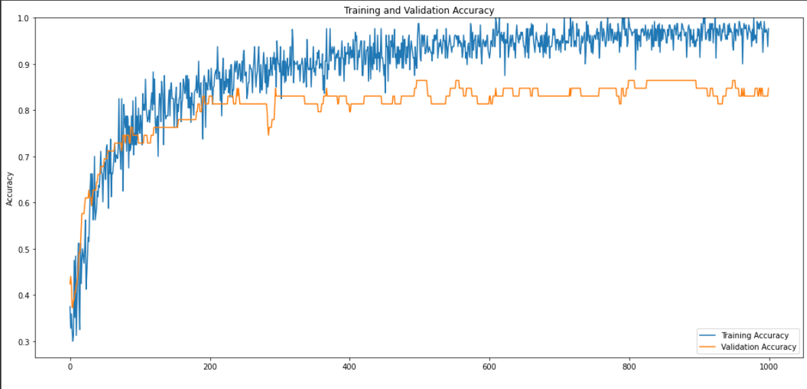
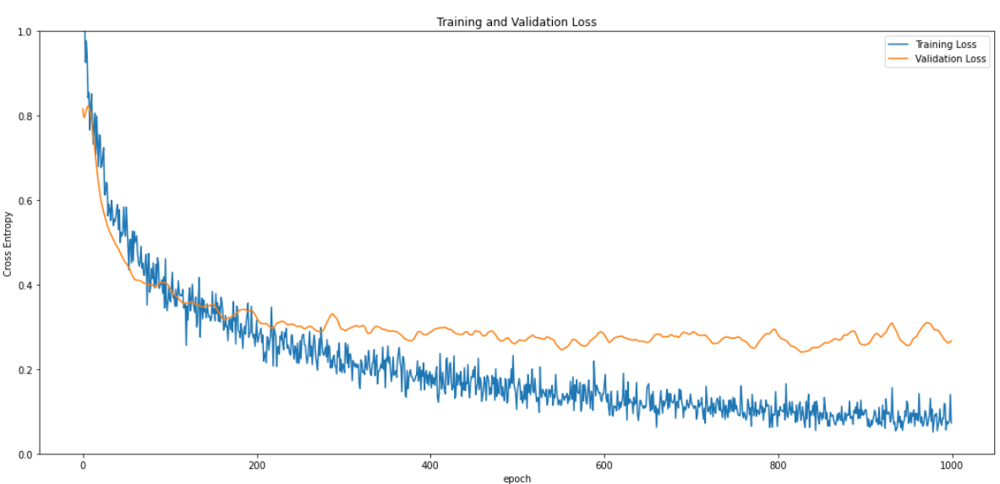

# RNA_Project

# Projeto Final - Modelos Preditivos Conexionistas

### Aluno - Caio Emanoel Serpa Lopes

### Tutor - Vitor Casadei

---
|**Tipo de Projeto**|**Modelo Selecionado**|**Linguagem**|
|--|--|--|
|Classificação de Imagens|MobileNetV2|Tensorflow|

[Clique aqui para rodar o modelo via browser (roboflow)](https://classify.roboflow.com/?model=classifier_animals&version=2&api_key=IDPIYW7fvVaFbVq3eTlB)
# Performance

O modelo treinado possui performance de **84.75%**.

* Modelo capaz de realizar classificação entre três classes (**Leão**, **Gato** e **Cachorro**)

---
## Output do bloco de treinamento

<details>
  <summary>Click to expand!</summary>
  
  ```Epoch 1/1000
2/2 [==============================] - ETA: 0s - loss: 1.0496 - accuracy: 0.3750
Epoch 1: saving model to training_1/cp.ckpt
2/2 [==============================] - 9s 4s/step - loss: 1.0496 - accuracy: 0.3750 - val_loss: 0.8153 - val_accuracy: 0.4237
Epoch 2/1000
2/2 [==============================] - ETA: 0s - loss: 1.0002 - accuracy: 0.3281
Epoch 2: saving model to training_1/cp.ckpt
2/2 [==============================] - 4s 2s/step - loss: 1.0002 - accuracy: 0.3281 - val_loss: 0.7967 - val_accuracy: 0.4407
Epoch 3/1000
2/2 [==============================] - ETA: 0s - loss: 1.0473 - accuracy: 0.3594
Epoch 3: saving model to training_1/cp.ckpt
2/2 [==============================] - 3s 2s/step - loss: 1.0473 - accuracy: 0.3594 - val_loss: 0.7953 - val_accuracy: 0.4237
Epoch 4/1000
2/2 [==============================] - ETA: 0s - loss: 0.9252 - accuracy: 0.3250
Epoch 4: saving model to training_1/cp.ckpt
2/2 [==============================] - 1s 1s/step - loss: 0.9252 - accuracy: 0.3250 - val_loss: 0.8039 - val_accuracy: 0.3729
Epoch 5/1000
2/2 [==============================] - ETA: 0s - loss: 0.9771 - accuracy: 0.3000
Epoch 5: saving model to training_1/cp.ckpt
2/2 [==============================] - 1s 781ms/step - loss: 0.9771 - accuracy: 0.3000 - val_loss: 0.8116 - val_accuracy: 0.3729
Epoch 6/1000
2/2 [==============================] - ETA: 0s - loss: 0.9402 - accuracy: 0.3125
Epoch 6: saving model to training_1/cp.ckpt
2/2 [==============================] - 1s 789ms/step - loss: 0.9402 - accuracy: 0.3125 - val_loss: 0.8183 - val_accuracy: 0.3898
Epoch 7/1000
2/2 [==============================] - ETA: 0s - loss: 0.8416 - accuracy: 0.4750
Epoch 7: saving model to training_1/cp.ckpt
2/2 [==============================] - 1s 1s/step - loss: 0.8416 - accuracy: 0.4750 - val_loss: 0.8229 - val_accuracy: 0.3898
Epoch 8/1000
2/2 [==============================] - ETA: 0s - loss: 0.8543 - accuracy: 0.3516
Epoch 8: saving model to training_1/cp.ckpt
2/2 [==============================] - 1s 913ms/step - loss: 0.8543 - accuracy: 0.3516 - val_loss: 0.8213 - val_accuracy: 0.4068
Epoch 9/1000
2/2 [==============================] - ETA: 0s - loss: 0.7657 - accuracy: 0.4844
Epoch 9: saving model to training_1/cp.ckpt
2/2 [==============================] - 1s 908ms/step - loss: 0.7657 - accuracy: 0.4844 - val_loss: 0.8124 - val_accuracy: 0.4068
Epoch 10/1000
2/2 [==============================] - ETA: 0s - loss: 0.8208 - accuracy: 0.3125
Epoch 10: saving model to training_1/cp.ckpt
2/2 [==============================] - 1s 1s/step - loss: 0.8208 - accuracy: 0.3125 - val_loss: 0.8035 - val_accuracy: 0.4237
Epoch 11/1000
2/2 [==============================] - ETA: 0s - loss: 0.8510 - accuracy: 0.3875
Epoch 11: saving model to training_1/cp.ckpt
2/2 [==============================] - 1s 789ms/step - loss: 0.8510 - accuracy: 0.3875 - val_loss: 0.7868 - val_accuracy: 0.4237
Epoch 12/1000
2/2 [==============================] - ETA: 0s - loss: 0.7841 - accuracy: 0.4609
Epoch 12: saving model to training_1/cp.ckpt
2/2 [==============================] - 1s 896ms/step - loss: 0.7841 - accuracy: 0.4609 - val_loss: 0.7674 - val_accuracy: 0.4407
Epoch 13/1000
2/2 [==============================] - ETA: 0s - loss: 0.7320 - accuracy: 0.5125
Epoch 13: saving model to training_1/cp.ckpt
2/2 [==============================] - 2s 1s/step - loss: 0.7320 - accuracy: 0.5125 - val_loss: 0.7513 - val_accuracy: 0.4576
Epoch 14/1000
2/2 [==============================] - ETA: 0s - loss: 0.7788 - accuracy: 0.3828
Epoch 14: saving model to training_1/cp.ckpt
2/2 [==============================] - 1s 908ms/step - loss: 0.7788 - accuracy: 0.3828 - val_loss: 0.7345 - val_accuracy: 0.4915
Epoch 15/1000
2/2 [==============================] - ETA: 0s - loss: 0.8054 - accuracy: 0.3250
Epoch 15: saving model to training_1/cp.ckpt
2/2 [==============================] - 1s 803ms/step - loss: 0.8054 - accuracy: 0.3250 - val_loss: 0.7162 - val_accuracy: 0.4915
Epoch 16/1000
2/2 [==============================] - ETA: 0s - loss: 0.7073 - accuracy: 0.5125
Epoch 16: saving model to training_1/cp.ckpt
2/2 [==============================] - 1s 1s/step - loss: 0.7073 - accuracy: 0.5125 - val_loss: 0.6949 - val_accuracy: 0.5085
Epoch 17/1000
2/2 [==============================] - ETA: 0s - loss: 0.7984 - accuracy: 0.4250
Epoch 17: saving model to training_1/cp.ckpt
2/2 [==============================] - 1s 1s/step - loss: 0.7984 - accuracy: 0.4250 - val_loss: 0.6756 - val_accuracy: 0.5424
Epoch 18/1000
2/2 [==============================] - ETA: 0s - loss: 0.7332 - accuracy: 0.4750
Epoch 18: saving model to training_1/cp.ckpt
2/2 [==============================] - 1s 777ms/step - loss: 0.7332 - accuracy: 0.4750 - val_loss: 0.6573 - val_accuracy: 0.5763
Epoch 19/1000
2/2 [==============================] - ETA: 0s - loss: 0.6789 - accuracy: 0.5000
Epoch 19: saving model to training_1/cp.ckpt
2/2 [==============================] - 1s 928ms/step - loss: 0.6789 - accuracy: 0.5000 - val_loss: 0.6398 - val_accuracy: 0.5763
Epoch 20/1000
2/2 [==============================] - ETA: 0s - loss: 0.7541 - accuracy: 0.4844
Epoch 20: saving model to training_1/cp.ckpt
2/2 [==============================] - 2s 1s/step - loss: 0.7541 - accuracy: 0.4844 - val_loss: 0.6241 - val_accuracy: 0.5763
Epoch 21/1000
2/2 [==============================] - ETA: 0s - loss: 0.7528 - accuracy: 0.4688
Epoch 21: saving model to training_1/cp.ckpt
2/2 [==============================] - 2s 1s/step - loss: 0.7528 - accuracy: 0.4688 - val_loss: 0.6103 - val_accuracy: 0.5763
Epoch 22/1000
2/2 [==============================] - ETA: 0s - loss: 0.6765 - accuracy: 0.5000
Epoch 22: saving model to training_1/cp.ckpt
2/2 [==============================] - 1s 1s/step - loss: 0.6765 - accuracy: 0.5000 - val_loss: 0.5980 - val_accuracy: 0.5932
Epoch 23/1000
2/2 [==============================] - ETA: 0s - loss: 0.6817 - accuracy: 0.5625
Epoch 23: saving model to training_1/cp.ckpt
2/2 [==============================] - 1s 1s/step - loss: 0.6817 - accuracy: 0.5625 - val_loss: 0.5890 - val_accuracy: 0.6102
Epoch 24/1000
2/2 [==============================] - ETA: 0s - loss: 0.7056 - accuracy: 0.4125
Epoch 24: saving model to training_1/cp.ckpt
2/2 [==============================] - 1s 785ms/step - loss: 0.7056 - accuracy: 0.4125 - val_loss: 0.5802 - val_accuracy: 0.6102
Epoch 25/1000
2/2 [==============================] - ETA: 0s - loss: 0.7238 - accuracy: 0.4453
Epoch 25: saving model to training_1/cp.ckpt
2/2 [==============================] - 2s 1s/step - loss: 0.7238 - accuracy: 0.4453 - val_loss: 0.5716 - val_accuracy: 0.6102
Epoch 26/1000
2/2 [==============================] - ETA: 0s - loss: 0.6118 - accuracy: 0.4875
Epoch 26: saving model to training_1/cp.ckpt
2/2 [==============================] - 1s 1s/step - loss: 0.6118 - accuracy: 0.4875 - val_loss: 0.5640 - val_accuracy: 0.6102
Epoch 27/1000
2/2 [==============================] - ETA: 0s - loss: 0.6136 - accuracy: 0.5250
Epoch 27: saving model to training_1/cp.ckpt
2/2 [==============================] - 1s 1s/step - loss: 0.6136 - accuracy: 0.5250 - val_loss: 0.5557 - val_accuracy: 0.6102
Epoch 28/1000
2/2 [==============================] - ETA: 0s - loss: 0.6424 - accuracy: 0.5156
Epoch 28: saving model to training_1/cp.ckpt
2/2 [==============================] - 1s 925ms/step - loss: 0.6424 - accuracy: 0.5156 - val_loss: 0.5483 - val_accuracy: 0.6271
Epoch 29/1000
2/2 [==============================] - ETA: 0s - loss: 0.6367 - accuracy: 0.5703
Epoch 29: saving model to training_1/cp.ckpt
2/2 [==============================] - 1s 925ms/step - loss: 0.6367 - accuracy: 0.5703 - val_loss: 0.5409 - val_accuracy: 0.6102
Epoch 30/1000
2/2 [==============================] - ETA: 0s - loss: 0.5621 - accuracy: 0.6375
Epoch 30: saving model to training_1/cp.ckpt
2/2 [==============================] - 1s 1s/step - loss: 0.5621 - accuracy: 0.6375 - val_loss: 0.5350 - val_accuracy: 0.6102
Epoch 31/1000
2/2 [==============================] - ETA: 0s - loss: 0.5903 - accuracy: 0.6625
Epoch 31: saving model to training_1/cp.ckpt
2/2 [==============================] - 1s 773ms/step - loss: 0.5903 - accuracy: 0.6625 - val_loss: 0.5297 - val_accuracy: 0.6102
Epoch 32/1000
2/2 [==============================] - ETA: 0s - loss: 0.5768 - accuracy: 0.5938
Epoch 32: saving model to training_1/cp.ckpt
2/2 [==============================] - 2s 1s/step - loss: 0.5768 - accuracy: 0.5938 - val_loss: 0.5246 - val_accuracy: 0.5932
Epoch 33/1000
2/2 [==============================] - ETA: 0s - loss: 0.5517 - accuracy: 0.6625
Epoch 33: saving model to training_1/cp.ckpt
2/2 [==============================] - 1s 771ms/step - loss: 0.5517 - accuracy: 0.6625 - val_loss: 0.5197 - val_accuracy: 0.6102
Epoch 34/1000
2/2 [==============================] - ETA: 0s - loss: 0.5987 - accuracy: 0.5625
Epoch 34: saving model to training_1/cp.ckpt
2/2 [==============================] - 1s 1s/step - loss: 0.5987 - accuracy: 0.5625 - val_loss: 0.5156 - val_accuracy: 0.6271
Epoch 35/1000
2/2 [==============================] - ETA: 0s - loss: 0.5768 - accuracy: 0.5859
Epoch 35: saving model to training_1/cp.ckpt
2/2 [==============================] - 1s 866ms/step - loss: 0.5768 - accuracy: 0.5859 - val_loss: 0.5116 - val_accuracy: 0.6271
Epoch 36/1000
2/2 [==============================] - ETA: 0s - loss: 0.5395 - accuracy: 0.7000
Epoch 36: saving model to training_1/cp.ckpt
2/2 [==============================] - 1s 1s/step - loss: 0.5395 - accuracy: 0.7000 - val_loss: 0.5072 - val_accuracy: 0.6271
Epoch 37/1000
2/2 [==============================] - ETA: 0s - loss: 0.5549 - accuracy: 0.5625
Epoch 37: saving model to training_1/cp.ckpt
2/2 [==============================] - 1s 1s/step - loss: 0.5549 - accuracy: 0.5625 - val_loss: 0.5027 - val_accuracy: 0.6271
Epoch 38/1000
2/2 [==============================] - ETA: 0s - loss: 0.5485 - accuracy: 0.5750
Epoch 38: saving model to training_1/cp.ckpt
2/2 [==============================] - 1s 783ms/step - loss: 0.5485 - accuracy: 0.5750 - val_loss: 0.4985 - val_accuracy: 0.6271
Epoch 39/1000
2/2 [==============================] - ETA: 0s - loss: 0.5600 - accuracy: 0.5875
Epoch 39: saving model to training_1/cp.ckpt
2/2 [==============================] - 1s 1s/step - loss: 0.5600 - accuracy: 0.5875 - val_loss: 0.4944 - val_accuracy: 0.6441
Epoch 40/1000
2/2 [==============================] - ETA: 0s - loss: 0.5797 - accuracy: 0.6250
Epoch 40: saving model to training_1/cp.ckpt
2/2 [==============================] - 1s 766ms/step - loss: 0.5797 - accuracy: 0.6250 - val_loss: 0.4913 - val_accuracy: 0.6441
Epoch 41/1000
2/2 [==============================] - ETA: 0s - loss: 0.5891 - accuracy: 0.6125
Epoch 41: saving model to training_1/cp.ckpt
2/2 [==============================] - 1s 850ms/step - loss: 0.5891 - accuracy: 0.6125 - val_loss: 0.4880 - val_accuracy: 0.6610
Epoch 42/1000
2/2 [==============================] - ETA: 0s - loss: 0.5301 - accuracy: 0.6375
Epoch 42: saving model to training_1/cp.ckpt
2/2 [==============================] - 1s 810ms/step - loss: 0.5301 - accuracy: 0.6375 - val_loss: 0.4847 - val_accuracy: 0.6610
Epoch 43/1000
2/2 [==============================] - ETA: 0s - loss: 0.5775 - accuracy: 0.6328
Epoch 43: saving model to training_1/cp.ckpt
2/2 [==============================] - 1s 942ms/step - loss: 0.5775 - accuracy: 0.6328 - val_loss: 0.4796 - val_accuracy: 0.6610
Epoch 44/1000
2/2 [==============================] - ETA: 0s - loss: 0.4997 - accuracy: 0.6641
Epoch 44: saving model to training_1/cp.ckpt
2/2 [==============================] - 2s 1s/step - loss: 0.4997 - accuracy: 0.6641 - val_loss: 0.4753 - val_accuracy: 0.6610
Epoch 45/1000
2/2 [==============================] - ETA: 0s - loss: 0.5236 - accuracy: 0.7109
Epoch 45: saving model to training_1/cp.ckpt
2/2 [==============================] - 2s 1s/step - loss: 0.5236 - accuracy: 0.7109 - val_loss: 0.4713 - val_accuracy: 0.6780
Epoch 46/1000
2/2 [==============================] - ETA: 0s - loss: 0.5150 - accuracy: 0.6641
Epoch 46: saving model to training_1/cp.ckpt
2/2 [==============================] - 2s 1s/step - loss: 0.5150 - accuracy: 0.6641 - val_loss: 0.4674 - val_accuracy: 0.6780
Epoch 47/1000
2/2 [==============================] - ETA: 0s - loss: 0.5213 - accuracy: 0.6625
Epoch 47: saving model to training_1/cp.ckpt
2/2 [==============================] - 1s 1s/step - loss: 0.5213 - accuracy: 0.6625 - val_loss: 0.4637 - val_accuracy: 0.6780
Epoch 48/1000
2/2 [==============================] - ETA: 0s - loss: 0.5835 - accuracy: 0.6016
Epoch 48: saving model to training_1/cp.ckpt
2/2 [==============================] - 1s 913ms/step - loss: 0.5835 - accuracy: 0.6016 - val_loss: 0.4594 - val_accuracy: 0.6780
Epoch 49/1000
2/2 [==============================] - ETA: 0s - loss: 0.5356 - accuracy: 0.6641
Epoch 49: saving model to training_1/cp.ckpt
2/2 [==============================] - 2s 1s/step - loss: 0.5356 - accuracy: 0.6641 - val_loss: 0.4551 - val_accuracy: 0.6780
Epoch 50/1000
2/2 [==============================] - ETA: 0s - loss: 0.5144 - accuracy: 0.6797
Epoch 50: saving model to training_1/cp.ckpt
2/2 [==============================] - 2s 1s/step - loss: 0.5144 - accuracy: 0.6797 - val_loss: 0.4520 - val_accuracy: 0.6949
Epoch 51/1000
2/2 [==============================] - ETA: 0s - loss: 0.5832 - accuracy: 0.6875
Epoch 51: saving model to training_1/cp.ckpt
2/2 [==============================] - 1s 1s/step - loss: 0.5832 - accuracy: 0.6875 - val_loss: 0.4498 - val_accuracy: 0.6949
Epoch 52/1000
2/2 [==============================] - ETA: 0s - loss: 0.5395 - accuracy: 0.6500
Epoch 52: saving model to training_1/cp.ckpt
2/2 [==============================] - 1s 795ms/step - loss: 0.5395 - accuracy: 0.6500 - val_loss: 0.4471 - val_accuracy: 0.6949
Epoch 53/1000
2/2 [==============================] - ETA: 0s - loss: 0.4901 - accuracy: 0.7188
Epoch 53: saving model to training_1/cp.ckpt
2/2 [==============================] - 1s 995ms/step - loss: 0.4901 - accuracy: 0.7188 - val_loss: 0.4434 - val_accuracy: 0.6949
Epoch 54/1000
2/2 [==============================] - ETA: 0s - loss: 0.4348 - accuracy: 0.7250
Epoch 54: saving model to training_1/cp.ckpt
2/2 [==============================] - 1s 796ms/step - loss: 0.4348 - accuracy: 0.7250 - val_loss: 0.4400 - val_accuracy: 0.6949
Epoch 55/1000
2/2 [==============================] - ETA: 0s - loss: 0.5062 - accuracy: 0.6641
Epoch 55: saving model to training_1/cp.ckpt
2/2 [==============================] - 2s 1s/step - loss: 0.5062 - accuracy: 0.6641 - val_loss: 0.4370 - val_accuracy: 0.7119
Epoch 56/1000
2/2 [==============================] - ETA: 0s - loss: 0.5069 - accuracy: 0.5875
Epoch 56: saving model to training_1/cp.ckpt
2/2 [==============================] - 1s 1s/step - loss: 0.5069 - accuracy: 0.5875 - val_loss: 0.4306 - val_accuracy: 0.7119
Epoch 57/1000
2/2 [==============================] - ETA: 0s - loss: 0.4512 - accuracy: 0.7125
Epoch 57: saving model to training_1/cp.ckpt
2/2 [==============================] - 1s 1s/step - loss: 0.4512 - accuracy: 0.7125 - val_loss: 0.4254 - val_accuracy: 0.7119
Epoch 58/1000
2/2 [==============================] - ETA: 0s - loss: 0.5265 - accuracy: 0.6625
Epoch 58: saving model to training_1/cp.ckpt
2/2 [==============================] - 1s 1s/step - loss: 0.5265 - accuracy: 0.6625 - val_loss: 0.4208 - val_accuracy: 0.7119
Epoch 59/1000
2/2 [==============================] - ETA: 0s - loss: 0.4557 - accuracy: 0.7375
Epoch 59: saving model to training_1/cp.ckpt
2/2 [==============================] - 1s 792ms/step - loss: 0.4557 - accuracy: 0.7375 - val_loss: 0.4171 - val_accuracy: 0.7119
Epoch 60/1000
2/2 [==============================] - ETA: 0s - loss: 0.5258 - accuracy: 0.6125
Epoch 60: saving model to training_1/cp.ckpt
2/2 [==============================] - 1s 793ms/step - loss: 0.5258 - accuracy: 0.6125 - val_loss: 0.4139 - val_accuracy: 0.7119
Epoch 61/1000
2/2 [==============================] - ETA: 0s - loss: 0.4988 - accuracy: 0.6641
Epoch 61: saving model to training_1/cp.ckpt
2/2 [==============================] - 2s 1s/step - loss: 0.4988 - accuracy: 0.6641 - val_loss: 0.4117 - val_accuracy: 0.7119
Epoch 62/1000
2/2 [==============================] - ETA: 0s - loss: 0.5074 - accuracy: 0.6625
Epoch 62: saving model to training_1/cp.ckpt
2/2 [==============================] - 1s 1s/step - loss: 0.5074 - accuracy: 0.6625 - val_loss: 0.4109 - val_accuracy: 0.7119
Epoch 63/1000
2/2 [==============================] - ETA: 0s - loss: 0.5155 - accuracy: 0.6797
Epoch 63: saving model to training_1/cp.ckpt
2/2 [==============================] - 2s 1s/step - loss: 0.5155 - accuracy: 0.6797 - val_loss: 0.4105 - val_accuracy: 0.7119
Epoch 64/1000
2/2 [==============================] - ETA: 0s - loss: 0.4738 - accuracy: 0.7031
Epoch 64: saving model to training_1/cp.ckpt
2/2 [==============================] - 2s 1s/step - loss: 0.4738 - accuracy: 0.7031 - val_loss: 0.4101 - val_accuracy: 0.7119
Epoch 65/1000
2/2 [==============================] - ETA: 0s - loss: 0.4526 - accuracy: 0.7266
Epoch 65: saving model to training_1/cp.ckpt
2/2 [==============================] - 2s 1s/step - loss: 0.4526 - accuracy: 0.7266 - val_loss: 0.4099 - val_accuracy: 0.7288
Epoch 66/1000
2/2 [==============================] - ETA: 0s - loss: 0.4432 - accuracy: 0.6875
Epoch 66: saving model to training_1/cp.ckpt
2/2 [==============================] - 1s 917ms/step - loss: 0.4432 - accuracy: 0.6875 - val_loss: 0.4096 - val_accuracy: 0.7288
Epoch 67/1000
2/2 [==============================] - ETA: 0s - loss: 0.4556 - accuracy: 0.7031
Epoch 67: saving model to training_1/cp.ckpt
2/2 [==============================] - 1s 891ms/step - loss: 0.4556 - accuracy: 0.7031 - val_loss: 0.4089 - val_accuracy: 0.7288
Epoch 68/1000
2/2 [==============================] - ETA: 0s - loss: 0.4906 - accuracy: 0.7000
Epoch 68: saving model to training_1/cp.ckpt
2/2 [==============================] - 1s 1s/step - loss: 0.4906 - accuracy: 0.7000 - val_loss: 0.4077 - val_accuracy: 0.7288
Epoch 69/1000
2/2 [==============================] - ETA: 0s - loss: 0.4392 - accuracy: 0.6953
Epoch 69: saving model to training_1/cp.ckpt
2/2 [==============================] - 1s 933ms/step - loss: 0.4392 - accuracy: 0.6953 - val_loss: 0.4067 - val_accuracy: 0.7288
Epoch 70/1000
2/2 [==============================] - ETA: 0s - loss: 0.4505 - accuracy: 0.7188
Epoch 70: saving model to training_1/cp.ckpt
2/2 [==============================] - 1s 911ms/step - loss: 0.4505 - accuracy: 0.7188 - val_loss: 0.4056 - val_accuracy: 0.7288
Epoch 71/1000
2/2 [==============================] - ETA: 0s - loss: 0.4227 - accuracy: 0.8250
Epoch 71: saving model to training_1/cp.ckpt
2/2 [==============================] - 1s 1s/step - loss: 0.4227 - accuracy: 0.8250 - val_loss: 0.4038 - val_accuracy: 0.7288
Epoch 72/1000
2/2 [==============================] - ETA: 0s - loss: 0.4216 - accuracy: 0.7188
Epoch 72: saving model to training_1/cp.ckpt
2/2 [==============================] - 1s 942ms/step - loss: 0.4216 - accuracy: 0.7188 - val_loss: 0.4028 - val_accuracy: 0.7288
Epoch 73/1000
2/2 [==============================] - ETA: 0s - loss: 0.4563 - accuracy: 0.7031
Epoch 73: saving model to training_1/cp.ckpt
2/2 [==============================] - 2s 1s/step - loss: 0.4563 - accuracy: 0.7031 - val_loss: 0.4029 - val_accuracy: 0.7288
Epoch 74/1000
2/2 [==============================] - ETA: 0s - loss: 0.4717 - accuracy: 0.6719
Epoch 74: saving model to training_1/cp.ckpt
2/2 [==============================] - 2s 1s/step - loss: 0.4717 - accuracy: 0.6719 - val_loss: 0.4026 - val_accuracy: 0.7288
Epoch 75/1000
2/2 [==============================] - ETA: 0s - loss: 0.3515 - accuracy: 0.8250
Epoch 75: saving model to training_1/cp.ckpt
2/2 [==============================] - 1s 1s/step - loss: 0.3515 - accuracy: 0.8250 - val_loss: 0.4009 - val_accuracy: 0.7119
Epoch 76/1000
2/2 [==============================] - ETA: 0s - loss: 0.4396 - accuracy: 0.7125
Epoch 76: saving model to training_1/cp.ckpt
2/2 [==============================] - 1s 795ms/step - loss: 0.4396 - accuracy: 0.7125 - val_loss: 0.4004 - val_accuracy: 0.7288
Epoch 77/1000
2/2 [==============================] - ETA: 0s - loss: 0.4737 - accuracy: 0.6250
Epoch 77: saving model to training_1/cp.ckpt
2/2 [==============================] - 2s 1s/step - loss: 0.4737 - accuracy: 0.6250 - val_loss: 0.4002 - val_accuracy: 0.7458
Epoch 78/1000
2/2 [==============================] - ETA: 0s - loss: 0.3818 - accuracy: 0.8125
Epoch 78: saving model to training_1/cp.ckpt
2/2 [==============================] - 2s 1s/step - loss: 0.3818 - accuracy: 0.8125 - val_loss: 0.3997 - val_accuracy: 0.7458
Epoch 79/1000
2/2 [==============================] - ETA: 0s - loss: 0.3942 - accuracy: 0.7812
Epoch 79: saving model to training_1/cp.ckpt
2/2 [==============================] - 2s 1s/step - loss: 0.3942 - accuracy: 0.7812 - val_loss: 0.3999 - val_accuracy: 0.7458
Epoch 80/1000
2/2 [==============================] - ETA: 0s - loss: 0.4376 - accuracy: 0.7625
Epoch 80: saving model to training_1/cp.ckpt
2/2 [==============================] - 1s 1s/step - loss: 0.4376 - accuracy: 0.7625 - val_loss: 0.3999 - val_accuracy: 0.7288
Epoch 81/1000
2/2 [==============================] - ETA: 0s - loss: 0.4146 - accuracy: 0.7875
Epoch 81: saving model to training_1/cp.ckpt
2/2 [==============================] - 1s 1s/step - loss: 0.4146 - accuracy: 0.7875 - val_loss: 0.3985 - val_accuracy: 0.7458
Epoch 82/1000
2/2 [==============================] - ETA: 0s - loss: 0.4513 - accuracy: 0.7109
Epoch 82: saving model to training_1/cp.ckpt
2/2 [==============================] - 1s 952ms/step - loss: 0.4513 - accuracy: 0.7109 - val_loss: 0.3975 - val_accuracy: 0.7458
Epoch 83/1000
2/2 [==============================] - ETA: 0s - loss: 0.4000 - accuracy: 0.7875
Epoch 83: saving model to training_1/cp.ckpt
2/2 [==============================] - 1s 1s/step - loss: 0.4000 - accuracy: 0.7875 - val_loss: 0.3966 - val_accuracy: 0.7458
Epoch 84/1000
2/2 [==============================] - ETA: 0s - loss: 0.3920 - accuracy: 0.7812
Epoch 84: saving model to training_1/cp.ckpt
2/2 [==============================] - 2s 1s/step - loss: 0.3920 - accuracy: 0.7812 - val_loss: 0.3957 - val_accuracy: 0.7458
Epoch 85/1000
2/2 [==============================] - ETA: 0s - loss: 0.4480 - accuracy: 0.6750
Epoch 85: saving model to training_1/cp.ckpt
2/2 [==============================] - 1s 1s/step - loss: 0.4480 - accuracy: 0.6750 - val_loss: 0.3950 - val_accuracy: 0.7458
Epoch 86/1000
2/2 [==============================] - ETA: 0s - loss: 0.4010 - accuracy: 0.7656
Epoch 86: saving model to training_1/cp.ckpt
2/2 [==============================] - 1s 881ms/step - loss: 0.4010 - accuracy: 0.7656 - val_loss: 0.3956 - val_accuracy: 0.7288
Epoch 87/1000
2/2 [==============================] - ETA: 0s - loss: 0.4635 - accuracy: 0.7125
Epoch 87: saving model to training_1/cp.ckpt
2/2 [==============================] - 1s 1s/step - loss: 0.4635 - accuracy: 0.7125 - val_loss: 0.3978 - val_accuracy: 0.7288
Epoch 88/1000
2/2 [==============================] - ETA: 0s - loss: 0.4501 - accuracy: 0.7188
Epoch 88: saving model to training_1/cp.ckpt
2/2 [==============================] - 1s 915ms/step - loss: 0.4501 - accuracy: 0.7188 - val_loss: 0.4002 - val_accuracy: 0.7627
Epoch 89/1000
2/2 [==============================] - ETA: 0s - loss: 0.3909 - accuracy: 0.7875
Epoch 89: saving model to training_1/cp.ckpt
2/2 [==============================] - 1s 1s/step - loss: 0.3909 - accuracy: 0.7875 - val_loss: 0.4037 - val_accuracy: 0.7627
Epoch 90/1000
2/2 [==============================] - ETA: 0s - loss: 0.3992 - accuracy: 0.7250
Epoch 90: saving model to training_1/cp.ckpt
2/2 [==============================] - 1s 1s/step - loss: 0.3992 - accuracy: 0.7250 - val_loss: 0.4045 - val_accuracy: 0.7627
Epoch 91/1000
2/2 [==============================] - ETA: 0s - loss: 0.4022 - accuracy: 0.8203
Epoch 91: saving model to training_1/cp.ckpt
2/2 [==============================] - 2s 1s/step - loss: 0.4022 - accuracy: 0.8203 - val_loss: 0.4050 - val_accuracy: 0.7458
Epoch 92/1000
2/2 [==============================] - ETA: 0s - loss: 0.4112 - accuracy: 0.7031
Epoch 92: saving model to training_1/cp.ckpt
2/2 [==============================] - 1s 972ms/step - loss: 0.4112 - accuracy: 0.7031 - val_loss: 0.4050 - val_accuracy: 0.7458
Epoch 93/1000
2/2 [==============================] - ETA: 0s - loss: 0.3795 - accuracy: 0.7500
Epoch 93: saving model to training_1/cp.ckpt
2/2 [==============================] - 2s 1s/step - loss: 0.3795 - accuracy: 0.7500 - val_loss: 0.4046 - val_accuracy: 0.7458
Epoch 94/1000
2/2 [==============================] - ETA: 0s - loss: 0.4178 - accuracy: 0.7250
Epoch 94: saving model to training_1/cp.ckpt
2/2 [==============================] - 1s 786ms/step - loss: 0.4178 - accuracy: 0.7250 - val_loss: 0.4047 - val_accuracy: 0.7458
Epoch 95/1000
2/2 [==============================] - ETA: 0s - loss: 0.3446 - accuracy: 0.8281
Epoch 95: saving model to training_1/cp.ckpt
2/2 [==============================] - 2s 1s/step - loss: 0.3446 - accuracy: 0.8281 - val_loss: 0.4047 - val_accuracy: 0.7458
Epoch 96/1000
2/2 [==============================] - ETA: 0s - loss: 0.4607 - accuracy: 0.7250
Epoch 96: saving model to training_1/cp.ckpt
2/2 [==============================] - 1s 1s/step - loss: 0.4607 - accuracy: 0.7250 - val_loss: 0.4035 - val_accuracy: 0.7458
Epoch 97/1000
2/2 [==============================] - ETA: 0s - loss: 0.3616 - accuracy: 0.7875
Epoch 97: saving model to training_1/cp.ckpt
2/2 [==============================] - 1s 809ms/step - loss: 0.3616 - accuracy: 0.7875 - val_loss: 0.4021 - val_accuracy: 0.7458
Epoch 98/1000
2/2 [==============================] - ETA: 0s - loss: 0.3380 - accuracy: 0.7375
Epoch 98: saving model to training_1/cp.ckpt
2/2 [==============================] - 1s 795ms/step - loss: 0.3380 - accuracy: 0.7375 - val_loss: 0.4014 - val_accuracy: 0.7458
Epoch 99/1000
2/2 [==============================] - ETA: 0s - loss: 0.3621 - accuracy: 0.8047
Epoch 99: saving model to training_1/cp.ckpt
2/2 [==============================] - 1s 925ms/step - loss: 0.3621 - accuracy: 0.8047 - val_loss: 0.3993 - val_accuracy: 0.7288
Epoch 100/1000
2/2 [==============================] - ETA: 0s - loss: 0.3969 - accuracy: 0.7578
Epoch 100: saving model to training_1/cp.ckpt
2/2 [==============================] - 1s 922ms/step - loss: 0.3969 - accuracy: 0.7578 - val_loss: 0.3952 - val_accuracy: 0.7288
Epoch 101/1000
2/2 [==============================] - ETA: 0s - loss: 0.3638 - accuracy: 0.7500
Epoch 101: saving model to training_1/cp.ckpt
2/2 [==============================] - 1s 807ms/step - loss: 0.3638 - accuracy: 0.7500 - val_loss: 0.3910 - val_accuracy: 0.7288
Epoch 102/1000
2/2 [==============================] - ETA: 0s - loss: 0.3590 - accuracy: 0.7891
Epoch 102: saving model to training_1/cp.ckpt
2/2 [==============================] - 1s 912ms/step - loss: 0.3590 - accuracy: 0.7891 - val_loss: 0.3877 - val_accuracy: 0.7288
Epoch 103/1000
2/2 [==============================] - ETA: 0s - loss: 0.3947 - accuracy: 0.7656
Epoch 103: saving model to training_1/cp.ckpt
2/2 [==============================] - 2s 959ms/step - loss: 0.3947 - accuracy: 0.7656 - val_loss: 0.3841 - val_accuracy: 0.7288
Epoch 104/1000
2/2 [==============================] - ETA: 0s - loss: 0.4289 - accuracy: 0.7250
Epoch 104: saving model to training_1/cp.ckpt
2/2 [==============================] - 1s 805ms/step - loss: 0.4289 - accuracy: 0.7250 - val_loss: 0.3815 - val_accuracy: 0.7288
Epoch 105/1000
2/2 [==============================] - ETA: 0s - loss: 0.3684 - accuracy: 0.8359
Epoch 105: saving model to training_1/cp.ckpt
2/2 [==============================] - 2s 1s/step - loss: 0.3684 - accuracy: 0.8359 - val_loss: 0.3784 - val_accuracy: 0.7288
Epoch 106/1000
2/2 [==============================] - ETA: 0s - loss: 0.3745 - accuracy: 0.8000
Epoch 106: saving model to training_1/cp.ckpt
2/2 [==============================] - 1s 866ms/step - loss: 0.3745 - accuracy: 0.8000 - val_loss: 0.3758 - val_accuracy: 0.7288
Epoch 107/1000
2/2 [==============================] - ETA: 0s - loss: 0.3485 - accuracy: 0.8125
Epoch 107: saving model to training_1/cp.ckpt
2/2 [==============================] - 1s 917ms/step - loss: 0.3485 - accuracy: 0.8125 - val_loss: 0.3743 - val_accuracy: 0.7458
Epoch 108/1000
2/2 [==============================] - ETA: 0s - loss: 0.3889 - accuracy: 0.8000
Epoch 108: saving model to training_1/cp.ckpt
2/2 [==============================] - 1s 997ms/step - loss: 0.3889 - accuracy: 0.8000 - val_loss: 0.3726 - val_accuracy: 0.7458
Epoch 109/1000
2/2 [==============================] - ETA: 0s - loss: 0.3484 - accuracy: 0.8672
Epoch 109: saving model to training_1/cp.ckpt
2/2 [==============================] - 1s 937ms/step - loss: 0.3484 - accuracy: 0.8672 - val_loss: 0.3712 - val_accuracy: 0.7458
Epoch 110/1000
2/2 [==============================] - ETA: 0s - loss: 0.3734 - accuracy: 0.8047
Epoch 110: saving model to training_1/cp.ckpt
2/2 [==============================] - 2s 1s/step - loss: 0.3734 - accuracy: 0.8047 - val_loss: 0.3696 - val_accuracy: 0.7458
Epoch 111/1000
2/2 [==============================] - ETA: 0s - loss: 0.4089 - accuracy: 0.7875
Epoch 111: saving model to training_1/cp.ckpt
2/2 [==============================] - 1s 789ms/step - loss: 0.4089 - accuracy: 0.7875 - val_loss: 0.3676 - val_accuracy: 0.7458
Epoch 112/1000
2/2 [==============================] - ETA: 0s - loss: 0.3788 - accuracy: 0.7750
Epoch 112: saving model to training_1/cp.ckpt
2/2 [==============================] - 1s 783ms/step - loss: 0.3788 - accuracy: 0.7750 - val_loss: 0.3646 - val_accuracy: 0.7288
Epoch 113/1000
2/2 [==============================] - ETA: 0s - loss: 0.3728 - accuracy: 0.7812
Epoch 113: saving model to training_1/cp.ckpt
2/2 [==============================] - 2s 1s/step - loss: 0.3728 - accuracy: 0.7812 - val_loss: 0.3621 - val_accuracy: 0.7288
Epoch 114/1000
2/2 [==============================] - ETA: 0s - loss: 0.3751 - accuracy: 0.8000
Epoch 114: saving model to training_1/cp.ckpt
2/2 [==============================] - 1s 1s/step - loss: 0.3751 - accuracy: 0.8000 - val_loss: 0.3599 - val_accuracy: 0.7288
Epoch 115/1000
2/2 [==============================] - ETA: 0s - loss: 0.3739 - accuracy: 0.7734
Epoch 115: saving model to training_1/cp.ckpt
2/2 [==============================] - 1s 946ms/step - loss: 0.3739 - accuracy: 0.7734 - val_loss: 0.3578 - val_accuracy: 0.7288
Epoch 116/1000
2/2 [==============================] - ETA: 0s - loss: 0.3883 - accuracy: 0.8000
Epoch 116: saving model to training_1/cp.ckpt
2/2 [==============================] - 1s 1s/step - loss: 0.3883 - accuracy: 0.8000 - val_loss: 0.3563 - val_accuracy: 0.7288
Epoch 117/1000
2/2 [==============================] - ETA: 0s - loss: 0.3443 - accuracy: 0.8203
Epoch 117: saving model to training_1/cp.ckpt
2/2 [==============================] - 2s 1s/step - loss: 0.3443 - accuracy: 0.8203 - val_loss: 0.3552 - val_accuracy: 0.7458
Epoch 118/1000
2/2 [==============================] - ETA: 0s - loss: 0.3449 - accuracy: 0.8375
Epoch 118: saving model to training_1/cp.ckpt
2/2 [==============================] - 1s 1s/step - loss: 0.3449 - accuracy: 0.8375 - val_loss: 0.3555 - val_accuracy: 0.7458
Epoch 119/1000
2/2 [==============================] - ETA: 0s - loss: 0.3562 - accuracy: 0.8000
Epoch 119: saving model to training_1/cp.ckpt
2/2 [==============================] - 1s 1s/step - loss: 0.3562 - accuracy: 0.8000 - val_loss: 0.3556 - val_accuracy: 0.7458
Epoch 120/1000
2/2 [==============================] - ETA: 0s - loss: 0.2561 - accuracy: 0.8828
Epoch 120: saving model to training_1/cp.ckpt
2/2 [==============================] - 1s 914ms/step - loss: 0.2561 - accuracy: 0.8828 - val_loss: 0.3562 - val_accuracy: 0.7458
Epoch 121/1000
2/2 [==============================] - ETA: 0s - loss: 0.3495 - accuracy: 0.8125
Epoch 121: saving model to training_1/cp.ckpt
2/2 [==============================] - 1s 916ms/step - loss: 0.3495 - accuracy: 0.8125 - val_loss: 0.3566 - val_accuracy: 0.7627
Epoch 122/1000
2/2 [==============================] - ETA: 0s - loss: 0.3165 - accuracy: 0.8672
Epoch 122: saving model to training_1/cp.ckpt
2/2 [==============================] - 2s 1s/step - loss: 0.3165 - accuracy: 0.8672 - val_loss: 0.3566 - val_accuracy: 0.7627
Epoch 123/1000
2/2 [==============================] - ETA: 0s - loss: 0.3741 - accuracy: 0.7734
Epoch 123: saving model to training_1/cp.ckpt
2/2 [==============================] - 2s 1s/step - loss: 0.3741 - accuracy: 0.7734 - val_loss: 0.3571 - val_accuracy: 0.7627
Epoch 124/1000
2/2 [==============================] - ETA: 0s - loss: 0.3923 - accuracy: 0.7500
Epoch 124: saving model to training_1/cp.ckpt
2/2 [==============================] - 1s 955ms/step - loss: 0.3923 - accuracy: 0.7500 - val_loss: 0.3574 - val_accuracy: 0.7627
Epoch 125/1000
2/2 [==============================] - ETA: 0s - loss: 0.3380 - accuracy: 0.7812
Epoch 125: saving model to training_1/cp.ckpt
2/2 [==============================] - 1s 912ms/step - loss: 0.3380 - accuracy: 0.7812 - val_loss: 0.3575 - val_accuracy: 0.7627
Epoch 126/1000
2/2 [==============================] - ETA: 0s - loss: 0.3617 - accuracy: 0.7875
Epoch 126: saving model to training_1/cp.ckpt
2/2 [==============================] - 1s 1s/step - loss: 0.3617 - accuracy: 0.7875 - val_loss: 0.3581 - val_accuracy: 0.7627
Epoch 127/1000
2/2 [==============================] - ETA: 0s - loss: 0.4007 - accuracy: 0.7000
Epoch 127: saving model to training_1/cp.ckpt
2/2 [==============================] - 1s 1s/step - loss: 0.4007 - accuracy: 0.7000 - val_loss: 0.3577 - val_accuracy: 0.7627
Epoch 128/1000
2/2 [==============================] - ETA: 0s - loss: 0.3632 - accuracy: 0.8000
Epoch 128: saving model to training_1/cp.ckpt
2/2 [==============================] - 1s 1s/step - loss: 0.3632 - accuracy: 0.8000 - val_loss: 0.3570 - val_accuracy: 0.7627
Epoch 129/1000
2/2 [==============================] - ETA: 0s - loss: 0.3418 - accuracy: 0.8359
Epoch 129: saving model to training_1/cp.ckpt
2/2 [==============================] - 2s 1s/step - loss: 0.3418 - accuracy: 0.8359 - val_loss: 0.3558 - val_accuracy: 0.7627
Epoch 130/1000
2/2 [==============================] - ETA: 0s - loss: 0.3338 - accuracy: 0.8250
Epoch 130: saving model to training_1/cp.ckpt
2/2 [==============================] - 1s 815ms/step - loss: 0.3338 - accuracy: 0.8250 - val_loss: 0.3545 - val_accuracy: 0.7627
Epoch 131/1000
2/2 [==============================] - ETA: 0s - loss: 0.3705 - accuracy: 0.7750
Epoch 131: saving model to training_1/cp.ckpt
2/2 [==============================] - 1s 1s/step - loss: 0.3705 - accuracy: 0.7750 - val_loss: 0.3534 - val_accuracy: 0.7627
Epoch 132/1000
2/2 [==============================] - ETA: 0s - loss: 0.2992 - accuracy: 0.8625
Epoch 132: saving model to training_1/cp.ckpt
2/2 [==============================] - 1s 1s/step - loss: 0.2992 - accuracy: 0.8625 - val_loss: 0.3531 - val_accuracy: 0.7627
Epoch 133/1000
2/2 [==============================] - ETA: 0s - loss: 0.3112 - accuracy: 0.8438
Epoch 133: saving model to training_1/cp.ckpt
2/2 [==============================] - 1s 940ms/step - loss: 0.3112 - accuracy: 0.8438 - val_loss: 0.3533 - val_accuracy: 0.7627
Epoch 134/1000
2/2 [==============================] - ETA: 0s - loss: 0.3687 - accuracy: 0.8203
Epoch 134: saving model to training_1/cp.ckpt
2/2 [==============================] - 1s 926ms/step - loss: 0.3687 - accuracy: 0.8203 - val_loss: 0.3521 - val_accuracy: 0.7627
Epoch 135/1000
2/2 [==============================] - ETA: 0s - loss: 0.4165 - accuracy: 0.7250
Epoch 135: saving model to training_1/cp.ckpt
2/2 [==============================] - 1s 1s/step - loss: 0.4165 - accuracy: 0.7250 - val_loss: 0.3497 - val_accuracy: 0.7627
Epoch 136/1000
2/2 [==============================] - ETA: 0s - loss: 0.2755 - accuracy: 0.8750
Epoch 136: saving model to training_1/cp.ckpt
2/2 [==============================] - 1s 801ms/step - loss: 0.2755 - accuracy: 0.8750 - val_loss: 0.3483 - val_accuracy: 0.7627
Epoch 137/1000
2/2 [==============================] - ETA: 0s - loss: 0.3457 - accuracy: 0.8000
Epoch 137: saving model to training_1/cp.ckpt
2/2 [==============================] - 1s 783ms/step - loss: 0.3457 - accuracy: 0.8000 - val_loss: 0.3478 - val_accuracy: 0.7627
Epoch 138/1000
2/2 [==============================] - ETA: 0s - loss: 0.3676 - accuracy: 0.7812
Epoch 138: saving model to training_1/cp.ckpt
2/2 [==============================] - 2s 1s/step - loss: 0.3676 - accuracy: 0.7812 - val_loss: 0.3470 - val_accuracy: 0.7627
Epoch 139/1000
2/2 [==============================] - ETA: 0s - loss: 0.3189 - accuracy: 0.7875
Epoch 139: saving model to training_1/cp.ckpt
2/2 [==============================] - 1s 781ms/step - loss: 0.3189 - accuracy: 0.7875 - val_loss: 0.3467 - val_accuracy: 0.7627
Epoch 140/1000
2/2 [==============================] - ETA: 0s - loss: 0.3633 - accuracy: 0.7875
Epoch 140: saving model to training_1/cp.ckpt
2/2 [==============================] - 1s 1s/step - loss: 0.3633 - accuracy: 0.7875 - val_loss: 0.3483 - val_accuracy: 0.7627
Epoch 141/1000
2/2 [==============================] - ETA: 0s - loss: 0.3355 - accuracy: 0.7875
Epoch 141: saving model to training_1/cp.ckpt
2/2 [==============================] - 1s 852ms/step - loss: 0.3355 - accuracy: 0.7875 - val_loss: 0.3495 - val_accuracy: 0.7627
Epoch 142/1000
2/2 [==============================] - ETA: 0s - loss: 0.3416 - accuracy: 0.8250
Epoch 142: saving model to training_1/cp.ckpt
2/2 [==============================] - 1s 796ms/step - loss: 0.3416 - accuracy: 0.8250 - val_loss: 0.3497 - val_accuracy: 0.7627
Epoch 143/1000
2/2 [==============================] - ETA: 0s - loss: 0.3214 - accuracy: 0.8438
Epoch 143: saving model to training_1/cp.ckpt
2/2 [==============================] - 2s 1s/step - loss: 0.3214 - accuracy: 0.8438 - val_loss: 0.3494 - val_accuracy: 0.7627
Epoch 144/1000
2/2 [==============================] - ETA: 0s - loss: 0.3541 - accuracy: 0.7875
Epoch 144: saving model to training_1/cp.ckpt
2/2 [==============================] - 2s 1s/step - loss: 0.3541 - accuracy: 0.7875 - val_loss: 0.3490 - val_accuracy: 0.7627
Epoch 145/1000
2/2 [==============================] - ETA: 0s - loss: 0.3347 - accuracy: 0.8500
Epoch 145: saving model to training_1/cp.ckpt
2/2 [==============================] - 1s 806ms/step - loss: 0.3347 - accuracy: 0.8500 - val_loss: 0.3488 - val_accuracy: 0.7627
Epoch 146/1000
2/2 [==============================] - ETA: 0s - loss: 0.3238 - accuracy: 0.8594
Epoch 146: saving model to training_1/cp.ckpt
2/2 [==============================] - 1s 969ms/step - loss: 0.3238 - accuracy: 0.8594 - val_loss: 0.3493 - val_accuracy: 0.7627
Epoch 147/1000
2/2 [==============================] - ETA: 0s - loss: 0.3252 - accuracy: 0.8250
Epoch 147: saving model to training_1/cp.ckpt
2/2 [==============================] - 1s 799ms/step - loss: 0.3252 - accuracy: 0.8250 - val_loss: 0.3499 - val_accuracy: 0.7627
Epoch 148/1000
2/2 [==============================] - ETA: 0s - loss: 0.3136 - accuracy: 0.8250
Epoch 148: saving model to training_1/cp.ckpt
2/2 [==============================] - 1s 766ms/step - loss: 0.3136 - accuracy: 0.8250 - val_loss: 0.3515 - val_accuracy: 0.7627
Epoch 149/1000
2/2 [==============================] - ETA: 0s - loss: 0.3215 - accuracy: 0.8250
Epoch 149: saving model to training_1/cp.ckpt
2/2 [==============================] - 1s 1s/step - loss: 0.3215 - accuracy: 0.8250 - val_loss: 0.3529 - val_accuracy: 0.7627
Epoch 150/1000
2/2 [==============================] - ETA: 0s - loss: 0.3838 - accuracy: 0.7625
Epoch 150: saving model to training_1/cp.ckpt
2/2 [==============================] - 1s 1s/step - loss: 0.3838 - accuracy: 0.7625 - val_loss: 0.3546 - val_accuracy: 0.7627
Epoch 151/1000
2/2 [==============================] - ETA: 0s - loss: 0.3322 - accuracy: 0.8125
Epoch 151: saving model to training_1/cp.ckpt
2/2 [==============================] - 1s 809ms/step - loss: 0.3322 - accuracy: 0.8125 - val_loss: 0.3537 - val_accuracy: 0.7627
Epoch 152/1000
2/2 [==============================] - ETA: 0s - loss: 0.3422 - accuracy: 0.8281
Epoch 152: saving model to training_1/cp.ckpt
2/2 [==============================] - 1s 913ms/step - loss: 0.3422 - accuracy: 0.8281 - val_loss: 0.3523 - val_accuracy: 0.7627
Epoch 153/1000
2/2 [==============================] - ETA: 0s - loss: 0.3141 - accuracy: 0.8500
Epoch 153: saving model to training_1/cp.ckpt
2/2 [==============================] - 1s 876ms/step - loss: 0.3141 - accuracy: 0.8500 - val_loss: 0.3495 - val_accuracy: 0.7627
Epoch 154/1000
2/2 [==============================] - ETA: 0s - loss: 0.3786 - accuracy: 0.7625
Epoch 154: saving model to training_1/cp.ckpt
2/2 [==============================] - 1s 1s/step - loss: 0.3786 - accuracy: 0.7625 - val_loss: 0.3458 - val_accuracy: 0.7627
Epoch 155/1000
2/2 [==============================] - ETA: 0s - loss: 0.3309 - accuracy: 0.8125
Epoch 155: saving model to training_1/cp.ckpt
2/2 [==============================] - 2s 1s/step - loss: 0.3309 - accuracy: 0.8125 - val_loss: 0.3425 - val_accuracy: 0.7627
Epoch 156/1000
2/2 [==============================] - ETA: 0s - loss: 0.3570 - accuracy: 0.7969
Epoch 156: saving model to training_1/cp.ckpt
2/2 [==============================] - 1s 928ms/step - loss: 0.3570 - accuracy: 0.7969 - val_loss: 0.3386 - val_accuracy: 0.7797
Epoch 157/1000
2/2 [==============================] - ETA: 0s - loss: 0.3137 - accuracy: 0.8250
Epoch 157: saving model to training_1/cp.ckpt
2/2 [==============================] - 1s 779ms/step - loss: 0.3137 - accuracy: 0.8250 - val_loss: 0.3349 - val_accuracy: 0.7797
Epoch 158/1000
2/2 [==============================] - ETA: 0s - loss: 0.3485 - accuracy: 0.8281
Epoch 158: saving model to training_1/cp.ckpt
2/2 [==============================] - 2s 1s/step - loss: 0.3485 - accuracy: 0.8281 - val_loss: 0.3321 - val_accuracy: 0.7797
Epoch 159/1000
2/2 [==============================] - ETA: 0s - loss: 0.3114 - accuracy: 0.8594
Epoch 159: saving model to training_1/cp.ckpt
2/2 [==============================] - 2s 997ms/step - loss: 0.3114 - accuracy: 0.8594 - val_loss: 0.3295 - val_accuracy: 0.7797
Epoch 160/1000
2/2 [==============================] - ETA: 0s - loss: 0.3695 - accuracy: 0.7750
Epoch 160: saving model to training_1/cp.ckpt
2/2 [==============================] - 1s 1s/step - loss: 0.3695 - accuracy: 0.7750 - val_loss: 0.3255 - val_accuracy: 0.7797
Epoch 161/1000
2/2 [==============================] - ETA: 0s - loss: 0.3590 - accuracy: 0.8125
Epoch 161: saving model to training_1/cp.ckpt
2/2 [==============================] - 1s 794ms/step - loss: 0.3590 - accuracy: 0.8125 - val_loss: 0.3215 - val_accuracy: 0.7797
Epoch 162/1000
2/2 [==============================] - ETA: 0s - loss: 0.3375 - accuracy: 0.8250
Epoch 162: saving model to training_1/cp.ckpt
2/2 [==============================] - 1s 1s/step - loss: 0.3375 - accuracy: 0.8250 - val_loss: 0.3184 - val_accuracy: 0.7797
Epoch 163/1000
2/2 [==============================] - ETA: 0s - loss: 0.2919 - accuracy: 0.8672
Epoch 163: saving model to training_1/cp.ckpt
2/2 [==============================] - 2s 1s/step - loss: 0.2919 - accuracy: 0.8672 - val_loss: 0.3172 - val_accuracy: 0.7797
Epoch 164/1000
2/2 [==============================] - ETA: 0s - loss: 0.2972 - accuracy: 0.8594
Epoch 164: saving model to training_1/cp.ckpt
2/2 [==============================] - 1s 937ms/step - loss: 0.2972 - accuracy: 0.8594 - val_loss: 0.3171 - val_accuracy: 0.7797
Epoch 165/1000
2/2 [==============================] - ETA: 0s - loss: 0.3267 - accuracy: 0.8359
Epoch 165: saving model to training_1/cp.ckpt
2/2 [==============================] - 2s 1s/step - loss: 0.3267 - accuracy: 0.8359 - val_loss: 0.3175 - val_accuracy: 0.7797
Epoch 166/1000
2/2 [==============================] - ETA: 0s - loss: 0.2999 - accuracy: 0.8438
Epoch 166: saving model to training_1/cp.ckpt
2/2 [==============================] - 2s 1s/step - loss: 0.2999 - accuracy: 0.8438 - val_loss: 0.3182 - val_accuracy: 0.7797
Epoch 167/1000
2/2 [==============================] - ETA: 0s - loss: 0.3014 - accuracy: 0.8750
Epoch 167: saving model to training_1/cp.ckpt
2/2 [==============================] - 1s 787ms/step - loss: 0.3014 - accuracy: 0.8750 - val_loss: 0.3198 - val_accuracy: 0.7797
Epoch 168/1000
2/2 [==============================] - ETA: 0s - loss: 0.2670 - accuracy: 0.8250
Epoch 168: saving model to training_1/cp.ckpt
2/2 [==============================] - 1s 810ms/step - loss: 0.2670 - accuracy: 0.8250 - val_loss: 0.3217 - val_accuracy: 0.7797
Epoch 169/1000
2/2 [==============================] - ETA: 0s - loss: 0.3162 - accuracy: 0.8750
Epoch 169: saving model to training_1/cp.ckpt
2/2 [==============================] - 1s 793ms/step - loss: 0.3162 - accuracy: 0.8750 - val_loss: 0.3219 - val_accuracy: 0.7797
Epoch 170/1000
2/2 [==============================] - ETA: 0s - loss: 0.3178 - accuracy: 0.8047
Epoch 170: saving model to training_1/cp.ckpt
2/2 [==============================] - 1s 943ms/step - loss: 0.3178 - accuracy: 0.8047 - val_loss: 0.3221 - val_accuracy: 0.7797
Epoch 171/1000
2/2 [==============================] - ETA: 0s - loss: 0.2931 - accuracy: 0.8672
Epoch 171: saving model to training_1/cp.ckpt
2/2 [==============================] - 1s 923ms/step - loss: 0.2931 - accuracy: 0.8672 - val_loss: 0.3225 - val_accuracy: 0.7797
Epoch 172/1000
2/2 [==============================] - ETA: 0s - loss: 0.3197 - accuracy: 0.8047
Epoch 172: saving model to training_1/cp.ckpt
2/2 [==============================] - 2s 1s/step - loss: 0.3197 - accuracy: 0.8047 - val_loss: 0.3238 - val_accuracy: 0.7797
Epoch 173/1000
2/2 [==============================] - ETA: 0s - loss: 0.2872 - accuracy: 0.8281
Epoch 173: saving model to training_1/cp.ckpt
2/2 [==============================] - 2s 1s/step - loss: 0.2872 - accuracy: 0.8281 - val_loss: 0.3255 - val_accuracy: 0.7797
Epoch 174/1000
2/2 [==============================] - ETA: 0s - loss: 0.3595 - accuracy: 0.7734
Epoch 174: saving model to training_1/cp.ckpt
2/2 [==============================] - 2s 1s/step - loss: 0.3595 - accuracy: 0.7734 - val_loss: 0.3273 - val_accuracy: 0.7797
Epoch 175/1000
2/2 [==============================] - ETA: 0s - loss: 0.3140 - accuracy: 0.8375
Epoch 175: saving model to training_1/cp.ckpt
2/2 [==============================] - 1s 811ms/step - loss: 0.3140 - accuracy: 0.8375 - val_loss: 0.3280 - val_accuracy: 0.7797
Epoch 176/1000
2/2 [==============================] - ETA: 0s - loss: 0.3210 - accuracy: 0.8125
Epoch 176: saving model to training_1/cp.ckpt
2/2 [==============================] - 2s 1s/step - loss: 0.3210 - accuracy: 0.8125 - val_loss: 0.3281 - val_accuracy: 0.7797
Epoch 177/1000
2/2 [==============================] - ETA: 0s - loss: 0.2593 - accuracy: 0.8125
Epoch 177: saving model to training_1/cp.ckpt
2/2 [==============================] - 1s 1s/step - loss: 0.2593 - accuracy: 0.8125 - val_loss: 0.3297 - val_accuracy: 0.7797
Epoch 178/1000
2/2 [==============================] - ETA: 0s - loss: 0.3493 - accuracy: 0.7891
Epoch 178: saving model to training_1/cp.ckpt
2/2 [==============================] - 2s 1s/step - loss: 0.3493 - accuracy: 0.7891 - val_loss: 0.3316 - val_accuracy: 0.7797
Epoch 179/1000
2/2 [==============================] - ETA: 0s - loss: 0.3391 - accuracy: 0.8375
Epoch 179: saving model to training_1/cp.ckpt
2/2 [==============================] - 1s 1s/step - loss: 0.3391 - accuracy: 0.8375 - val_loss: 0.3345 - val_accuracy: 0.7797
Epoch 180/1000
2/2 [==============================] - ETA: 0s - loss: 0.2908 - accuracy: 0.8438
Epoch 180: saving model to training_1/cp.ckpt
2/2 [==============================] - 2s 1s/step - loss: 0.2908 - accuracy: 0.8438 - val_loss: 0.3373 - val_accuracy: 0.7797
Epoch 181/1000
2/2 [==============================] - ETA: 0s - loss: 0.2884 - accuracy: 0.8438
Epoch 181: saving model to training_1/cp.ckpt
2/2 [==============================] - 1s 912ms/step - loss: 0.2884 - accuracy: 0.8438 - val_loss: 0.3386 - val_accuracy: 0.7797
Epoch 182/1000
2/2 [==============================] - ETA: 0s - loss: 0.2741 - accuracy: 0.8750
Epoch 182: saving model to training_1/cp.ckpt
2/2 [==============================] - 1s 1s/step - loss: 0.2741 - accuracy: 0.8750 - val_loss: 0.3397 - val_accuracy: 0.7966
Epoch 183/1000
2/2 [==============================] - ETA: 0s - loss: 0.3079 - accuracy: 0.8375
Epoch 183: saving model to training_1/cp.ckpt
2/2 [==============================] - 1s 1s/step - loss: 0.3079 - accuracy: 0.8375 - val_loss: 0.3402 - val_accuracy: 0.7966
Epoch 184/1000
2/2 [==============================] - ETA: 0s - loss: 0.2915 - accuracy: 0.8500
Epoch 184: saving model to training_1/cp.ckpt
2/2 [==============================] - 1s 821ms/step - loss: 0.2915 - accuracy: 0.8500 - val_loss: 0.3408 - val_accuracy: 0.8136
Epoch 185/1000
2/2 [==============================] - ETA: 0s - loss: 0.2488 - accuracy: 0.9062
Epoch 185: saving model to training_1/cp.ckpt
2/2 [==============================] - 2s 1s/step - loss: 0.2488 - accuracy: 0.9062 - val_loss: 0.3411 - val_accuracy: 0.8136
Epoch 186/1000
2/2 [==============================] - ETA: 0s - loss: 0.2850 - accuracy: 0.8281
Epoch 186: saving model to training_1/cp.ckpt
2/2 [==============================] - 2s 1s/step - loss: 0.2850 - accuracy: 0.8281 - val_loss: 0.3412 - val_accuracy: 0.8136
Epoch 187/1000
2/2 [==============================] - ETA: 0s - loss: 0.3010 - accuracy: 0.8375
Epoch 187: saving model to training_1/cp.ckpt
2/2 [==============================] - 1s 816ms/step - loss: 0.3010 - accuracy: 0.8375 - val_loss: 0.3412 - val_accuracy: 0.7966
Epoch 188/1000
2/2 [==============================] - ETA: 0s - loss: 0.2825 - accuracy: 0.8594
Epoch 188: saving model to training_1/cp.ckpt
2/2 [==============================] - 1s 979ms/step - loss: 0.2825 - accuracy: 0.8594 - val_loss: 0.3410 - val_accuracy: 0.7966
Epoch 189/1000
2/2 [==============================] - ETA: 0s - loss: 0.3138 - accuracy: 0.8125
Epoch 189: saving model to training_1/cp.ckpt
2/2 [==============================] - 1s 956ms/step - loss: 0.3138 - accuracy: 0.8125 - val_loss: 0.3392 - val_accuracy: 0.7966
Epoch 190/1000
2/2 [==============================] - ETA: 0s - loss: 0.3285 - accuracy: 0.8000
Epoch 190: saving model to training_1/cp.ckpt
2/2 [==============================] - 1s 793ms/step - loss: 0.3285 - accuracy: 0.8000 - val_loss: 0.3374 - val_accuracy: 0.8136
Epoch 191/1000
2/2 [==============================] - ETA: 0s - loss: 0.3562 - accuracy: 0.7375
Epoch 191: saving model to training_1/cp.ckpt
2/2 [==============================] - 1s 794ms/step - loss: 0.3562 - accuracy: 0.7375 - val_loss: 0.3362 - val_accuracy: 0.8305
Epoch 192/1000
2/2 [==============================] - ETA: 0s - loss: 0.2750 - accuracy: 0.8625
Epoch 192: saving model to training_1/cp.ckpt
2/2 [==============================] - 1s 805ms/step - loss: 0.2750 - accuracy: 0.8625 - val_loss: 0.3371 - val_accuracy: 0.8305
Epoch 193/1000
2/2 [==============================] - ETA: 0s - loss: 0.2853 - accuracy: 0.8750
Epoch 193: saving model to training_1/cp.ckpt
2/2 [==============================] - 1s 778ms/step - loss: 0.2853 - accuracy: 0.8750 - val_loss: 0.3378 - val_accuracy: 0.8305
Epoch 194/1000
2/2 [==============================] - ETA: 0s - loss: 0.2862 - accuracy: 0.8625
Epoch 194: saving model to training_1/cp.ckpt
2/2 [==============================] - 1s 1s/step - loss: 0.2862 - accuracy: 0.8625 - val_loss: 0.3387 - val_accuracy: 0.8136
Epoch 195/1000
2/2 [==============================] - ETA: 0s - loss: 0.3483 - accuracy: 0.7625
Epoch 195: saving model to training_1/cp.ckpt
2/2 [==============================] - 1s 1s/step - loss: 0.3483 - accuracy: 0.7625 - val_loss: 0.3393 - val_accuracy: 0.8136
Epoch 196/1000
2/2 [==============================] - ETA: 0s - loss: 0.2863 - accuracy: 0.8594
Epoch 196: saving model to training_1/cp.ckpt
2/2 [==============================] - 2s 1s/step - loss: 0.2863 - accuracy: 0.8594 - val_loss: 0.3378 - val_accuracy: 0.8136
Epoch 197/1000
2/2 [==============================] - ETA: 0s - loss: 0.2744 - accuracy: 0.8500
Epoch 197: saving model to training_1/cp.ckpt
2/2 [==============================] - 1s 824ms/step - loss: 0.2744 - accuracy: 0.8500 - val_loss: 0.3355 - val_accuracy: 0.8136
Epoch 198/1000
2/2 [==============================] - ETA: 0s - loss: 0.2827 - accuracy: 0.8438
Epoch 198: saving model to training_1/cp.ckpt
2/2 [==============================] - 1s 952ms/step - loss: 0.2827 - accuracy: 0.8438 - val_loss: 0.3326 - val_accuracy: 0.8136
Epoch 199/1000
2/2 [==============================] - ETA: 0s - loss: 0.2542 - accuracy: 0.8875
Epoch 199: saving model to training_1/cp.ckpt
2/2 [==============================] - 1s 815ms/step - loss: 0.2542 - accuracy: 0.8875 - val_loss: 0.3295 - val_accuracy: 0.8136
Epoch 200/1000
2/2 [==============================] - ETA: 0s - loss: 0.2779 - accuracy: 0.8672
Epoch 200: saving model to training_1/cp.ckpt
2/2 [==============================] - 2s 1s/step - loss: 0.2779 - accuracy: 0.8672 - val_loss: 0.3259 - val_accuracy: 0.8305
Epoch 201/1000
2/2 [==============================] - ETA: 0s - loss: 0.3151 - accuracy: 0.8516
Epoch 201: saving model to training_1/cp.ckpt
2/2 [==============================] - 2s 1s/step - loss: 0.3151 - accuracy: 0.8516 - val_loss: 0.3212 - val_accuracy: 0.8305
Epoch 202/1000
2/2 [==============================] - ETA: 0s - loss: 0.2635 - accuracy: 0.8438
Epoch 202: saving model to training_1/cp.ckpt
2/2 [==============================] - 2s 1s/step - loss: 0.2635 - accuracy: 0.8438 - val_loss: 0.3172 - val_accuracy: 0.8305
Epoch 203/1000
2/2 [==============================] - ETA: 0s - loss: 0.2691 - accuracy: 0.8906
Epoch 203: saving model to training_1/cp.ckpt
2/2 [==============================] - 2s 1s/step - loss: 0.2691 - accuracy: 0.8906 - val_loss: 0.3138 - val_accuracy: 0.8305
Epoch 204/1000
2/2 [==============================] - ETA: 0s - loss: 0.2818 - accuracy: 0.8500
Epoch 204: saving model to training_1/cp.ckpt
2/2 [==============================] - 1s 1s/step - loss: 0.2818 - accuracy: 0.8500 - val_loss: 0.3109 - val_accuracy: 0.8305
Epoch 205/1000
2/2 [==============================] - ETA: 0s - loss: 0.2874 - accuracy: 0.8125
Epoch 205: saving model to training_1/cp.ckpt
2/2 [==============================] - 1s 1s/step - loss: 0.2874 - accuracy: 0.8125 - val_loss: 0.3089 - val_accuracy: 0.8136
Epoch 206/1000
2/2 [==============================] - ETA: 0s - loss: 0.2961 - accuracy: 0.8500
Epoch 206: saving model to training_1/cp.ckpt
2/2 [==============================] - 1s 821ms/step - loss: 0.2961 - accuracy: 0.8500 - val_loss: 0.3080 - val_accuracy: 0.8136
Epoch 207/1000
2/2 [==============================] - ETA: 0s - loss: 0.2628 - accuracy: 0.8516
Epoch 207: saving model to training_1/cp.ckpt
2/2 [==============================] - 2s 1s/step - loss: 0.2628 - accuracy: 0.8516 - val_loss: 0.3077 - val_accuracy: 0.8136
Epoch 208/1000
2/2 [==============================] - ETA: 0s - loss: 0.2807 - accuracy: 0.8750
Epoch 208: saving model to training_1/cp.ckpt
2/2 [==============================] - 1s 792ms/step - loss: 0.2807 - accuracy: 0.8750 - val_loss: 0.3076 - val_accuracy: 0.8136
Epoch 209/1000
2/2 [==============================] - ETA: 0s - loss: 0.2190 - accuracy: 0.8828
Epoch 209: saving model to training_1/cp.ckpt
2/2 [==============================] - 1s 902ms/step - loss: 0.2190 - accuracy: 0.8828 - val_loss: 0.3073 - val_accuracy: 0.8136
Epoch 210/1000
2/2 [==============================] - ETA: 0s - loss: 0.2307 - accuracy: 0.8875
Epoch 210: saving model to training_1/cp.ckpt
2/2 [==============================] - 1s 1s/step - loss: 0.2307 - accuracy: 0.8875 - val_loss: 0.3073 - val_accuracy: 0.8136
Epoch 211/1000
2/2 [==============================] - ETA: 0s - loss: 0.2403 - accuracy: 0.8672
Epoch 211: saving model to training_1/cp.ckpt
2/2 [==============================] - 2s 1s/step - loss: 0.2403 - accuracy: 0.8672 - val_loss: 0.3079 - val_accuracy: 0.8136
Epoch 212/1000
2/2 [==============================] - ETA: 0s - loss: 0.2151 - accuracy: 0.9375
Epoch 212: saving model to training_1/cp.ckpt
2/2 [==============================] - 1s 1s/step - loss: 0.2151 - accuracy: 0.9375 - val_loss: 0.3075 - val_accuracy: 0.8136
Epoch 213/1000
2/2 [==============================] - ETA: 0s - loss: 0.2767 - accuracy: 0.8875
Epoch 213: saving model to training_1/cp.ckpt
2/2 [==============================] - 1s 795ms/step - loss: 0.2767 - accuracy: 0.8875 - val_loss: 0.3060 - val_accuracy: 0.8136
Epoch 214/1000
2/2 [==============================] - ETA: 0s - loss: 0.2731 - accuracy: 0.8672
Epoch 214: saving model to training_1/cp.ckpt
2/2 [==============================] - 2s 1s/step - loss: 0.2731 - accuracy: 0.8672 - val_loss: 0.3040 - val_accuracy: 0.8136
Epoch 215/1000
2/2 [==============================] - ETA: 0s - loss: 0.2449 - accuracy: 0.8828
Epoch 215: saving model to training_1/cp.ckpt
2/2 [==============================] - 2s 1s/step - loss: 0.2449 - accuracy: 0.8828 - val_loss: 0.3022 - val_accuracy: 0.8136
Epoch 216/1000
2/2 [==============================] - ETA: 0s - loss: 0.2654 - accuracy: 0.8203
Epoch 216: saving model to training_1/cp.ckpt
2/2 [==============================] - 2s 1s/step - loss: 0.2654 - accuracy: 0.8203 - val_loss: 0.2999 - val_accuracy: 0.8136
Epoch 217/1000
2/2 [==============================] - ETA: 0s - loss: 0.2781 - accuracy: 0.8672
Epoch 217: saving model to training_1/cp.ckpt
2/2 [==============================] - 2s 1s/step - loss: 0.2781 - accuracy: 0.8672 - val_loss: 0.2985 - val_accuracy: 0.8136
Epoch 218/1000
2/2 [==============================] - ETA: 0s - loss: 0.3467 - accuracy: 0.7875
Epoch 218: saving model to training_1/cp.ckpt
2/2 [==============================] - 1s 808ms/step - loss: 0.3467 - accuracy: 0.7875 - val_loss: 0.2967 - val_accuracy: 0.8136
Epoch 219/1000
2/2 [==============================] - ETA: 0s - loss: 0.2858 - accuracy: 0.8750
Epoch 219: saving model to training_1/cp.ckpt
2/2 [==============================] - 1s 1s/step - loss: 0.2858 - accuracy: 0.8750 - val_loss: 0.2970 - val_accuracy: 0.8136
Epoch 220/1000
2/2 [==============================] - ETA: 0s - loss: 0.2070 - accuracy: 0.9125
Epoch 220: saving model to training_1/cp.ckpt
2/2 [==============================] - 1s 1s/step - loss: 0.2070 - accuracy: 0.9125 - val_loss: 0.2983 - val_accuracy: 0.8136
Epoch 221/1000
2/2 [==============================] - ETA: 0s - loss: 0.2974 - accuracy: 0.8359
Epoch 221: saving model to training_1/cp.ckpt
2/2 [==============================] - 2s 1s/step - loss: 0.2974 - accuracy: 0.8359 - val_loss: 0.2998 - val_accuracy: 0.8136
Epoch 222/1000
2/2 [==============================] - ETA: 0s - loss: 0.2884 - accuracy: 0.8625
Epoch 222: saving model to training_1/cp.ckpt
2/2 [==============================] - 1s 806ms/step - loss: 0.2884 - accuracy: 0.8625 - val_loss: 0.3019 - val_accuracy: 0.8136
Epoch 223/1000
2/2 [==============================] - ETA: 0s - loss: 0.2783 - accuracy: 0.8438
Epoch 223: saving model to training_1/cp.ckpt
2/2 [==============================] - 2s 1s/step - loss: 0.2783 - accuracy: 0.8438 - val_loss: 0.3043 - val_accuracy: 0.8136
Epoch 224/1000
2/2 [==============================] - ETA: 0s - loss: 0.2062 - accuracy: 0.8875
Epoch 224: saving model to training_1/cp.ckpt
2/2 [==============================] - 1s 1s/step - loss: 0.2062 - accuracy: 0.8875 - val_loss: 0.3075 - val_accuracy: 0.8136
Epoch 225/1000
2/2 [==============================] - ETA: 0s - loss: 0.2499 - accuracy: 0.8500
Epoch 225: saving model to training_1/cp.ckpt
2/2 [==============================] - 1s 1s/step - loss: 0.2499 - accuracy: 0.8500 - val_loss: 0.3094 - val_accuracy: 0.8136
Epoch 226/1000
2/2 [==============================] - ETA: 0s - loss: 0.2541 - accuracy: 0.8672
Epoch 226: saving model to training_1/cp.ckpt
2/2 [==============================] - 1s 957ms/step - loss: 0.2541 - accuracy: 0.8672 - val_loss: 0.3105 - val_accuracy: 0.8136
Epoch 227/1000
2/2 [==============================] - ETA: 0s - loss: 0.2353 - accuracy: 0.8672
Epoch 227: saving model to training_1/cp.ckpt
2/2 [==============================] - 1s 903ms/step - loss: 0.2353 - accuracy: 0.8672 - val_loss: 0.3106 - val_accuracy: 0.8305
Epoch 228/1000
2/2 [==============================] - ETA: 0s - loss: 0.2782 - accuracy: 0.8375
Epoch 228: saving model to training_1/cp.ckpt
2/2 [==============================] - 1s 792ms/step - loss: 0.2782 - accuracy: 0.8375 - val_loss: 0.3112 - val_accuracy: 0.8305
Epoch 229/1000
2/2 [==============================] - ETA: 0s - loss: 0.2693 - accuracy: 0.8875
Epoch 229: saving model to training_1/cp.ckpt
2/2 [==============================] - 1s 795ms/step - loss: 0.2693 - accuracy: 0.8875 - val_loss: 0.3124 - val_accuracy: 0.8305
Epoch 230/1000
2/2 [==============================] - ETA: 0s - loss: 0.2889 - accuracy: 0.8281
Epoch 230: saving model to training_1/cp.ckpt
2/2 [==============================] - 1s 943ms/step - loss: 0.2889 - accuracy: 0.8281 - val_loss: 0.3135 - val_accuracy: 0.8305
Epoch 231/1000
2/2 [==============================] - ETA: 0s - loss: 0.2589 - accuracy: 0.8984
Epoch 231: saving model to training_1/cp.ckpt
2/2 [==============================] - 1s 907ms/step - loss: 0.2589 - accuracy: 0.8984 - val_loss: 0.3135 - val_accuracy: 0.8305
Epoch 232/1000
2/2 [==============================] - ETA: 0s - loss: 0.2456 - accuracy: 0.8984
Epoch 232: saving model to training_1/cp.ckpt
2/2 [==============================] - 2s 1s/step - loss: 0.2456 - accuracy: 0.8984 - val_loss: 0.3123 - val_accuracy: 0.8305
Epoch 233/1000
2/2 [==============================] - ETA: 0s - loss: 0.2860 - accuracy: 0.8281
Epoch 233: saving model to training_1/cp.ckpt
2/2 [==============================] - 2s 1s/step - loss: 0.2860 - accuracy: 0.8281 - val_loss: 0.3108 - val_accuracy: 0.8305
Epoch 234/1000
2/2 [==============================] - ETA: 0s - loss: 0.2758 - accuracy: 0.8438
Epoch 234: saving model to training_1/cp.ckpt
2/2 [==============================] - 1s 910ms/step - loss: 0.2758 - accuracy: 0.8438 - val_loss: 0.3082 - val_accuracy: 0.8305
Epoch 235/1000
2/2 [==============================] - ETA: 0s - loss: 0.2963 - accuracy: 0.8438
Epoch 235: saving model to training_1/cp.ckpt
2/2 [==============================] - 2s 1s/step - loss: 0.2963 - accuracy: 0.8438 - val_loss: 0.3071 - val_accuracy: 0.8136
Epoch 236/1000
2/2 [==============================] - ETA: 0s - loss: 0.2494 - accuracy: 0.8906
Epoch 236: saving model to training_1/cp.ckpt
2/2 [==============================] - 1s 946ms/step - loss: 0.2494 - accuracy: 0.8906 - val_loss: 0.3057 - val_accuracy: 0.8136
Epoch 237/1000
2/2 [==============================] - ETA: 0s - loss: 0.2573 - accuracy: 0.9062
Epoch 237: saving model to training_1/cp.ckpt
2/2 [==============================] - 1s 917ms/step - loss: 0.2573 - accuracy: 0.9062 - val_loss: 0.3048 - val_accuracy: 0.8136
Epoch 238/1000
2/2 [==============================] - ETA: 0s - loss: 0.2491 - accuracy: 0.8828
Epoch 238: saving model to training_1/cp.ckpt
2/2 [==============================] - 1s 921ms/step - loss: 0.2491 - accuracy: 0.8828 - val_loss: 0.3050 - val_accuracy: 0.8136
Epoch 239/1000
2/2 [==============================] - ETA: 0s - loss: 0.2366 - accuracy: 0.9000
Epoch 239: saving model to training_1/cp.ckpt
2/2 [==============================] - 1s 1s/step - loss: 0.2366 - accuracy: 0.9000 - val_loss: 0.3059 - val_accuracy: 0.8305
Epoch 240/1000
2/2 [==============================] - ETA: 0s - loss: 0.2333 - accuracy: 0.9062
Epoch 240: saving model to training_1/cp.ckpt
2/2 [==============================] - 1s 945ms/step - loss: 0.2333 - accuracy: 0.9062 - val_loss: 0.3063 - val_accuracy: 0.8475
Epoch 241/1000
2/2 [==============================] - ETA: 0s - loss: 0.2809 - accuracy: 0.8672
Epoch 241: saving model to training_1/cp.ckpt
2/2 [==============================] - 2s 1s/step - loss: 0.2809 - accuracy: 0.8672 - val_loss: 0.3059 - val_accuracy: 0.8305
Epoch 242/1000
2/2 [==============================] - ETA: 0s - loss: 0.2800 - accuracy: 0.8750
Epoch 242: saving model to training_1/cp.ckpt
2/2 [==============================] - 1s 1s/step - loss: 0.2800 - accuracy: 0.8750 - val_loss: 0.3063 - val_accuracy: 0.8475
Epoch 243/1000
2/2 [==============================] - ETA: 0s - loss: 0.2448 - accuracy: 0.9000
Epoch 243: saving model to training_1/cp.ckpt
2/2 [==============================] - 1s 1s/step - loss: 0.2448 - accuracy: 0.9000 - val_loss: 0.3057 - val_accuracy: 0.8305
Epoch 244/1000
2/2 [==============================] - ETA: 0s - loss: 0.2235 - accuracy: 0.9000
Epoch 244: saving model to training_1/cp.ckpt
2/2 [==============================] - 1s 794ms/step - loss: 0.2235 - accuracy: 0.9000 - val_loss: 0.3050 - val_accuracy: 0.8136
Epoch 245/1000
2/2 [==============================] - ETA: 0s - loss: 0.2548 - accuracy: 0.8625
Epoch 245: saving model to training_1/cp.ckpt
2/2 [==============================] - 1s 1s/step - loss: 0.2548 - accuracy: 0.8625 - val_loss: 0.3034 - val_accuracy: 0.8136
Epoch 246/1000
2/2 [==============================] - ETA: 0s - loss: 0.2482 - accuracy: 0.8672
Epoch 246: saving model to training_1/cp.ckpt
2/2 [==============================] - 1s 946ms/step - loss: 0.2482 - accuracy: 0.8672 - val_loss: 0.3021 - val_accuracy: 0.8136
Epoch 247/1000
2/2 [==============================] - ETA: 0s - loss: 0.2149 - accuracy: 0.9062
Epoch 247: saving model to training_1/cp.ckpt
2/2 [==============================] - 2s 1s/step - loss: 0.2149 - accuracy: 0.9062 - val_loss: 0.3014 - val_accuracy: 0.8136
Epoch 248/1000
2/2 [==============================] - ETA: 0s - loss: 0.2617 - accuracy: 0.8594
Epoch 248: saving model to training_1/cp.ckpt
2/2 [==============================] - 2s 1s/step - loss: 0.2617 - accuracy: 0.8594 - val_loss: 0.3010 - val_accuracy: 0.8136
Epoch 249/1000
2/2 [==============================] - ETA: 0s - loss: 0.2135 - accuracy: 0.9219
Epoch 249: saving model to training_1/cp.ckpt
2/2 [==============================] - 2s 1s/step - loss: 0.2135 - accuracy: 0.9219 - val_loss: 0.3009 - val_accuracy: 0.8136
Epoch 250/1000
2/2 [==============================] - ETA: 0s - loss: 0.2178 - accuracy: 0.9297
Epoch 250: saving model to training_1/cp.ckpt
2/2 [==============================] - 2s 1s/step - loss: 0.2178 - accuracy: 0.9297 - val_loss: 0.3010 - val_accuracy: 0.8136
Epoch 251/1000
2/2 [==============================] - ETA: 0s - loss: 0.2670 - accuracy: 0.8750
Epoch 251: saving model to training_1/cp.ckpt
2/2 [==============================] - 1s 1s/step - loss: 0.2670 - accuracy: 0.8750 - val_loss: 0.3018 - val_accuracy: 0.8136
Epoch 252/1000
2/2 [==============================] - ETA: 0s - loss: 0.2248 - accuracy: 0.8750
Epoch 252: saving model to training_1/cp.ckpt
2/2 [==============================] - 1s 818ms/step - loss: 0.2248 - accuracy: 0.8750 - val_loss: 0.3011 - val_accuracy: 0.8136
Epoch 253/1000
2/2 [==============================] - ETA: 0s - loss: 0.2740 - accuracy: 0.8828
Epoch 253: saving model to training_1/cp.ckpt
2/2 [==============================] - 2s 1s/step - loss: 0.2740 - accuracy: 0.8828 - val_loss: 0.2994 - val_accuracy: 0.8136
Epoch 254/1000
2/2 [==============================] - ETA: 0s - loss: 0.2816 - accuracy: 0.8250
Epoch 254: saving model to training_1/cp.ckpt
2/2 [==============================] - 1s 803ms/step - loss: 0.2816 - accuracy: 0.8250 - val_loss: 0.2979 - val_accuracy: 0.8136
Epoch 255/1000
2/2 [==============================] - ETA: 0s - loss: 0.2820 - accuracy: 0.8359
Epoch 255: saving model to training_1/cp.ckpt
2/2 [==============================] - 1s 947ms/step - loss: 0.2820 - accuracy: 0.8359 - val_loss: 0.2963 - val_accuracy: 0.8136
Epoch 256/1000
2/2 [==============================] - ETA: 0s - loss: 0.2573 - accuracy: 0.8594
Epoch 256: saving model to training_1/cp.ckpt
2/2 [==============================] - 2s 1s/step - loss: 0.2573 - accuracy: 0.8594 - val_loss: 0.2953 - val_accuracy: 0.8136
Epoch 257/1000
2/2 [==============================] - ETA: 0s - loss: 0.2565 - accuracy: 0.8594
Epoch 257: saving model to training_1/cp.ckpt
2/2 [==============================] - 2s 1s/step - loss: 0.2565 - accuracy: 0.8594 - val_loss: 0.2960 - val_accuracy: 0.8136
Epoch 258/1000
2/2 [==============================] - ETA: 0s - loss: 0.2307 - accuracy: 0.8984
Epoch 258: saving model to training_1/cp.ckpt
2/2 [==============================] - 2s 1s/step - loss: 0.2307 - accuracy: 0.8984 - val_loss: 0.2969 - val_accuracy: 0.8136
Epoch 259/1000
2/2 [==============================] - ETA: 0s - loss: 0.2131 - accuracy: 0.8906
Epoch 259: saving model to training_1/cp.ckpt
2/2 [==============================] - 2s 1s/step - loss: 0.2131 - accuracy: 0.8906 - val_loss: 0.2983 - val_accuracy: 0.8136
Epoch 260/1000
2/2 [==============================] - ETA: 0s - loss: 0.2280 - accuracy: 0.8906
Epoch 260: saving model to training_1/cp.ckpt
2/2 [==============================] - 1s 902ms/step - loss: 0.2280 - accuracy: 0.8906 - val_loss: 0.2995 - val_accuracy: 0.8136
Epoch 261/1000
2/2 [==============================] - ETA: 0s - loss: 0.2603 - accuracy: 0.8828
Epoch 261: saving model to training_1/cp.ckpt
2/2 [==============================] - 2s 1s/step - loss: 0.2603 - accuracy: 0.8828 - val_loss: 0.3003 - val_accuracy: 0.8136
Epoch 262/1000
2/2 [==============================] - ETA: 0s - loss: 0.2892 - accuracy: 0.8375
Epoch 262: saving model to training_1/cp.ckpt
2/2 [==============================] - 1s 1s/step - loss: 0.2892 - accuracy: 0.8375 - val_loss: 0.3015 - val_accuracy: 0.8136
Epoch 263/1000
2/2 [==============================] - ETA: 0s - loss: 0.2298 - accuracy: 0.8875
Epoch 263: saving model to training_1/cp.ckpt
2/2 [==============================] - 1s 1s/step - loss: 0.2298 - accuracy: 0.8875 - val_loss: 0.3009 - val_accuracy: 0.8136
Epoch 264/1000
2/2 [==============================] - ETA: 0s - loss: 0.2543 - accuracy: 0.9062
Epoch 264: saving model to training_1/cp.ckpt
2/2 [==============================] - 1s 958ms/step - loss: 0.2543 - accuracy: 0.9062 - val_loss: 0.3001 - val_accuracy: 0.8136
Epoch 265/1000
2/2 [==============================] - ETA: 0s - loss: 0.2106 - accuracy: 0.9375
Epoch 265: saving model to training_1/cp.ckpt
2/2 [==============================] - 1s 814ms/step - loss: 0.2106 - accuracy: 0.9375 - val_loss: 0.2987 - val_accuracy: 0.8136
Epoch 266/1000
2/2 [==============================] - ETA: 0s - loss: 0.2526 - accuracy: 0.8828
Epoch 266: saving model to training_1/cp.ckpt
2/2 [==============================] - 2s 1s/step - loss: 0.2526 - accuracy: 0.8828 - val_loss: 0.2968 - val_accuracy: 0.8136
Epoch 267/1000
2/2 [==============================] - ETA: 0s - loss: 0.2803 - accuracy: 0.8500
Epoch 267: saving model to training_1/cp.ckpt
2/2 [==============================] - 1s 853ms/step - loss: 0.2803 - accuracy: 0.8500 - val_loss: 0.2950 - val_accuracy: 0.8136
Epoch 268/1000
2/2 [==============================] - ETA: 0s - loss: 0.2660 - accuracy: 0.8750
Epoch 268: saving model to training_1/cp.ckpt
2/2 [==============================] - 1s 806ms/step - loss: 0.2660 - accuracy: 0.8750 - val_loss: 0.2931 - val_accuracy: 0.8136
Epoch 269/1000
2/2 [==============================] - ETA: 0s - loss: 0.2276 - accuracy: 0.8828
Epoch 269: saving model to training_1/cp.ckpt
2/2 [==============================] - 2s 1s/step - loss: 0.2276 - accuracy: 0.8828 - val_loss: 0.2913 - val_accuracy: 0.8136
Epoch 270/1000
2/2 [==============================] - ETA: 0s - loss: 0.2157 - accuracy: 0.9125
Epoch 270: saving model to training_1/cp.ckpt
2/2 [==============================] - 1s 860ms/step - loss: 0.2157 - accuracy: 0.9125 - val_loss: 0.2903 - val_accuracy: 0.8136
Epoch 271/1000
2/2 [==============================] - ETA: 0s - loss: 0.1974 - accuracy: 0.9375
Epoch 271: saving model to training_1/cp.ckpt
2/2 [==============================] - 1s 898ms/step - loss: 0.1974 - accuracy: 0.9375 - val_loss: 0.2898 - val_accuracy: 0.8136
Epoch 272/1000
2/2 [==============================] - ETA: 0s - loss: 0.2401 - accuracy: 0.8750
Epoch 272: saving model to training_1/cp.ckpt
2/2 [==============================] - 1s 943ms/step - loss: 0.2401 - accuracy: 0.8750 - val_loss: 0.2889 - val_accuracy: 0.8136
Epoch 273/1000
2/2 [==============================] - ETA: 0s - loss: 0.2718 - accuracy: 0.8375
Epoch 273: saving model to training_1/cp.ckpt
2/2 [==============================] - 1s 1s/step - loss: 0.2718 - accuracy: 0.8375 - val_loss: 0.2886 - val_accuracy: 0.8136
Epoch 274/1000
2/2 [==============================] - ETA: 0s - loss: 0.2322 - accuracy: 0.8984
Epoch 274: saving model to training_1/cp.ckpt
2/2 [==============================] - 1s 930ms/step - loss: 0.2322 - accuracy: 0.8984 - val_loss: 0.2888 - val_accuracy: 0.8136
Epoch 275/1000
2/2 [==============================] - ETA: 0s - loss: 0.2986 - accuracy: 0.8438
Epoch 275: saving model to training_1/cp.ckpt
2/2 [==============================] - 1s 957ms/step - loss: 0.2986 - accuracy: 0.8438 - val_loss: 0.2887 - val_accuracy: 0.8136
Epoch 276/1000
2/2 [==============================] - ETA: 0s - loss: 0.2662 - accuracy: 0.8438
Epoch 276: saving model to training_1/cp.ckpt
2/2 [==============================] - 2s 1s/step - loss: 0.2662 - accuracy: 0.8438 - val_loss: 0.2889 - val_accuracy: 0.8136
Epoch 277/1000
2/2 [==============================] - ETA: 0s - loss: 0.2386 - accuracy: 0.8984
Epoch 277: saving model to training_1/cp.ckpt
2/2 [==============================] - 2s 1s/step - loss: 0.2386 - accuracy: 0.8984 - val_loss: 0.2899 - val_accuracy: 0.8136
Epoch 278/1000
2/2 [==============================] - ETA: 0s - loss: 0.2327 - accuracy: 0.9250
Epoch 278: saving model to training_1/cp.ckpt
2/2 [==============================] - 1s 1s/step - loss: 0.2327 - accuracy: 0.9250 - val_loss: 0.2929 - val_accuracy: 0.8136
Epoch 279/1000
2/2 [==============================] - ETA: 0s - loss: 0.2378 - accuracy: 0.8984
Epoch 279: saving model to training_1/cp.ckpt
2/2 [==============================] - 2s 1s/step - loss: 0.2378 - accuracy: 0.8984 - val_loss: 0.2975 - val_accuracy: 0.8136
Epoch 280/1000
2/2 [==============================] - ETA: 0s - loss: 0.2511 - accuracy: 0.8594
Epoch 280: saving model to training_1/cp.ckpt
2/2 [==============================] - 2s 1s/step - loss: 0.2511 - accuracy: 0.8594 - val_loss: 0.3020 - val_accuracy: 0.8136
Epoch 281/1000
2/2 [==============================] - ETA: 0s - loss: 0.2288 - accuracy: 0.8984
Epoch 281: saving model to training_1/cp.ckpt
2/2 [==============================] - 1s 916ms/step - loss: 0.2288 - accuracy: 0.8984 - val_loss: 0.3068 - val_accuracy: 0.8136
Epoch 282/1000
2/2 [==============================] - ETA: 0s - loss: 0.2698 - accuracy: 0.8359
Epoch 282: saving model to training_1/cp.ckpt
2/2 [==============================] - 2s 1s/step - loss: 0.2698 - accuracy: 0.8359 - val_loss: 0.3105 - val_accuracy: 0.8136
Epoch 283/1000
2/2 [==============================] - ETA: 0s - loss: 0.2154 - accuracy: 0.9141
Epoch 283: saving model to training_1/cp.ckpt
2/2 [==============================] - 2s 1s/step - loss: 0.2154 - accuracy: 0.9141 - val_loss: 0.3148 - val_accuracy: 0.7966
Epoch 284/1000
2/2 [==============================] - ETA: 0s - loss: 0.2556 - accuracy: 0.8500
Epoch 284: saving model to training_1/cp.ckpt
2/2 [==============================] - 1s 842ms/step - loss: 0.2556 - accuracy: 0.8500 - val_loss: 0.3190 - val_accuracy: 0.7627
Epoch 285/1000
2/2 [==============================] - ETA: 0s - loss: 0.2494 - accuracy: 0.8625
Epoch 285: saving model to training_1/cp.ckpt
2/2 [==============================] - 2s 2s/step - loss: 0.2494 - accuracy: 0.8625 - val_loss: 0.3235 - val_accuracy: 0.7458
Epoch 286/1000
2/2 [==============================] - ETA: 0s - loss: 0.2026 - accuracy: 0.8875
Epoch 286: saving model to training_1/cp.ckpt
2/2 [==============================] - 1s 1s/step - loss: 0.2026 - accuracy: 0.8875 - val_loss: 0.3262 - val_accuracy: 0.7627
Epoch 287/1000
2/2 [==============================] - ETA: 0s - loss: 0.2219 - accuracy: 0.8750
Epoch 287: saving model to training_1/cp.ckpt
2/2 [==============================] - 1s 1s/step - loss: 0.2219 - accuracy: 0.8750 - val_loss: 0.3293 - val_accuracy: 0.7627
Epoch 288/1000
2/2 [==============================] - ETA: 0s - loss: 0.2030 - accuracy: 0.9141
Epoch 288: saving model to training_1/cp.ckpt
2/2 [==============================] - 1s 909ms/step - loss: 0.2030 - accuracy: 0.9141 - val_loss: 0.3301 - val_accuracy: 0.7627
Epoch 289/1000
2/2 [==============================] - ETA: 0s - loss: 0.2287 - accuracy: 0.8906
Epoch 289: saving model to training_1/cp.ckpt
2/2 [==============================] - 1s 914ms/step - loss: 0.2287 - accuracy: 0.8906 - val_loss: 0.3300 - val_accuracy: 0.7627
Epoch 290/1000
2/2 [==============================] - ETA: 0s - loss: 0.2328 - accuracy: 0.8750
Epoch 290: saving model to training_1/cp.ckpt
2/2 [==============================] - 1s 950ms/step - loss: 0.2328 - accuracy: 0.8750 - val_loss: 0.3270 - val_accuracy: 0.7797
Epoch 291/1000
2/2 [==============================] - ETA: 0s - loss: 0.2071 - accuracy: 0.9141
Epoch 291: saving model to training_1/cp.ckpt
2/2 [==============================] - 2s 1s/step - loss: 0.2071 - accuracy: 0.9141 - val_loss: 0.3240 - val_accuracy: 0.7797
Epoch 292/1000
2/2 [==============================] - ETA: 0s - loss: 0.2068 - accuracy: 0.9000
Epoch 292: saving model to training_1/cp.ckpt
2/2 [==============================] - 1s 1s/step - loss: 0.2068 - accuracy: 0.9000 - val_loss: 0.3218 - val_accuracy: 0.7797
Epoch 293/1000
2/2 [==============================] - ETA: 0s - loss: 0.1890 - accuracy: 0.9250
Epoch 293: saving model to training_1/cp.ckpt
2/2 [==============================] - 1s 804ms/step - loss: 0.1890 - accuracy: 0.9250 - val_loss: 0.3199 - val_accuracy: 0.7797
Epoch 294/1000
2/2 [==============================] - ETA: 0s - loss: 0.2426 - accuracy: 0.8875
Epoch 294: saving model to training_1/cp.ckpt
2/2 [==============================] - 1s 790ms/step - loss: 0.2426 - accuracy: 0.8875 - val_loss: 0.3161 - val_accuracy: 0.8136
Epoch 295/1000
2/2 [==============================] - ETA: 0s - loss: 0.2291 - accuracy: 0.9125
Epoch 295: saving model to training_1/cp.ckpt
2/2 [==============================] - 1s 1s/step - loss: 0.2291 - accuracy: 0.9125 - val_loss: 0.3102 - val_accuracy: 0.8475
Epoch 296/1000
2/2 [==============================] - ETA: 0s - loss: 0.2617 - accuracy: 0.8500
Epoch 296: saving model to training_1/cp.ckpt
2/2 [==============================] - 1s 824ms/step - loss: 0.2617 - accuracy: 0.8500 - val_loss: 0.3041 - val_accuracy: 0.8305
Epoch 297/1000
2/2 [==============================] - ETA: 0s - loss: 0.1950 - accuracy: 0.9500
Epoch 297: saving model to training_1/cp.ckpt
2/2 [==============================] - 1s 818ms/step - loss: 0.1950 - accuracy: 0.9500 - val_loss: 0.2988 - val_accuracy: 0.8305
Epoch 298/1000
2/2 [==============================] - ETA: 0s - loss: 0.2231 - accuracy: 0.9141
Epoch 298: saving model to training_1/cp.ckpt
2/2 [==============================] - 2s 1s/step - loss: 0.2231 - accuracy: 0.9141 - val_loss: 0.2959 - val_accuracy: 0.8305
Epoch 299/1000
2/2 [==============================] - ETA: 0s - loss: 0.1917 - accuracy: 0.9000
Epoch 299: saving model to training_1/cp.ckpt
2/2 [==============================] - 1s 1s/step - loss: 0.1917 - accuracy: 0.9000 - val_loss: 0.2945 - val_accuracy: 0.8305
Epoch 300/1000
2/2 [==============================] - ETA: 0s - loss: 0.2121 - accuracy: 0.9000
Epoch 300: saving model to training_1/cp.ckpt
2/2 [==============================] - 1s 794ms/step - loss: 0.2121 - accuracy: 0.9000 - val_loss: 0.2938 - val_accuracy: 0.8305
Epoch 301/1000
2/2 [==============================] - ETA: 0s - loss: 0.2052 - accuracy: 0.8828
Epoch 301: saving model to training_1/cp.ckpt
2/2 [==============================] - 2s 1s/step - loss: 0.2052 - accuracy: 0.8828 - val_loss: 0.2929 - val_accuracy: 0.8305
Epoch 302/1000
2/2 [==============================] - ETA: 0s - loss: 0.1914 - accuracy: 0.9375
Epoch 302: saving model to training_1/cp.ckpt
2/2 [==============================] - 1s 795ms/step - loss: 0.1914 - accuracy: 0.9375 - val_loss: 0.2915 - val_accuracy: 0.8305
Epoch 303/1000
2/2 [==============================] - ETA: 0s - loss: 0.2616 - accuracy: 0.8250
Epoch 303: saving model to training_1/cp.ckpt
2/2 [==============================] - 1s 800ms/step - loss: 0.2616 - accuracy: 0.8250 - val_loss: 0.2906 - val_accuracy: 0.8305
Epoch 304/1000
2/2 [==============================] - ETA: 0s - loss: 0.2484 - accuracy: 0.8750
Epoch 304: saving model to training_1/cp.ckpt
2/2 [==============================] - 1s 1s/step - loss: 0.2484 - accuracy: 0.8750 - val_loss: 0.2926 - val_accuracy: 0.8305
Epoch 305/1000
2/2 [==============================] - ETA: 0s - loss: 0.2136 - accuracy: 0.9062
Epoch 305: saving model to training_1/cp.ckpt
2/2 [==============================] - 2s 1s/step - loss: 0.2136 - accuracy: 0.9062 - val_loss: 0.2943 - val_accuracy: 0.8305
Epoch 306/1000
2/2 [==============================] - ETA: 0s - loss: 0.2577 - accuracy: 0.8750
Epoch 306: saving model to training_1/cp.ckpt
2/2 [==============================] - 1s 792ms/step - loss: 0.2577 - accuracy: 0.8750 - val_loss: 0.2947 - val_accuracy: 0.8305
Epoch 307/1000
2/2 [==============================] - ETA: 0s - loss: 0.2036 - accuracy: 0.9297
Epoch 307: saving model to training_1/cp.ckpt
2/2 [==============================] - 2s 1s/step - loss: 0.2036 - accuracy: 0.9297 - val_loss: 0.2952 - val_accuracy: 0.8305
Epoch 308/1000
2/2 [==============================] - ETA: 0s - loss: 0.2358 - accuracy: 0.8594
Epoch 308: saving model to training_1/cp.ckpt
2/2 [==============================] - 1s 906ms/step - loss: 0.2358 - accuracy: 0.8594 - val_loss: 0.2963 - val_accuracy: 0.8305
Epoch 309/1000
2/2 [==============================] - ETA: 0s - loss: 0.2349 - accuracy: 0.9062
Epoch 309: saving model to training_1/cp.ckpt
2/2 [==============================] - 2s 1s/step - loss: 0.2349 - accuracy: 0.9062 - val_loss: 0.2975 - val_accuracy: 0.8305
Epoch 310/1000
2/2 [==============================] - ETA: 0s - loss: 0.2118 - accuracy: 0.8625
Epoch 310: saving model to training_1/cp.ckpt
2/2 [==============================] - 1s 808ms/step - loss: 0.2118 - accuracy: 0.8625 - val_loss: 0.2989 - val_accuracy: 0.8305
Epoch 311/1000
2/2 [==============================] - ETA: 0s - loss: 0.1725 - accuracy: 0.9000
Epoch 311: saving model to training_1/cp.ckpt
2/2 [==============================] - 2s 1s/step - loss: 0.1725 - accuracy: 0.9000 - val_loss: 0.2993 - val_accuracy: 0.8305
Epoch 312/1000
2/2 [==============================] - ETA: 0s - loss: 0.2201 - accuracy: 0.9125
Epoch 312: saving model to training_1/cp.ckpt
2/2 [==============================] - 1s 1s/step - loss: 0.2201 - accuracy: 0.9125 - val_loss: 0.3002 - val_accuracy: 0.8305
Epoch 313/1000
2/2 [==============================] - ETA: 0s - loss: 0.2136 - accuracy: 0.8750
Epoch 313: saving model to training_1/cp.ckpt
2/2 [==============================] - 2s 1s/step - loss: 0.2136 - accuracy: 0.8750 - val_loss: 0.3005 - val_accuracy: 0.8305
Epoch 314/1000
2/2 [==============================] - ETA: 0s - loss: 0.2057 - accuracy: 0.8906
Epoch 314: saving model to training_1/cp.ckpt
2/2 [==============================] - 1s 934ms/step - loss: 0.2057 - accuracy: 0.8906 - val_loss: 0.3016 - val_accuracy: 0.8305
Epoch 315/1000
2/2 [==============================] - ETA: 0s - loss: 0.2134 - accuracy: 0.8984
Epoch 315: saving model to training_1/cp.ckpt
2/2 [==============================] - 1s 968ms/step - loss: 0.2134 - accuracy: 0.8984 - val_loss: 0.3029 - val_accuracy: 0.8305
Epoch 316/1000
2/2 [==============================] - ETA: 0s - loss: 0.2028 - accuracy: 0.9375
Epoch 316: saving model to training_1/cp.ckpt
2/2 [==============================] - 1s 1s/step - loss: 0.2028 - accuracy: 0.9375 - val_loss: 0.3031 - val_accuracy: 0.8305
Epoch 317/1000
2/2 [==============================] - ETA: 0s - loss: 0.2105 - accuracy: 0.8750
Epoch 317: saving model to training_1/cp.ckpt
2/2 [==============================] - 1s 1s/step - loss: 0.2105 - accuracy: 0.8750 - val_loss: 0.3014 - val_accuracy: 0.8305
Epoch 318/1000
2/2 [==============================] - ETA: 0s - loss: 0.2106 - accuracy: 0.8984
Epoch 318: saving model to training_1/cp.ckpt
2/2 [==============================] - 1s 918ms/step - loss: 0.2106 - accuracy: 0.8984 - val_loss: 0.3000 - val_accuracy: 0.8305
Epoch 319/1000
2/2 [==============================] - ETA: 0s - loss: 0.1630 - accuracy: 0.9750
Epoch 319: saving model to training_1/cp.ckpt
2/2 [==============================] - 1s 796ms/step - loss: 0.1630 - accuracy: 0.9750 - val_loss: 0.3004 - val_accuracy: 0.8305
Epoch 320/1000
2/2 [==============================] - ETA: 0s - loss: 0.1539 - accuracy: 0.9500
Epoch 320: saving model to training_1/cp.ckpt
2/2 [==============================] - 1s 810ms/step - loss: 0.1539 - accuracy: 0.9500 - val_loss: 0.3006 - val_accuracy: 0.8305
Epoch 321/1000
2/2 [==============================] - ETA: 0s - loss: 0.2218 - accuracy: 0.8594
Epoch 321: saving model to training_1/cp.ckpt
2/2 [==============================] - 2s 1s/step - loss: 0.2218 - accuracy: 0.8594 - val_loss: 0.3013 - val_accuracy: 0.8305
Epoch 322/1000
2/2 [==============================] - ETA: 0s - loss: 0.2165 - accuracy: 0.9062
Epoch 322: saving model to training_1/cp.ckpt
2/2 [==============================] - 2s 1s/step - loss: 0.2165 - accuracy: 0.9062 - val_loss: 0.3022 - val_accuracy: 0.8305
Epoch 323/1000
2/2 [==============================] - ETA: 0s - loss: 0.1919 - accuracy: 0.9000
Epoch 323: saving model to training_1/cp.ckpt
2/2 [==============================] - 1s 1s/step - loss: 0.1919 - accuracy: 0.9000 - val_loss: 0.3030 - val_accuracy: 0.8305
Epoch 324/1000
2/2 [==============================] - ETA: 0s - loss: 0.1958 - accuracy: 0.9000
Epoch 324: saving model to training_1/cp.ckpt
2/2 [==============================] - 1s 850ms/step - loss: 0.1958 - accuracy: 0.9000 - val_loss: 0.3028 - val_accuracy: 0.8305
Epoch 325/1000
2/2 [==============================] - ETA: 0s - loss: 0.1868 - accuracy: 0.9000
Epoch 325: saving model to training_1/cp.ckpt
2/2 [==============================] - 1s 814ms/step - loss: 0.1868 - accuracy: 0.9000 - val_loss: 0.3007 - val_accuracy: 0.8305
Epoch 326/1000
2/2 [==============================] - ETA: 0s - loss: 0.2316 - accuracy: 0.9062
Epoch 326: saving model to training_1/cp.ckpt
2/2 [==============================] - 1s 941ms/step - loss: 0.2316 - accuracy: 0.9062 - val_loss: 0.2972 - val_accuracy: 0.8305
Epoch 327/1000
2/2 [==============================] - ETA: 0s - loss: 0.2059 - accuracy: 0.8875
Epoch 327: saving model to training_1/cp.ckpt
2/2 [==============================] - 1s 1s/step - loss: 0.2059 - accuracy: 0.8875 - val_loss: 0.2908 - val_accuracy: 0.8305
Epoch 328/1000
2/2 [==============================] - ETA: 0s - loss: 0.1977 - accuracy: 0.8906
Epoch 328: saving model to training_1/cp.ckpt
2/2 [==============================] - 1s 969ms/step - loss: 0.1977 - accuracy: 0.8906 - val_loss: 0.2869 - val_accuracy: 0.8305
Epoch 329/1000
2/2 [==============================] - ETA: 0s - loss: 0.2260 - accuracy: 0.8984
Epoch 329: saving model to training_1/cp.ckpt
2/2 [==============================] - 1s 992ms/step - loss: 0.2260 - accuracy: 0.8984 - val_loss: 0.2843 - val_accuracy: 0.8305
Epoch 330/1000
2/2 [==============================] - ETA: 0s - loss: 0.2437 - accuracy: 0.8625
Epoch 330: saving model to training_1/cp.ckpt
2/2 [==============================] - 1s 1s/step - loss: 0.2437 - accuracy: 0.8625 - val_loss: 0.2842 - val_accuracy: 0.8305
Epoch 331/1000
2/2 [==============================] - ETA: 0s - loss: 0.2069 - accuracy: 0.8984
Epoch 331: saving model to training_1/cp.ckpt
2/2 [==============================] - 1s 935ms/step - loss: 0.2069 - accuracy: 0.8984 - val_loss: 0.2851 - val_accuracy: 0.8305
Epoch 332/1000
2/2 [==============================] - ETA: 0s - loss: 0.1874 - accuracy: 0.9000
Epoch 332: saving model to training_1/cp.ckpt
2/2 [==============================] - 1s 869ms/step - loss: 0.1874 - accuracy: 0.9000 - val_loss: 0.2855 - val_accuracy: 0.8305
Epoch 333/1000
2/2 [==============================] - ETA: 0s - loss: 0.1848 - accuracy: 0.9125
Epoch 333: saving model to training_1/cp.ckpt
2/2 [==============================] - 1s 787ms/step - loss: 0.1848 - accuracy: 0.9125 - val_loss: 0.2884 - val_accuracy: 0.8305
Epoch 334/1000
2/2 [==============================] - ETA: 0s - loss: 0.2140 - accuracy: 0.8984
Epoch 334: saving model to training_1/cp.ckpt
2/2 [==============================] - 2s 1s/step - loss: 0.2140 - accuracy: 0.8984 - val_loss: 0.2922 - val_accuracy: 0.8305
Epoch 335/1000
2/2 [==============================] - ETA: 0s - loss: 0.2155 - accuracy: 0.8594
Epoch 335: saving model to training_1/cp.ckpt
2/2 [==============================] - 1s 998ms/step - loss: 0.2155 - accuracy: 0.8594 - val_loss: 0.2948 - val_accuracy: 0.8305
Epoch 336/1000
2/2 [==============================] - ETA: 0s - loss: 0.2458 - accuracy: 0.8625
Epoch 336: saving model to training_1/cp.ckpt
2/2 [==============================] - 1s 826ms/step - loss: 0.2458 - accuracy: 0.8625 - val_loss: 0.2973 - val_accuracy: 0.8305
Epoch 337/1000
2/2 [==============================] - ETA: 0s - loss: 0.1843 - accuracy: 0.9125
Epoch 337: saving model to training_1/cp.ckpt
2/2 [==============================] - 1s 812ms/step - loss: 0.1843 - accuracy: 0.9125 - val_loss: 0.3001 - val_accuracy: 0.8136
Epoch 338/1000
2/2 [==============================] - ETA: 0s - loss: 0.2171 - accuracy: 0.9000
Epoch 338: saving model to training_1/cp.ckpt
2/2 [==============================] - 1s 847ms/step - loss: 0.2171 - accuracy: 0.9000 - val_loss: 0.3006 - val_accuracy: 0.8136
Epoch 339/1000
2/2 [==============================] - ETA: 0s - loss: 0.2334 - accuracy: 0.8500
Epoch 339: saving model to training_1/cp.ckpt
2/2 [==============================] - 1s 1s/step - loss: 0.2334 - accuracy: 0.8500 - val_loss: 0.3007 - val_accuracy: 0.8136
Epoch 340/1000
2/2 [==============================] - ETA: 0s - loss: 0.1649 - accuracy: 0.9531
Epoch 340: saving model to training_1/cp.ckpt
2/2 [==============================] - 1s 921ms/step - loss: 0.1649 - accuracy: 0.9531 - val_loss: 0.3008 - val_accuracy: 0.8136
Epoch 341/1000
2/2 [==============================] - ETA: 0s - loss: 0.1953 - accuracy: 0.8984
Epoch 341: saving model to training_1/cp.ckpt
2/2 [==============================] - 2s 1s/step - loss: 0.1953 - accuracy: 0.8984 - val_loss: 0.3000 - val_accuracy: 0.8136
Epoch 342/1000
2/2 [==============================] - ETA: 0s - loss: 0.1953 - accuracy: 0.8875
Epoch 342: saving model to training_1/cp.ckpt
2/2 [==============================] - 1s 820ms/step - loss: 0.1953 - accuracy: 0.8875 - val_loss: 0.2995 - val_accuracy: 0.8136
Epoch 343/1000
2/2 [==============================] - ETA: 0s - loss: 0.2022 - accuracy: 0.8906
Epoch 343: saving model to training_1/cp.ckpt
2/2 [==============================] - 1s 931ms/step - loss: 0.2022 - accuracy: 0.8906 - val_loss: 0.2981 - val_accuracy: 0.8136
Epoch 344/1000
2/2 [==============================] - ETA: 0s - loss: 0.2112 - accuracy: 0.8875
Epoch 344: saving model to training_1/cp.ckpt
2/2 [==============================] - 1s 1s/step - loss: 0.2112 - accuracy: 0.8875 - val_loss: 0.2967 - val_accuracy: 0.8136
Epoch 345/1000
2/2 [==============================] - ETA: 0s - loss: 0.2026 - accuracy: 0.9125
Epoch 345: saving model to training_1/cp.ckpt
2/2 [==============================] - 1s 1s/step - loss: 0.2026 - accuracy: 0.9125 - val_loss: 0.2950 - val_accuracy: 0.8136
Epoch 346/1000
2/2 [==============================] - ETA: 0s - loss: 0.2523 - accuracy: 0.8500
Epoch 346: saving model to training_1/cp.ckpt
2/2 [==============================] - 1s 1s/step - loss: 0.2523 - accuracy: 0.8500 - val_loss: 0.2945 - val_accuracy: 0.8136
Epoch 347/1000
2/2 [==============================] - ETA: 0s - loss: 0.1992 - accuracy: 0.8906
Epoch 347: saving model to training_1/cp.ckpt
2/2 [==============================] - 2s 1s/step - loss: 0.1992 - accuracy: 0.8906 - val_loss: 0.2937 - val_accuracy: 0.8136
Epoch 348/1000
2/2 [==============================] - ETA: 0s - loss: 0.2214 - accuracy: 0.8906
Epoch 348: saving model to training_1/cp.ckpt
2/2 [==============================] - 2s 1s/step - loss: 0.2214 - accuracy: 0.8906 - val_loss: 0.2934 - val_accuracy: 0.8136
Epoch 349/1000
2/2 [==============================] - ETA: 0s - loss: 0.1557 - accuracy: 0.9375
Epoch 349: saving model to training_1/cp.ckpt
2/2 [==============================] - 2s 1s/step - loss: 0.1557 - accuracy: 0.9375 - val_loss: 0.2937 - val_accuracy: 0.8136
Epoch 350/1000
2/2 [==============================] - ETA: 0s - loss: 0.2254 - accuracy: 0.8828
Epoch 350: saving model to training_1/cp.ckpt
2/2 [==============================] - 2s 1s/step - loss: 0.2254 - accuracy: 0.8828 - val_loss: 0.2925 - val_accuracy: 0.8136
Epoch 351/1000
2/2 [==============================] - ETA: 0s - loss: 0.2194 - accuracy: 0.8906
Epoch 351: saving model to training_1/cp.ckpt
2/2 [==============================] - 1s 891ms/step - loss: 0.2194 - accuracy: 0.8906 - val_loss: 0.2909 - val_accuracy: 0.8136
Epoch 352/1000
2/2 [==============================] - ETA: 0s - loss: 0.2548 - accuracy: 0.8750
Epoch 352: saving model to training_1/cp.ckpt
2/2 [==============================] - 1s 963ms/step - loss: 0.2548 - accuracy: 0.8750 - val_loss: 0.2898 - val_accuracy: 0.8136
Epoch 353/1000
2/2 [==============================] - ETA: 0s - loss: 0.2142 - accuracy: 0.9062
Epoch 353: saving model to training_1/cp.ckpt
2/2 [==============================] - 2s 1s/step - loss: 0.2142 - accuracy: 0.9062 - val_loss: 0.2904 - val_accuracy: 0.8136
Epoch 354/1000
2/2 [==============================] - ETA: 0s - loss: 0.2285 - accuracy: 0.8984
Epoch 354: saving model to training_1/cp.ckpt
2/2 [==============================] - 2s 1s/step - loss: 0.2285 - accuracy: 0.8984 - val_loss: 0.2903 - val_accuracy: 0.8136
Epoch 355/1000
2/2 [==============================] - ETA: 0s - loss: 0.1971 - accuracy: 0.9250
Epoch 355: saving model to training_1/cp.ckpt
2/2 [==============================] - 1s 813ms/step - loss: 0.1971 - accuracy: 0.9250 - val_loss: 0.2898 - val_accuracy: 0.8136
Epoch 356/1000
2/2 [==============================] - ETA: 0s - loss: 0.1707 - accuracy: 0.9125
Epoch 356: saving model to training_1/cp.ckpt
2/2 [==============================] - 1s 804ms/step - loss: 0.1707 - accuracy: 0.9125 - val_loss: 0.2897 - val_accuracy: 0.7966
Epoch 357/1000
2/2 [==============================] - ETA: 0s - loss: 0.1891 - accuracy: 0.9297
Epoch 357: saving model to training_1/cp.ckpt
2/2 [==============================] - 2s 1s/step - loss: 0.1891 - accuracy: 0.9297 - val_loss: 0.2902 - val_accuracy: 0.7966
Epoch 358/1000
2/2 [==============================] - ETA: 0s - loss: 0.2287 - accuracy: 0.8906
Epoch 358: saving model to training_1/cp.ckpt
2/2 [==============================] - 1s 916ms/step - loss: 0.2287 - accuracy: 0.8906 - val_loss: 0.2905 - val_accuracy: 0.7966
Epoch 359/1000
2/2 [==============================] - ETA: 0s - loss: 0.1855 - accuracy: 0.9000
Epoch 359: saving model to training_1/cp.ckpt
2/2 [==============================] - 1s 808ms/step - loss: 0.1855 - accuracy: 0.9000 - val_loss: 0.2893 - val_accuracy: 0.7966
Epoch 360/1000
2/2 [==============================] - ETA: 0s - loss: 0.1888 - accuracy: 0.9000
Epoch 360: saving model to training_1/cp.ckpt
2/2 [==============================] - 1s 1s/step - loss: 0.1888 - accuracy: 0.9000 - val_loss: 0.2888 - val_accuracy: 0.7966
Epoch 361/1000
2/2 [==============================] - ETA: 0s - loss: 0.1960 - accuracy: 0.8906
Epoch 361: saving model to training_1/cp.ckpt
2/2 [==============================] - 1s 937ms/step - loss: 0.1960 - accuracy: 0.8906 - val_loss: 0.2888 - val_accuracy: 0.8136
Epoch 362/1000
2/2 [==============================] - ETA: 0s - loss: 0.1805 - accuracy: 0.9219
Epoch 362: saving model to training_1/cp.ckpt
2/2 [==============================] - 2s 1s/step - loss: 0.1805 - accuracy: 0.9219 - val_loss: 0.2886 - val_accuracy: 0.8136
Epoch 363/1000
2/2 [==============================] - ETA: 0s - loss: 0.2204 - accuracy: 0.8438
Epoch 363: saving model to training_1/cp.ckpt
2/2 [==============================] - 2s 1s/step - loss: 0.2204 - accuracy: 0.8438 - val_loss: 0.2874 - val_accuracy: 0.8136
Epoch 364/1000
2/2 [==============================] - ETA: 0s - loss: 0.2377 - accuracy: 0.8750
Epoch 364: saving model to training_1/cp.ckpt
2/2 [==============================] - 1s 1s/step - loss: 0.2377 - accuracy: 0.8750 - val_loss: 0.2852 - val_accuracy: 0.8305
Epoch 365/1000
2/2 [==============================] - ETA: 0s - loss: 0.2509 - accuracy: 0.8359
Epoch 365: saving model to training_1/cp.ckpt
2/2 [==============================] - 2s 1s/step - loss: 0.2509 - accuracy: 0.8359 - val_loss: 0.2844 - val_accuracy: 0.8305
Epoch 366/1000
2/2 [==============================] - ETA: 0s - loss: 0.2157 - accuracy: 0.9062
Epoch 366: saving model to training_1/cp.ckpt
2/2 [==============================] - 1s 937ms/step - loss: 0.2157 - accuracy: 0.9062 - val_loss: 0.2826 - val_accuracy: 0.8305
Epoch 367/1000
2/2 [==============================] - ETA: 0s - loss: 0.2052 - accuracy: 0.9062
Epoch 367: saving model to training_1/cp.ckpt
2/2 [==============================] - 2s 1s/step - loss: 0.2052 - accuracy: 0.9062 - val_loss: 0.2812 - val_accuracy: 0.8305
Epoch 368/1000
2/2 [==============================] - ETA: 0s - loss: 0.1466 - accuracy: 0.9766
Epoch 368: saving model to training_1/cp.ckpt
2/2 [==============================] - 1s 914ms/step - loss: 0.1466 - accuracy: 0.9766 - val_loss: 0.2792 - val_accuracy: 0.8475
Epoch 369/1000
2/2 [==============================] - ETA: 0s - loss: 0.2298 - accuracy: 0.8672
Epoch 369: saving model to training_1/cp.ckpt
2/2 [==============================] - 2s 1s/step - loss: 0.2298 - accuracy: 0.8672 - val_loss: 0.2770 - val_accuracy: 0.8305
Epoch 370/1000
2/2 [==============================] - ETA: 0s - loss: 0.2274 - accuracy: 0.8984
Epoch 370: saving model to training_1/cp.ckpt
2/2 [==============================] - 2s 1s/step - loss: 0.2274 - accuracy: 0.8984 - val_loss: 0.2750 - val_accuracy: 0.8305
Epoch 371/1000
2/2 [==============================] - ETA: 0s - loss: 0.2067 - accuracy: 0.8875
Epoch 371: saving model to training_1/cp.ckpt
2/2 [==============================] - 1s 811ms/step - loss: 0.2067 - accuracy: 0.8875 - val_loss: 0.2723 - val_accuracy: 0.8305
Epoch 372/1000
2/2 [==============================] - ETA: 0s - loss: 0.1376 - accuracy: 0.9250
Epoch 372: saving model to training_1/cp.ckpt
2/2 [==============================] - 1s 806ms/step - loss: 0.1376 - accuracy: 0.9250 - val_loss: 0.2710 - val_accuracy: 0.8305
Epoch 373/1000
2/2 [==============================] - ETA: 0s - loss: 0.1334 - accuracy: 0.9766
Epoch 373: saving model to training_1/cp.ckpt
2/2 [==============================] - 2s 1s/step - loss: 0.1334 - accuracy: 0.9766 - val_loss: 0.2704 - val_accuracy: 0.8305
Epoch 374/1000
2/2 [==============================] - ETA: 0s - loss: 0.1969 - accuracy: 0.9062
Epoch 374: saving model to training_1/cp.ckpt
2/2 [==============================] - 2s 1s/step - loss: 0.1969 - accuracy: 0.9062 - val_loss: 0.2690 - val_accuracy: 0.8305
Epoch 375/1000
2/2 [==============================] - ETA: 0s - loss: 0.1532 - accuracy: 0.9250
Epoch 375: saving model to training_1/cp.ckpt
2/2 [==============================] - 1s 1s/step - loss: 0.1532 - accuracy: 0.9250 - val_loss: 0.2681 - val_accuracy: 0.8305
Epoch 376/1000
2/2 [==============================] - ETA: 0s - loss: 0.1761 - accuracy: 0.9375
Epoch 376: saving model to training_1/cp.ckpt
2/2 [==============================] - 1s 1s/step - loss: 0.1761 - accuracy: 0.9375 - val_loss: 0.2677 - val_accuracy: 0.8305
Epoch 377/1000
2/2 [==============================] - ETA: 0s - loss: 0.1927 - accuracy: 0.9219
Epoch 377: saving model to training_1/cp.ckpt
2/2 [==============================] - 1s 916ms/step - loss: 0.1927 - accuracy: 0.9219 - val_loss: 0.2674 - val_accuracy: 0.8305
Epoch 378/1000
2/2 [==============================] - ETA: 0s - loss: 0.1983 - accuracy: 0.9297
Epoch 378: saving model to training_1/cp.ckpt
2/2 [==============================] - 2s 1s/step - loss: 0.1983 - accuracy: 0.9297 - val_loss: 0.2671 - val_accuracy: 0.8305
Epoch 379/1000
2/2 [==============================] - ETA: 0s - loss: 0.1826 - accuracy: 0.9375
Epoch 379: saving model to training_1/cp.ckpt
2/2 [==============================] - 1s 806ms/step - loss: 0.1826 - accuracy: 0.9375 - val_loss: 0.2670 - val_accuracy: 0.8305
Epoch 380/1000
2/2 [==============================] - ETA: 0s - loss: 0.1814 - accuracy: 0.8875
Epoch 380: saving model to training_1/cp.ckpt
2/2 [==============================] - 1s 803ms/step - loss: 0.1814 - accuracy: 0.8875 - val_loss: 0.2679 - val_accuracy: 0.8305
Epoch 381/1000
2/2 [==============================] - ETA: 0s - loss: 0.1725 - accuracy: 0.9125
Epoch 381: saving model to training_1/cp.ckpt
2/2 [==============================] - 1s 797ms/step - loss: 0.1725 - accuracy: 0.9125 - val_loss: 0.2694 - val_accuracy: 0.8305
Epoch 382/1000
2/2 [==============================] - ETA: 0s - loss: 0.1709 - accuracy: 0.9219
Epoch 382: saving model to training_1/cp.ckpt
2/2 [==============================] - 1s 948ms/step - loss: 0.1709 - accuracy: 0.9219 - val_loss: 0.2718 - val_accuracy: 0.8305
Epoch 383/1000
2/2 [==============================] - ETA: 0s - loss: 0.1744 - accuracy: 0.9125
Epoch 383: saving model to training_1/cp.ckpt
2/2 [==============================] - 1s 988ms/step - loss: 0.1744 - accuracy: 0.9125 - val_loss: 0.2752 - val_accuracy: 0.8305
Epoch 384/1000
2/2 [==============================] - ETA: 0s - loss: 0.1834 - accuracy: 0.9250
Epoch 384: saving model to training_1/cp.ckpt
2/2 [==============================] - 1s 815ms/step - loss: 0.1834 - accuracy: 0.9250 - val_loss: 0.2793 - val_accuracy: 0.8136
Epoch 385/1000
2/2 [==============================] - ETA: 0s - loss: 0.1865 - accuracy: 0.9297
Epoch 385: saving model to training_1/cp.ckpt
2/2 [==============================] - 2s 1s/step - loss: 0.1865 - accuracy: 0.9297 - val_loss: 0.2834 - val_accuracy: 0.8136
Epoch 386/1000
2/2 [==============================] - ETA: 0s - loss: 0.2197 - accuracy: 0.8750
Epoch 386: saving model to training_1/cp.ckpt
2/2 [==============================] - 2s 1s/step - loss: 0.2197 - accuracy: 0.8750 - val_loss: 0.2869 - val_accuracy: 0.8305
Epoch 387/1000
2/2 [==============================] - ETA: 0s - loss: 0.1715 - accuracy: 0.9141
Epoch 387: saving model to training_1/cp.ckpt
2/2 [==============================] - 1s 938ms/step - loss: 0.1715 - accuracy: 0.9141 - val_loss: 0.2888 - val_accuracy: 0.8305
Epoch 388/1000
2/2 [==============================] - ETA: 0s - loss: 0.1848 - accuracy: 0.8750
Epoch 388: saving model to training_1/cp.ckpt
2/2 [==============================] - 1s 815ms/step - loss: 0.1848 - accuracy: 0.8750 - val_loss: 0.2891 - val_accuracy: 0.8305
Epoch 389/1000
2/2 [==============================] - ETA: 0s - loss: 0.2054 - accuracy: 0.9219
Epoch 389: saving model to training_1/cp.ckpt
2/2 [==============================] - 2s 1s/step - loss: 0.2054 - accuracy: 0.9219 - val_loss: 0.2882 - val_accuracy: 0.8305
Epoch 390/1000
2/2 [==============================] - ETA: 0s - loss: 0.1498 - accuracy: 0.9500
Epoch 390: saving model to training_1/cp.ckpt
2/2 [==============================] - 1s 1s/step - loss: 0.1498 - accuracy: 0.9500 - val_loss: 0.2871 - val_accuracy: 0.8305
Epoch 391/1000
2/2 [==============================] - ETA: 0s - loss: 0.1969 - accuracy: 0.9125
Epoch 391: saving model to training_1/cp.ckpt
2/2 [==============================] - 1s 796ms/step - loss: 0.1969 - accuracy: 0.9125 - val_loss: 0.2851 - val_accuracy: 0.8305
Epoch 392/1000
2/2 [==============================] - ETA: 0s - loss: 0.1831 - accuracy: 0.9125
Epoch 392: saving model to training_1/cp.ckpt
2/2 [==============================] - 1s 1s/step - loss: 0.1831 - accuracy: 0.9125 - val_loss: 0.2831 - val_accuracy: 0.8305
Epoch 393/1000
2/2 [==============================] - ETA: 0s - loss: 0.2146 - accuracy: 0.8625
Epoch 393: saving model to training_1/cp.ckpt
2/2 [==============================] - 1s 811ms/step - loss: 0.2146 - accuracy: 0.8625 - val_loss: 0.2820 - val_accuracy: 0.8305
Epoch 394/1000
2/2 [==============================] - ETA: 0s - loss: 0.1512 - accuracy: 0.9375
Epoch 394: saving model to training_1/cp.ckpt
2/2 [==============================] - 1s 797ms/step - loss: 0.1512 - accuracy: 0.9375 - val_loss: 0.2816 - val_accuracy: 0.8305
Epoch 395/1000
2/2 [==============================] - ETA: 0s - loss: 0.1887 - accuracy: 0.8984
Epoch 395: saving model to training_1/cp.ckpt
2/2 [==============================] - 2s 1s/step - loss: 0.1887 - accuracy: 0.8984 - val_loss: 0.2810 - val_accuracy: 0.8305
Epoch 396/1000
2/2 [==============================] - ETA: 0s - loss: 0.1964 - accuracy: 0.9250
Epoch 396: saving model to training_1/cp.ckpt
2/2 [==============================] - 1s 805ms/step - loss: 0.1964 - accuracy: 0.9250 - val_loss: 0.2817 - val_accuracy: 0.8305
Epoch 397/1000
2/2 [==============================] - ETA: 0s - loss: 0.1661 - accuracy: 0.9219
Epoch 397: saving model to training_1/cp.ckpt
2/2 [==============================] - 1s 969ms/step - loss: 0.1661 - accuracy: 0.9219 - val_loss: 0.2819 - val_accuracy: 0.8136
Epoch 398/1000
2/2 [==============================] - ETA: 0s - loss: 0.1866 - accuracy: 0.9219
Epoch 398: saving model to training_1/cp.ckpt
2/2 [==============================] - 2s 1s/step - loss: 0.1866 - accuracy: 0.9219 - val_loss: 0.2835 - val_accuracy: 0.8136
Epoch 399/1000
2/2 [==============================] - ETA: 0s - loss: 0.1613 - accuracy: 0.9453
Epoch 399: saving model to training_1/cp.ckpt
2/2 [==============================] - 2s 1s/step - loss: 0.1613 - accuracy: 0.9453 - val_loss: 0.2854 - val_accuracy: 0.8136
Epoch 400/1000
2/2 [==============================] - ETA: 0s - loss: 0.1936 - accuracy: 0.9000
Epoch 400: saving model to training_1/cp.ckpt
2/2 [==============================] - 1s 1s/step - loss: 0.1936 - accuracy: 0.9000 - val_loss: 0.2866 - val_accuracy: 0.8136
Epoch 401/1000
2/2 [==============================] - ETA: 0s - loss: 0.1871 - accuracy: 0.9219
Epoch 401: saving model to training_1/cp.ckpt
2/2 [==============================] - 2s 1s/step - loss: 0.1871 - accuracy: 0.9219 - val_loss: 0.2878 - val_accuracy: 0.7966
Epoch 402/1000
2/2 [==============================] - ETA: 0s - loss: 0.1557 - accuracy: 0.9375
Epoch 402: saving model to training_1/cp.ckpt
2/2 [==============================] - 1s 1s/step - loss: 0.1557 - accuracy: 0.9375 - val_loss: 0.2889 - val_accuracy: 0.7966
Epoch 403/1000
2/2 [==============================] - ETA: 0s - loss: 0.1863 - accuracy: 0.9125
Epoch 403: saving model to training_1/cp.ckpt
2/2 [==============================] - 1s 822ms/step - loss: 0.1863 - accuracy: 0.9125 - val_loss: 0.2906 - val_accuracy: 0.8136
Epoch 404/1000
2/2 [==============================] - ETA: 0s - loss: 0.1650 - accuracy: 0.9297
Epoch 404: saving model to training_1/cp.ckpt
2/2 [==============================] - 1s 948ms/step - loss: 0.1650 - accuracy: 0.9297 - val_loss: 0.2921 - val_accuracy: 0.8136
Epoch 405/1000
2/2 [==============================] - ETA: 0s - loss: 0.1796 - accuracy: 0.9141
Epoch 405: saving model to training_1/cp.ckpt
2/2 [==============================] - 1s 956ms/step - loss: 0.1796 - accuracy: 0.9141 - val_loss: 0.2936 - val_accuracy: 0.8136
Epoch 406/1000
2/2 [==============================] - ETA: 0s - loss: 0.1615 - accuracy: 0.9531
Epoch 406: saving model to training_1/cp.ckpt
2/2 [==============================] - 2s 1s/step - loss: 0.1615 - accuracy: 0.9531 - val_loss: 0.2949 - val_accuracy: 0.8136
Epoch 407/1000
2/2 [==============================] - ETA: 0s - loss: 0.1877 - accuracy: 0.9141
Epoch 407: saving model to training_1/cp.ckpt
2/2 [==============================] - 2s 1s/step - loss: 0.1877 - accuracy: 0.9141 - val_loss: 0.2954 - val_accuracy: 0.8136
Epoch 408/1000
2/2 [==============================] - ETA: 0s - loss: 0.2060 - accuracy: 0.8875
Epoch 408: saving model to training_1/cp.ckpt
2/2 [==============================] - 1s 1s/step - loss: 0.2060 - accuracy: 0.8875 - val_loss: 0.2953 - val_accuracy: 0.8136
Epoch 409/1000
2/2 [==============================] - ETA: 0s - loss: 0.1334 - accuracy: 0.9688
Epoch 409: saving model to training_1/cp.ckpt
2/2 [==============================] - 1s 943ms/step - loss: 0.1334 - accuracy: 0.9688 - val_loss: 0.2956 - val_accuracy: 0.8136
Epoch 410/1000
2/2 [==============================] - ETA: 0s - loss: 0.1217 - accuracy: 0.9500
Epoch 410: saving model to training_1/cp.ckpt
2/2 [==============================] - 1s 818ms/step - loss: 0.1217 - accuracy: 0.9500 - val_loss: 0.2970 - val_accuracy: 0.8136
Epoch 411/1000
2/2 [==============================] - ETA: 0s - loss: 0.1435 - accuracy: 0.9609
Epoch 411: saving model to training_1/cp.ckpt
2/2 [==============================] - 1s 956ms/step - loss: 0.1435 - accuracy: 0.9609 - val_loss: 0.2978 - val_accuracy: 0.8136
Epoch 412/1000
2/2 [==============================] - ETA: 0s - loss: 0.2369 - accuracy: 0.8875
Epoch 412: saving model to training_1/cp.ckpt
2/2 [==============================] - 1s 1s/step - loss: 0.2369 - accuracy: 0.8875 - val_loss: 0.2975 - val_accuracy: 0.8136
Epoch 413/1000
2/2 [==============================] - ETA: 0s - loss: 0.1769 - accuracy: 0.9062
Epoch 413: saving model to training_1/cp.ckpt
2/2 [==============================] - 1s 925ms/step - loss: 0.1769 - accuracy: 0.9062 - val_loss: 0.2976 - val_accuracy: 0.8136
Epoch 414/1000
2/2 [==============================] - ETA: 0s - loss: 0.1529 - accuracy: 0.9297
Epoch 414: saving model to training_1/cp.ckpt
2/2 [==============================] - 2s 1s/step - loss: 0.1529 - accuracy: 0.9297 - val_loss: 0.2980 - val_accuracy: 0.8136
Epoch 415/1000
2/2 [==============================] - ETA: 0s - loss: 0.1929 - accuracy: 0.9141
Epoch 415: saving model to training_1/cp.ckpt
2/2 [==============================] - 2s 1s/step - loss: 0.1929 - accuracy: 0.9141 - val_loss: 0.2981 - val_accuracy: 0.8136
Epoch 416/1000
2/2 [==============================] - ETA: 0s - loss: 0.1664 - accuracy: 0.9375
Epoch 416: saving model to training_1/cp.ckpt
2/2 [==============================] - 2s 1s/step - loss: 0.1664 - accuracy: 0.9375 - val_loss: 0.2983 - val_accuracy: 0.8136
Epoch 417/1000
2/2 [==============================] - ETA: 0s - loss: 0.1497 - accuracy: 0.9500
Epoch 417: saving model to training_1/cp.ckpt
2/2 [==============================] - 1s 802ms/step - loss: 0.1497 - accuracy: 0.9500 - val_loss: 0.2982 - val_accuracy: 0.8136
Epoch 418/1000
2/2 [==============================] - ETA: 0s - loss: 0.1411 - accuracy: 0.9500
Epoch 418: saving model to training_1/cp.ckpt
2/2 [==============================] - 1s 1s/step - loss: 0.1411 - accuracy: 0.9500 - val_loss: 0.2985 - val_accuracy: 0.8136
Epoch 419/1000
2/2 [==============================] - ETA: 0s - loss: 0.2223 - accuracy: 0.8750
Epoch 419: saving model to training_1/cp.ckpt
2/2 [==============================] - 1s 1s/step - loss: 0.2223 - accuracy: 0.8750 - val_loss: 0.2979 - val_accuracy: 0.8136
Epoch 420/1000
2/2 [==============================] - ETA: 0s - loss: 0.2264 - accuracy: 0.8750
Epoch 420: saving model to training_1/cp.ckpt
2/2 [==============================] - 1s 940ms/step - loss: 0.2264 - accuracy: 0.8750 - val_loss: 0.2962 - val_accuracy: 0.8136
Epoch 421/1000
2/2 [==============================] - ETA: 0s - loss: 0.1621 - accuracy: 0.9219
Epoch 421: saving model to training_1/cp.ckpt
2/2 [==============================] - 1s 898ms/step - loss: 0.1621 - accuracy: 0.9219 - val_loss: 0.2952 - val_accuracy: 0.8136
Epoch 422/1000
2/2 [==============================] - ETA: 0s - loss: 0.1696 - accuracy: 0.9500
Epoch 422: saving model to training_1/cp.ckpt
2/2 [==============================] - 1s 1s/step - loss: 0.1696 - accuracy: 0.9500 - val_loss: 0.2945 - val_accuracy: 0.8305
Epoch 423/1000
2/2 [==============================] - ETA: 0s - loss: 0.2096 - accuracy: 0.8984
Epoch 423: saving model to training_1/cp.ckpt
2/2 [==============================] - 2s 1s/step - loss: 0.2096 - accuracy: 0.8984 - val_loss: 0.2934 - val_accuracy: 0.8305
Epoch 424/1000
2/2 [==============================] - ETA: 0s - loss: 0.2152 - accuracy: 0.9000
Epoch 424: saving model to training_1/cp.ckpt
2/2 [==============================] - 1s 1s/step - loss: 0.2152 - accuracy: 0.9000 - val_loss: 0.2935 - val_accuracy: 0.8305
Epoch 425/1000
2/2 [==============================] - ETA: 0s - loss: 0.1662 - accuracy: 0.9297
Epoch 425: saving model to training_1/cp.ckpt
2/2 [==============================] - 1s 902ms/step - loss: 0.1662 - accuracy: 0.9297 - val_loss: 0.2931 - val_accuracy: 0.8305
Epoch 426/1000
2/2 [==============================] - ETA: 0s - loss: 0.1505 - accuracy: 0.9297
Epoch 426: saving model to training_1/cp.ckpt
2/2 [==============================] - 1s 904ms/step - loss: 0.1505 - accuracy: 0.9297 - val_loss: 0.2917 - val_accuracy: 0.8305
Epoch 427/1000
2/2 [==============================] - ETA: 0s - loss: 0.1576 - accuracy: 0.9375
Epoch 427: saving model to training_1/cp.ckpt
2/2 [==============================] - 1s 1s/step - loss: 0.1576 - accuracy: 0.9375 - val_loss: 0.2896 - val_accuracy: 0.8305
Epoch 428/1000
2/2 [==============================] - ETA: 0s - loss: 0.2311 - accuracy: 0.8625
Epoch 428: saving model to training_1/cp.ckpt
2/2 [==============================] - 1s 800ms/step - loss: 0.2311 - accuracy: 0.8625 - val_loss: 0.2872 - val_accuracy: 0.8305
Epoch 429/1000
2/2 [==============================] - ETA: 0s - loss: 0.1310 - accuracy: 0.9125
Epoch 429: saving model to training_1/cp.ckpt
2/2 [==============================] - 1s 815ms/step - loss: 0.1310 - accuracy: 0.9125 - val_loss: 0.2852 - val_accuracy: 0.8305
Epoch 430/1000
2/2 [==============================] - ETA: 0s - loss: 0.1362 - accuracy: 0.9625
Epoch 430: saving model to training_1/cp.ckpt
2/2 [==============================] - 1s 809ms/step - loss: 0.1362 - accuracy: 0.9625 - val_loss: 0.2846 - val_accuracy: 0.8305
Epoch 431/1000
2/2 [==============================] - ETA: 0s - loss: 0.1907 - accuracy: 0.8672
Epoch 431: saving model to training_1/cp.ckpt
2/2 [==============================] - 1s 970ms/step - loss: 0.1907 - accuracy: 0.8672 - val_loss: 0.2838 - val_accuracy: 0.8305
Epoch 432/1000
2/2 [==============================] - ETA: 0s - loss: 0.1620 - accuracy: 0.9375
Epoch 432: saving model to training_1/cp.ckpt
2/2 [==============================] - 1s 1s/step - loss: 0.1620 - accuracy: 0.9375 - val_loss: 0.2835 - val_accuracy: 0.8305
Epoch 433/1000
2/2 [==============================] - ETA: 0s - loss: 0.1835 - accuracy: 0.9000
Epoch 433: saving model to training_1/cp.ckpt
2/2 [==============================] - 1s 804ms/step - loss: 0.1835 - accuracy: 0.9000 - val_loss: 0.2827 - val_accuracy: 0.8305
Epoch 434/1000
2/2 [==============================] - ETA: 0s - loss: 0.1855 - accuracy: 0.8875
Epoch 434: saving model to training_1/cp.ckpt
2/2 [==============================] - 1s 819ms/step - loss: 0.1855 - accuracy: 0.8875 - val_loss: 0.2822 - val_accuracy: 0.8305
Epoch 435/1000
2/2 [==============================] - ETA: 0s - loss: 0.1618 - accuracy: 0.9453
Epoch 435: saving model to training_1/cp.ckpt
2/2 [==============================] - 2s 1s/step - loss: 0.1618 - accuracy: 0.9453 - val_loss: 0.2819 - val_accuracy: 0.8305
Epoch 436/1000
2/2 [==============================] - ETA: 0s - loss: 0.1945 - accuracy: 0.9000
Epoch 436: saving model to training_1/cp.ckpt
2/2 [==============================] - 1s 824ms/step - loss: 0.1945 - accuracy: 0.9000 - val_loss: 0.2820 - val_accuracy: 0.8305
Epoch 437/1000
2/2 [==============================] - ETA: 0s - loss: 0.1356 - accuracy: 0.9766
Epoch 437: saving model to training_1/cp.ckpt
2/2 [==============================] - 2s 1s/step - loss: 0.1356 - accuracy: 0.9766 - val_loss: 0.2816 - val_accuracy: 0.8305
Epoch 438/1000
2/2 [==============================] - ETA: 0s - loss: 0.1677 - accuracy: 0.9125
Epoch 438: saving model to training_1/cp.ckpt
2/2 [==============================] - 1s 1s/step - loss: 0.1677 - accuracy: 0.9125 - val_loss: 0.2828 - val_accuracy: 0.8305
Epoch 439/1000
2/2 [==============================] - ETA: 0s - loss: 0.1504 - accuracy: 0.9219
Epoch 439: saving model to training_1/cp.ckpt
2/2 [==============================] - 1s 953ms/step - loss: 0.1504 - accuracy: 0.9219 - val_loss: 0.2843 - val_accuracy: 0.8305
Epoch 440/1000
2/2 [==============================] - ETA: 0s - loss: 0.2032 - accuracy: 0.8875
Epoch 440: saving model to training_1/cp.ckpt
2/2 [==============================] - 1s 842ms/step - loss: 0.2032 - accuracy: 0.8875 - val_loss: 0.2862 - val_accuracy: 0.8305
Epoch 441/1000
2/2 [==============================] - ETA: 0s - loss: 0.1492 - accuracy: 0.9625
Epoch 441: saving model to training_1/cp.ckpt
2/2 [==============================] - 1s 815ms/step - loss: 0.1492 - accuracy: 0.9625 - val_loss: 0.2884 - val_accuracy: 0.8305
Epoch 442/1000
2/2 [==============================] - ETA: 0s - loss: 0.1689 - accuracy: 0.9125
Epoch 442: saving model to training_1/cp.ckpt
2/2 [==============================] - 1s 819ms/step - loss: 0.1689 - accuracy: 0.9125 - val_loss: 0.2880 - val_accuracy: 0.8305
Epoch 443/1000
2/2 [==============================] - ETA: 0s - loss: 0.1659 - accuracy: 0.9250
Epoch 443: saving model to training_1/cp.ckpt
2/2 [==============================] - 1s 1s/step - loss: 0.1659 - accuracy: 0.9250 - val_loss: 0.2883 - val_accuracy: 0.8305
Epoch 444/1000
2/2 [==============================] - ETA: 0s - loss: 0.2104 - accuracy: 0.8828
Epoch 444: saving model to training_1/cp.ckpt
2/2 [==============================] - 1s 949ms/step - loss: 0.2104 - accuracy: 0.8828 - val_loss: 0.2863 - val_accuracy: 0.8305
Epoch 445/1000
2/2 [==============================] - ETA: 0s - loss: 0.1544 - accuracy: 0.9219
Epoch 445: saving model to training_1/cp.ckpt
2/2 [==============================] - 1s 942ms/step - loss: 0.1544 - accuracy: 0.9219 - val_loss: 0.2832 - val_accuracy: 0.8305
Epoch 446/1000
2/2 [==============================] - ETA: 0s - loss: 0.1321 - accuracy: 0.9766
Epoch 446: saving model to training_1/cp.ckpt
2/2 [==============================] - 1s 938ms/step - loss: 0.1321 - accuracy: 0.9766 - val_loss: 0.2813 - val_accuracy: 0.8305
Epoch 447/1000
2/2 [==============================] - ETA: 0s - loss: 0.1680 - accuracy: 0.9125
Epoch 447: saving model to training_1/cp.ckpt
2/2 [==============================] - 2s 1s/step - loss: 0.1680 - accuracy: 0.9125 - val_loss: 0.2811 - val_accuracy: 0.8136
Epoch 448/1000
2/2 [==============================] - ETA: 0s - loss: 0.1816 - accuracy: 0.9141
Epoch 448: saving model to training_1/cp.ckpt
2/2 [==============================] - 2s 1s/step - loss: 0.1816 - accuracy: 0.9141 - val_loss: 0.2806 - val_accuracy: 0.8136
Epoch 449/1000
2/2 [==============================] - ETA: 0s - loss: 0.1797 - accuracy: 0.9000
Epoch 449: saving model to training_1/cp.ckpt
2/2 [==============================] - 1s 1s/step - loss: 0.1797 - accuracy: 0.9000 - val_loss: 0.2814 - val_accuracy: 0.8136
Epoch 450/1000
2/2 [==============================] - ETA: 0s - loss: 0.1986 - accuracy: 0.8750
Epoch 450: saving model to training_1/cp.ckpt
2/2 [==============================] - 1s 1s/step - loss: 0.1986 - accuracy: 0.8750 - val_loss: 0.2840 - val_accuracy: 0.8136
Epoch 451/1000
2/2 [==============================] - ETA: 0s - loss: 0.1813 - accuracy: 0.8984
Epoch 451: saving model to training_1/cp.ckpt
2/2 [==============================] - 2s 1s/step - loss: 0.1813 - accuracy: 0.8984 - val_loss: 0.2866 - val_accuracy: 0.8136
Epoch 452/1000
2/2 [==============================] - ETA: 0s - loss: 0.2064 - accuracy: 0.8375
Epoch 452: saving model to training_1/cp.ckpt
2/2 [==============================] - 1s 833ms/step - loss: 0.2064 - accuracy: 0.8375 - val_loss: 0.2891 - val_accuracy: 0.8136
Epoch 453/1000
2/2 [==============================] - ETA: 0s - loss: 0.1394 - accuracy: 0.9625
Epoch 453: saving model to training_1/cp.ckpt
2/2 [==============================] - 1s 831ms/step - loss: 0.1394 - accuracy: 0.9625 - val_loss: 0.2909 - val_accuracy: 0.8136
Epoch 454/1000
2/2 [==============================] - ETA: 0s - loss: 0.1555 - accuracy: 0.9375
Epoch 454: saving model to training_1/cp.ckpt
2/2 [==============================] - 2s 1s/step - loss: 0.1555 - accuracy: 0.9375 - val_loss: 0.2903 - val_accuracy: 0.8136
Epoch 455/1000
2/2 [==============================] - ETA: 0s - loss: 0.1647 - accuracy: 0.9375
Epoch 455: saving model to training_1/cp.ckpt
2/2 [==============================] - 1s 874ms/step - loss: 0.1647 - accuracy: 0.9375 - val_loss: 0.2888 - val_accuracy: 0.8136
Epoch 456/1000
2/2 [==============================] - ETA: 0s - loss: 0.2253 - accuracy: 0.8625
Epoch 456: saving model to training_1/cp.ckpt
2/2 [==============================] - 1s 1s/step - loss: 0.2253 - accuracy: 0.8625 - val_loss: 0.2889 - val_accuracy: 0.8136
Epoch 457/1000
2/2 [==============================] - ETA: 0s - loss: 0.1515 - accuracy: 0.9625
Epoch 457: saving model to training_1/cp.ckpt
2/2 [==============================] - 1s 1s/step - loss: 0.1515 - accuracy: 0.9625 - val_loss: 0.2885 - val_accuracy: 0.8136
Epoch 458/1000
2/2 [==============================] - ETA: 0s - loss: 0.1796 - accuracy: 0.9141
Epoch 458: saving model to training_1/cp.ckpt
2/2 [==============================] - 2s 1s/step - loss: 0.1796 - accuracy: 0.9141 - val_loss: 0.2875 - val_accuracy: 0.8136
Epoch 459/1000
2/2 [==============================] - ETA: 0s - loss: 0.1726 - accuracy: 0.9000
Epoch 459: saving model to training_1/cp.ckpt
2/2 [==============================] - 1s 1s/step - loss: 0.1726 - accuracy: 0.9000 - val_loss: 0.2845 - val_accuracy: 0.8136
Epoch 460/1000
2/2 [==============================] - ETA: 0s - loss: 0.1235 - accuracy: 0.9500
Epoch 460: saving model to training_1/cp.ckpt
2/2 [==============================] - 1s 1s/step - loss: 0.1235 - accuracy: 0.9500 - val_loss: 0.2820 - val_accuracy: 0.8136
Epoch 461/1000
2/2 [==============================] - ETA: 0s - loss: 0.1356 - accuracy: 0.9375
Epoch 461: saving model to training_1/cp.ckpt
2/2 [==============================] - 2s 1s/step - loss: 0.1356 - accuracy: 0.9375 - val_loss: 0.2795 - val_accuracy: 0.8136
Epoch 462/1000
2/2 [==============================] - ETA: 0s - loss: 0.1549 - accuracy: 0.9625
Epoch 462: saving model to training_1/cp.ckpt
2/2 [==============================] - 1s 1s/step - loss: 0.1549 - accuracy: 0.9625 - val_loss: 0.2786 - val_accuracy: 0.8136
Epoch 463/1000
2/2 [==============================] - ETA: 0s - loss: 0.1813 - accuracy: 0.9141
Epoch 463: saving model to training_1/cp.ckpt
2/2 [==============================] - 1s 936ms/step - loss: 0.1813 - accuracy: 0.9141 - val_loss: 0.2789 - val_accuracy: 0.8305
Epoch 464/1000
2/2 [==============================] - ETA: 0s - loss: 0.1662 - accuracy: 0.9375
Epoch 464: saving model to training_1/cp.ckpt
2/2 [==============================] - 2s 1s/step - loss: 0.1662 - accuracy: 0.9375 - val_loss: 0.2788 - val_accuracy: 0.8305
Epoch 465/1000
2/2 [==============================] - ETA: 0s - loss: 0.1256 - accuracy: 0.9750
Epoch 465: saving model to training_1/cp.ckpt
2/2 [==============================] - 1s 833ms/step - loss: 0.1256 - accuracy: 0.9750 - val_loss: 0.2806 - val_accuracy: 0.8305
Epoch 466/1000
2/2 [==============================] - ETA: 0s - loss: 0.1848 - accuracy: 0.9141
Epoch 466: saving model to training_1/cp.ckpt
2/2 [==============================] - 2s 1s/step - loss: 0.1848 - accuracy: 0.9141 - val_loss: 0.2832 - val_accuracy: 0.8136
Epoch 467/1000
2/2 [==============================] - ETA: 0s - loss: 0.1815 - accuracy: 0.9219
Epoch 467: saving model to training_1/cp.ckpt
2/2 [==============================] - 1s 932ms/step - loss: 0.1815 - accuracy: 0.9219 - val_loss: 0.2864 - val_accuracy: 0.8136
Epoch 468/1000
2/2 [==============================] - ETA: 0s - loss: 0.1715 - accuracy: 0.8906
Epoch 468: saving model to training_1/cp.ckpt
2/2 [==============================] - 2s 1s/step - loss: 0.1715 - accuracy: 0.8906 - val_loss: 0.2882 - val_accuracy: 0.8136
Epoch 469/1000
2/2 [==============================] - ETA: 0s - loss: 0.1390 - accuracy: 0.9375
Epoch 469: saving model to training_1/cp.ckpt
2/2 [==============================] - 1s 969ms/step - loss: 0.1390 - accuracy: 0.9375 - val_loss: 0.2885 - val_accuracy: 0.8136
Epoch 470/1000
2/2 [==============================] - ETA: 0s - loss: 0.1557 - accuracy: 0.9000
Epoch 470: saving model to training_1/cp.ckpt
2/2 [==============================] - 1s 808ms/step - loss: 0.1557 - accuracy: 0.9000 - val_loss: 0.2893 - val_accuracy: 0.8136
Epoch 471/1000
2/2 [==============================] - ETA: 0s - loss: 0.1416 - accuracy: 0.9375
Epoch 471: saving model to training_1/cp.ckpt
2/2 [==============================] - 1s 1s/step - loss: 0.1416 - accuracy: 0.9375 - val_loss: 0.2901 - val_accuracy: 0.8136
Epoch 472/1000
2/2 [==============================] - ETA: 0s - loss: 0.1847 - accuracy: 0.9000
Epoch 472: saving model to training_1/cp.ckpt
2/2 [==============================] - 1s 875ms/step - loss: 0.1847 - accuracy: 0.9000 - val_loss: 0.2897 - val_accuracy: 0.8136
Epoch 473/1000
2/2 [==============================] - ETA: 0s - loss: 0.1655 - accuracy: 0.9297
Epoch 473: saving model to training_1/cp.ckpt
2/2 [==============================] - 1s 953ms/step - loss: 0.1655 - accuracy: 0.9297 - val_loss: 0.2874 - val_accuracy: 0.8136
Epoch 474/1000
2/2 [==============================] - ETA: 0s - loss: 0.1800 - accuracy: 0.9141
Epoch 474: saving model to training_1/cp.ckpt
2/2 [==============================] - 1s 923ms/step - loss: 0.1800 - accuracy: 0.9141 - val_loss: 0.2858 - val_accuracy: 0.8136
Epoch 475/1000
2/2 [==============================] - ETA: 0s - loss: 0.1262 - accuracy: 0.9453
Epoch 475: saving model to training_1/cp.ckpt
2/2 [==============================] - 2s 993ms/step - loss: 0.1262 - accuracy: 0.9453 - val_loss: 0.2833 - val_accuracy: 0.8305
Epoch 476/1000
2/2 [==============================] - ETA: 0s - loss: 0.2006 - accuracy: 0.8906
Epoch 476: saving model to training_1/cp.ckpt
2/2 [==============================] - 1s 930ms/step - loss: 0.2006 - accuracy: 0.8906 - val_loss: 0.2805 - val_accuracy: 0.8305
Epoch 477/1000
2/2 [==============================] - ETA: 0s - loss: 0.1352 - accuracy: 0.9609
Epoch 477: saving model to training_1/cp.ckpt
2/2 [==============================] - 1s 925ms/step - loss: 0.1352 - accuracy: 0.9609 - val_loss: 0.2774 - val_accuracy: 0.8305
Epoch 478/1000
2/2 [==============================] - ETA: 0s - loss: 0.1754 - accuracy: 0.8906
Epoch 478: saving model to training_1/cp.ckpt
2/2 [==============================] - 2s 1s/step - loss: 0.1754 - accuracy: 0.8906 - val_loss: 0.2742 - val_accuracy: 0.8305
Epoch 479/1000
2/2 [==============================] - ETA: 0s - loss: 0.1439 - accuracy: 0.9531
Epoch 479: saving model to training_1/cp.ckpt
2/2 [==============================] - 1s 920ms/step - loss: 0.1439 - accuracy: 0.9531 - val_loss: 0.2717 - val_accuracy: 0.8305
Epoch 480/1000
2/2 [==============================] - ETA: 0s - loss: 0.1415 - accuracy: 0.9531
Epoch 480: saving model to training_1/cp.ckpt
2/2 [==============================] - 2s 1s/step - loss: 0.1415 - accuracy: 0.9531 - val_loss: 0.2691 - val_accuracy: 0.8305
Epoch 481/1000
2/2 [==============================] - ETA: 0s - loss: 0.1797 - accuracy: 0.9062
Epoch 481: saving model to training_1/cp.ckpt
2/2 [==============================] - 2s 1s/step - loss: 0.1797 - accuracy: 0.9062 - val_loss: 0.2675 - val_accuracy: 0.8305
Epoch 482/1000
2/2 [==============================] - ETA: 0s - loss: 0.1773 - accuracy: 0.9000
Epoch 482: saving model to training_1/cp.ckpt
2/2 [==============================] - 1s 1s/step - loss: 0.1773 - accuracy: 0.9000 - val_loss: 0.2663 - val_accuracy: 0.8305
Epoch 483/1000
2/2 [==============================] - ETA: 0s - loss: 0.1369 - accuracy: 0.9375
Epoch 483: saving model to training_1/cp.ckpt
2/2 [==============================] - 2s 1s/step - loss: 0.1369 - accuracy: 0.9375 - val_loss: 0.2664 - val_accuracy: 0.8305
Epoch 484/1000
2/2 [==============================] - ETA: 0s - loss: 0.1577 - accuracy: 0.9141
Epoch 484: saving model to training_1/cp.ckpt
2/2 [==============================] - 2s 1s/step - loss: 0.1577 - accuracy: 0.9141 - val_loss: 0.2667 - val_accuracy: 0.8305
Epoch 485/1000
2/2 [==============================] - ETA: 0s - loss: 0.1333 - accuracy: 0.9531
Epoch 485: saving model to training_1/cp.ckpt
2/2 [==============================] - 1s 956ms/step - loss: 0.1333 - accuracy: 0.9531 - val_loss: 0.2676 - val_accuracy: 0.8305
Epoch 486/1000
2/2 [==============================] - ETA: 0s - loss: 0.1250 - accuracy: 0.9625
Epoch 486: saving model to training_1/cp.ckpt
2/2 [==============================] - 1s 825ms/step - loss: 0.1250 - accuracy: 0.9625 - val_loss: 0.2692 - val_accuracy: 0.8305
Epoch 487/1000
2/2 [==============================] - ETA: 0s - loss: 0.1775 - accuracy: 0.8875
Epoch 487: saving model to training_1/cp.ckpt
2/2 [==============================] - 1s 1s/step - loss: 0.1775 - accuracy: 0.8875 - val_loss: 0.2708 - val_accuracy: 0.8305
Epoch 488/1000
2/2 [==============================] - ETA: 0s - loss: 0.1744 - accuracy: 0.9297
Epoch 488: saving model to training_1/cp.ckpt
2/2 [==============================] - 2s 1s/step - loss: 0.1744 - accuracy: 0.9297 - val_loss: 0.2726 - val_accuracy: 0.8305
Epoch 489/1000
2/2 [==============================] - ETA: 0s - loss: 0.1200 - accuracy: 0.9500
Epoch 489: saving model to training_1/cp.ckpt
2/2 [==============================] - 1s 1s/step - loss: 0.1200 - accuracy: 0.9500 - val_loss: 0.2729 - val_accuracy: 0.8305
Epoch 490/1000
2/2 [==============================] - ETA: 0s - loss: 0.1249 - accuracy: 0.9375
Epoch 490: saving model to training_1/cp.ckpt
2/2 [==============================] - 2s 1s/step - loss: 0.1249 - accuracy: 0.9375 - val_loss: 0.2736 - val_accuracy: 0.8305
Epoch 491/1000
2/2 [==============================] - ETA: 0s - loss: 0.1771 - accuracy: 0.9250
Epoch 491: saving model to training_1/cp.ckpt
2/2 [==============================] - 1s 1s/step - loss: 0.1771 - accuracy: 0.9250 - val_loss: 0.2729 - val_accuracy: 0.8305
Epoch 492/1000
2/2 [==============================] - ETA: 0s - loss: 0.1549 - accuracy: 0.9125
Epoch 492: saving model to training_1/cp.ckpt
2/2 [==============================] - 1s 818ms/step - loss: 0.1549 - accuracy: 0.9125 - val_loss: 0.2700 - val_accuracy: 0.8305
Epoch 493/1000
2/2 [==============================] - ETA: 0s - loss: 0.1681 - accuracy: 0.9141
Epoch 493: saving model to training_1/cp.ckpt
2/2 [==============================] - 2s 1s/step - loss: 0.1681 - accuracy: 0.9141 - val_loss: 0.2669 - val_accuracy: 0.8305
Epoch 494/1000
2/2 [==============================] - ETA: 0s - loss: 0.2009 - accuracy: 0.8750
Epoch 494: saving model to training_1/cp.ckpt
2/2 [==============================] - 1s 828ms/step - loss: 0.2009 - accuracy: 0.8750 - val_loss: 0.2638 - val_accuracy: 0.8475
Epoch 495/1000
2/2 [==============================] - ETA: 0s - loss: 0.1664 - accuracy: 0.9375
Epoch 495: saving model to training_1/cp.ckpt
2/2 [==============================] - 1s 1s/step - loss: 0.1664 - accuracy: 0.9375 - val_loss: 0.2620 - val_accuracy: 0.8475
Epoch 496/1000
2/2 [==============================] - ETA: 0s - loss: 0.2320 - accuracy: 0.8984
Epoch 496: saving model to training_1/cp.ckpt
2/2 [==============================] - 2s 1s/step - loss: 0.2320 - accuracy: 0.8984 - val_loss: 0.2619 - val_accuracy: 0.8475
Epoch 497/1000
2/2 [==============================] - ETA: 0s - loss: 0.1626 - accuracy: 0.8906
Epoch 497: saving model to training_1/cp.ckpt
2/2 [==============================] - 2s 1s/step - loss: 0.1626 - accuracy: 0.8906 - val_loss: 0.2602 - val_accuracy: 0.8644
Epoch 498/1000
2/2 [==============================] - ETA: 0s - loss: 0.1545 - accuracy: 0.9531
Epoch 498: saving model to training_1/cp.ckpt
2/2 [==============================] - 1s 979ms/step - loss: 0.1545 - accuracy: 0.9531 - val_loss: 0.2595 - val_accuracy: 0.8644
Epoch 499/1000
2/2 [==============================] - ETA: 0s - loss: 0.1404 - accuracy: 0.9875
Epoch 499: saving model to training_1/cp.ckpt
2/2 [==============================] - 1s 1s/step - loss: 0.1404 - accuracy: 0.9875 - val_loss: 0.2609 - val_accuracy: 0.8644
Epoch 500/1000
2/2 [==============================] - ETA: 0s - loss: 0.1046 - accuracy: 0.9875
Epoch 500: saving model to training_1/cp.ckpt
2/2 [==============================] - 1s 843ms/step - loss: 0.1046 - accuracy: 0.9875 - val_loss: 0.2629 - val_accuracy: 0.8644
Epoch 501/1000
2/2 [==============================] - ETA: 0s - loss: 0.1495 - accuracy: 0.9531
Epoch 501: saving model to training_1/cp.ckpt
2/2 [==============================] - 1s 952ms/step - loss: 0.1495 - accuracy: 0.9531 - val_loss: 0.2650 - val_accuracy: 0.8644
Epoch 502/1000
2/2 [==============================] - ETA: 0s - loss: 0.1643 - accuracy: 0.9141
Epoch 502: saving model to training_1/cp.ckpt
2/2 [==============================] - 2s 1s/step - loss: 0.1643 - accuracy: 0.9141 - val_loss: 0.2670 - val_accuracy: 0.8644
Epoch 503/1000
2/2 [==============================] - ETA: 0s - loss: 0.1779 - accuracy: 0.9062
Epoch 503: saving model to training_1/cp.ckpt
2/2 [==============================] - 2s 1s/step - loss: 0.1779 - accuracy: 0.9062 - val_loss: 0.2686 - val_accuracy: 0.8644
Epoch 504/1000
2/2 [==============================] - ETA: 0s - loss: 0.1600 - accuracy: 0.9625
Epoch 504: saving model to training_1/cp.ckpt
2/2 [==============================] - 1s 1s/step - loss: 0.1600 - accuracy: 0.9625 - val_loss: 0.2689 - val_accuracy: 0.8644
Epoch 505/1000
2/2 [==============================] - ETA: 0s - loss: 0.1275 - accuracy: 0.9625
Epoch 505: saving model to training_1/cp.ckpt
2/2 [==============================] - 1s 1s/step - loss: 0.1275 - accuracy: 0.9625 - val_loss: 0.2680 - val_accuracy: 0.8644
Epoch 506/1000
2/2 [==============================] - ETA: 0s - loss: 0.1473 - accuracy: 0.9375
Epoch 506: saving model to training_1/cp.ckpt
2/2 [==============================] - 2s 1s/step - loss: 0.1473 - accuracy: 0.9375 - val_loss: 0.2678 - val_accuracy: 0.8644
Epoch 507/1000
2/2 [==============================] - ETA: 0s - loss: 0.1198 - accuracy: 0.9609
Epoch 507: saving model to training_1/cp.ckpt
2/2 [==============================] - 1s 968ms/step - loss: 0.1198 - accuracy: 0.9609 - val_loss: 0.2672 - val_accuracy: 0.8644
Epoch 508/1000
2/2 [==============================] - ETA: 0s - loss: 0.1290 - accuracy: 0.9625
Epoch 508: saving model to training_1/cp.ckpt
2/2 [==============================] - 1s 804ms/step - loss: 0.1290 - accuracy: 0.9625 - val_loss: 0.2670 - val_accuracy: 0.8644
Epoch 509/1000
2/2 [==============================] - ETA: 0s - loss: 0.1622 - accuracy: 0.9219
Epoch 509: saving model to training_1/cp.ckpt
2/2 [==============================] - 2s 1s/step - loss: 0.1622 - accuracy: 0.9219 - val_loss: 0.2672 - val_accuracy: 0.8644
Epoch 510/1000
2/2 [==============================] - ETA: 0s - loss: 0.1284 - accuracy: 0.9250
Epoch 510: saving model to training_1/cp.ckpt
2/2 [==============================] - 1s 835ms/step - loss: 0.1284 - accuracy: 0.9250 - val_loss: 0.2674 - val_accuracy: 0.8644
Epoch 511/1000
2/2 [==============================] - ETA: 0s - loss: 0.1641 - accuracy: 0.9375
Epoch 511: saving model to training_1/cp.ckpt
2/2 [==============================] - 2s 1s/step - loss: 0.1641 - accuracy: 0.9375 - val_loss: 0.2685 - val_accuracy: 0.8644
Epoch 512/1000
2/2 [==============================] - ETA: 0s - loss: 0.1069 - accuracy: 0.9609
Epoch 512: saving model to training_1/cp.ckpt
2/2 [==============================] - 2s 1s/step - loss: 0.1069 - accuracy: 0.9609 - val_loss: 0.2706 - val_accuracy: 0.8475
Epoch 513/1000
2/2 [==============================] - ETA: 0s - loss: 0.1871 - accuracy: 0.9250
Epoch 513: saving model to training_1/cp.ckpt
2/2 [==============================] - 1s 834ms/step - loss: 0.1871 - accuracy: 0.9250 - val_loss: 0.2733 - val_accuracy: 0.8305
Epoch 514/1000
2/2 [==============================] - ETA: 0s - loss: 0.1451 - accuracy: 0.9297
Epoch 514: saving model to training_1/cp.ckpt
2/2 [==============================] - 2s 1s/step - loss: 0.1451 - accuracy: 0.9297 - val_loss: 0.2743 - val_accuracy: 0.8305
Epoch 515/1000
2/2 [==============================] - ETA: 0s - loss: 0.1631 - accuracy: 0.9375
Epoch 515: saving model to training_1/cp.ckpt
2/2 [==============================] - 1s 1s/step - loss: 0.1631 - accuracy: 0.9375 - val_loss: 0.2753 - val_accuracy: 0.8305
Epoch 516/1000
2/2 [==============================] - ETA: 0s - loss: 0.1393 - accuracy: 0.9297
Epoch 516: saving model to training_1/cp.ckpt
2/2 [==============================] - 2s 1s/step - loss: 0.1393 - accuracy: 0.9297 - val_loss: 0.2769 - val_accuracy: 0.8305
Epoch 517/1000
2/2 [==============================] - ETA: 0s - loss: 0.1717 - accuracy: 0.9250
Epoch 517: saving model to training_1/cp.ckpt
2/2 [==============================] - 1s 1s/step - loss: 0.1717 - accuracy: 0.9250 - val_loss: 0.2786 - val_accuracy: 0.8305
Epoch 518/1000
2/2 [==============================] - ETA: 0s - loss: 0.2001 - accuracy: 0.9250
Epoch 518: saving model to training_1/cp.ckpt
2/2 [==============================] - 1s 809ms/step - loss: 0.2001 - accuracy: 0.9250 - val_loss: 0.2801 - val_accuracy: 0.8136
Epoch 519/1000
2/2 [==============================] - ETA: 0s - loss: 0.1469 - accuracy: 0.9062
Epoch 519: saving model to training_1/cp.ckpt
2/2 [==============================] - 1s 994ms/step - loss: 0.1469 - accuracy: 0.9062 - val_loss: 0.2800 - val_accuracy: 0.8136
Epoch 520/1000
2/2 [==============================] - ETA: 0s - loss: 0.1444 - accuracy: 0.9531
Epoch 520: saving model to training_1/cp.ckpt
2/2 [==============================] - 1s 929ms/step - loss: 0.1444 - accuracy: 0.9531 - val_loss: 0.2781 - val_accuracy: 0.8136
Epoch 521/1000
2/2 [==============================] - ETA: 0s - loss: 0.1783 - accuracy: 0.9219
Epoch 521: saving model to training_1/cp.ckpt
2/2 [==============================] - 1s 1s/step - loss: 0.1783 - accuracy: 0.9219 - val_loss: 0.2761 - val_accuracy: 0.8136
Epoch 522/1000
2/2 [==============================] - ETA: 0s - loss: 0.1481 - accuracy: 0.9625
Epoch 522: saving model to training_1/cp.ckpt
2/2 [==============================] - 1s 815ms/step - loss: 0.1481 - accuracy: 0.9625 - val_loss: 0.2747 - val_accuracy: 0.8136
Epoch 523/1000
2/2 [==============================] - ETA: 0s - loss: 0.1230 - accuracy: 0.9500
Epoch 523: saving model to training_1/cp.ckpt
2/2 [==============================] - 1s 1s/step - loss: 0.1230 - accuracy: 0.9500 - val_loss: 0.2744 - val_accuracy: 0.8136
Epoch 524/1000
2/2 [==============================] - ETA: 0s - loss: 0.1329 - accuracy: 0.9625
Epoch 524: saving model to training_1/cp.ckpt
2/2 [==============================] - 1s 1s/step - loss: 0.1329 - accuracy: 0.9625 - val_loss: 0.2744 - val_accuracy: 0.8136
Epoch 525/1000
2/2 [==============================] - ETA: 0s - loss: 0.1305 - accuracy: 0.9531
Epoch 525: saving model to training_1/cp.ckpt
2/2 [==============================] - 2s 1s/step - loss: 0.1305 - accuracy: 0.9531 - val_loss: 0.2744 - val_accuracy: 0.8136
Epoch 526/1000
2/2 [==============================] - ETA: 0s - loss: 0.0974 - accuracy: 0.9750
Epoch 526: saving model to training_1/cp.ckpt
2/2 [==============================] - 1s 1s/step - loss: 0.0974 - accuracy: 0.9750 - val_loss: 0.2743 - val_accuracy: 0.8136
Epoch 527/1000
2/2 [==============================] - ETA: 0s - loss: 0.2049 - accuracy: 0.9125
Epoch 527: saving model to training_1/cp.ckpt
2/2 [==============================] - 1s 1s/step - loss: 0.2049 - accuracy: 0.9125 - val_loss: 0.2730 - val_accuracy: 0.8136
Epoch 528/1000
2/2 [==============================] - ETA: 0s - loss: 0.1441 - accuracy: 0.9297
Epoch 528: saving model to training_1/cp.ckpt
2/2 [==============================] - 1s 964ms/step - loss: 0.1441 - accuracy: 0.9297 - val_loss: 0.2722 - val_accuracy: 0.8136
Epoch 529/1000
2/2 [==============================] - ETA: 0s - loss: 0.1328 - accuracy: 0.9453
Epoch 529: saving model to training_1/cp.ckpt
2/2 [==============================] - 1s 973ms/step - loss: 0.1328 - accuracy: 0.9453 - val_loss: 0.2716 - val_accuracy: 0.8136
Epoch 530/1000
2/2 [==============================] - ETA: 0s - loss: 0.1522 - accuracy: 0.9375
Epoch 530: saving model to training_1/cp.ckpt
2/2 [==============================] - 1s 1s/step - loss: 0.1522 - accuracy: 0.9375 - val_loss: 0.2708 - val_accuracy: 0.8136
Epoch 531/1000
2/2 [==============================] - ETA: 0s - loss: 0.1479 - accuracy: 0.9531
Epoch 531: saving model to training_1/cp.ckpt
2/2 [==============================] - 2s 1s/step - loss: 0.1479 - accuracy: 0.9531 - val_loss: 0.2707 - val_accuracy: 0.8136
Epoch 532/1000
2/2 [==============================] - ETA: 0s - loss: 0.1405 - accuracy: 0.9375
Epoch 532: saving model to training_1/cp.ckpt
2/2 [==============================] - 1s 824ms/step - loss: 0.1405 - accuracy: 0.9375 - val_loss: 0.2708 - val_accuracy: 0.8136
Epoch 533/1000
2/2 [==============================] - ETA: 0s - loss: 0.1355 - accuracy: 0.9219
Epoch 533: saving model to training_1/cp.ckpt
2/2 [==============================] - 1s 929ms/step - loss: 0.1355 - accuracy: 0.9219 - val_loss: 0.2722 - val_accuracy: 0.8136
Epoch 534/1000
2/2 [==============================] - ETA: 0s - loss: 0.1524 - accuracy: 0.9375
Epoch 534: saving model to training_1/cp.ckpt
2/2 [==============================] - 2s 975ms/step - loss: 0.1524 - accuracy: 0.9375 - val_loss: 0.2752 - val_accuracy: 0.8136
Epoch 535/1000
2/2 [==============================] - ETA: 0s - loss: 0.1148 - accuracy: 0.9625
Epoch 535: saving model to training_1/cp.ckpt
2/2 [==============================] - 1s 825ms/step - loss: 0.1148 - accuracy: 0.9625 - val_loss: 0.2764 - val_accuracy: 0.8136
Epoch 536/1000
2/2 [==============================] - ETA: 0s - loss: 0.1230 - accuracy: 0.9500
Epoch 536: saving model to training_1/cp.ckpt
2/2 [==============================] - 1s 812ms/step - loss: 0.1230 - accuracy: 0.9500 - val_loss: 0.2759 - val_accuracy: 0.8136
Epoch 537/1000
2/2 [==============================] - ETA: 0s - loss: 0.1516 - accuracy: 0.9500
Epoch 537: saving model to training_1/cp.ckpt
2/2 [==============================] - 1s 1s/step - loss: 0.1516 - accuracy: 0.9500 - val_loss: 0.2749 - val_accuracy: 0.8136
Epoch 538/1000
2/2 [==============================] - ETA: 0s - loss: 0.1491 - accuracy: 0.9125
Epoch 538: saving model to training_1/cp.ckpt
2/2 [==============================] - 1s 835ms/step - loss: 0.1491 - accuracy: 0.9125 - val_loss: 0.2737 - val_accuracy: 0.8136
Epoch 539/1000
2/2 [==============================] - ETA: 0s - loss: 0.1335 - accuracy: 0.9766
Epoch 539: saving model to training_1/cp.ckpt
2/2 [==============================] - 1s 934ms/step - loss: 0.1335 - accuracy: 0.9766 - val_loss: 0.2722 - val_accuracy: 0.8305
Epoch 540/1000
2/2 [==============================] - ETA: 0s - loss: 0.1515 - accuracy: 0.9375
Epoch 540: saving model to training_1/cp.ckpt
2/2 [==============================] - 1s 836ms/step - loss: 0.1515 - accuracy: 0.9375 - val_loss: 0.2716 - val_accuracy: 0.8305
Epoch 541/1000
2/2 [==============================] - ETA: 0s - loss: 0.1613 - accuracy: 0.9125
Epoch 541: saving model to training_1/cp.ckpt
2/2 [==============================] - 1s 835ms/step - loss: 0.1613 - accuracy: 0.9125 - val_loss: 0.2709 - val_accuracy: 0.8305
Epoch 542/1000
2/2 [==============================] - ETA: 0s - loss: 0.1141 - accuracy: 0.9375
Epoch 542: saving model to training_1/cp.ckpt
2/2 [==============================] - 1s 1s/step - loss: 0.1141 - accuracy: 0.9375 - val_loss: 0.2692 - val_accuracy: 0.8305
Epoch 543/1000
2/2 [==============================] - ETA: 0s - loss: 0.1393 - accuracy: 0.9453
Epoch 543: saving model to training_1/cp.ckpt
2/2 [==============================] - 2s 1s/step - loss: 0.1393 - accuracy: 0.9453 - val_loss: 0.2681 - val_accuracy: 0.8305
Epoch 544/1000
2/2 [==============================] - ETA: 0s - loss: 0.1320 - accuracy: 0.9625
Epoch 544: saving model to training_1/cp.ckpt
2/2 [==============================] - 1s 1s/step - loss: 0.1320 - accuracy: 0.9625 - val_loss: 0.2639 - val_accuracy: 0.8305
Epoch 545/1000
2/2 [==============================] - ETA: 0s - loss: 0.1872 - accuracy: 0.9500
Epoch 545: saving model to training_1/cp.ckpt
2/2 [==============================] - 1s 1s/step - loss: 0.1872 - accuracy: 0.9500 - val_loss: 0.2605 - val_accuracy: 0.8475
Epoch 546/1000
2/2 [==============================] - ETA: 0s - loss: 0.1484 - accuracy: 0.9375
Epoch 546: saving model to training_1/cp.ckpt
2/2 [==============================] - 1s 867ms/step - loss: 0.1484 - accuracy: 0.9375 - val_loss: 0.2576 - val_accuracy: 0.8475
Epoch 547/1000
2/2 [==============================] - ETA: 0s - loss: 0.1332 - accuracy: 0.9250
Epoch 547: saving model to training_1/cp.ckpt
2/2 [==============================] - 1s 1s/step - loss: 0.1332 - accuracy: 0.9250 - val_loss: 0.2548 - val_accuracy: 0.8475
Epoch 548/1000
2/2 [==============================] - ETA: 0s - loss: 0.1152 - accuracy: 0.9375
Epoch 548: saving model to training_1/cp.ckpt
2/2 [==============================] - 1s 863ms/step - loss: 0.1152 - accuracy: 0.9375 - val_loss: 0.2531 - val_accuracy: 0.8475
Epoch 549/1000
2/2 [==============================] - ETA: 0s - loss: 0.1229 - accuracy: 0.9375
Epoch 549: saving model to training_1/cp.ckpt
2/2 [==============================] - 1s 816ms/step - loss: 0.1229 - accuracy: 0.9375 - val_loss: 0.2502 - val_accuracy: 0.8475
Epoch 550/1000
2/2 [==============================] - ETA: 0s - loss: 0.1275 - accuracy: 0.9375
Epoch 550: saving model to training_1/cp.ckpt
2/2 [==============================] - 1s 970ms/step - loss: 0.1275 - accuracy: 0.9375 - val_loss: 0.2477 - val_accuracy: 0.8475
Epoch 551/1000
2/2 [==============================] - ETA: 0s - loss: 0.1139 - accuracy: 0.9609
Epoch 551: saving model to training_1/cp.ckpt
2/2 [==============================] - 2s 1s/step - loss: 0.1139 - accuracy: 0.9609 - val_loss: 0.2460 - val_accuracy: 0.8475
Epoch 552/1000
2/2 [==============================] - ETA: 0s - loss: 0.1195 - accuracy: 0.9625
Epoch 552: saving model to training_1/cp.ckpt
2/2 [==============================] - 1s 843ms/step - loss: 0.1195 - accuracy: 0.9625 - val_loss: 0.2457 - val_accuracy: 0.8475
Epoch 553/1000
2/2 [==============================] - ETA: 0s - loss: 0.1418 - accuracy: 0.9609
Epoch 553: saving model to training_1/cp.ckpt
2/2 [==============================] - 2s 1s/step - loss: 0.1418 - accuracy: 0.9609 - val_loss: 0.2463 - val_accuracy: 0.8644
Epoch 554/1000
2/2 [==============================] - ETA: 0s - loss: 0.1361 - accuracy: 0.9531
Epoch 554: saving model to training_1/cp.ckpt
2/2 [==============================] - 1s 928ms/step - loss: 0.1361 - accuracy: 0.9531 - val_loss: 0.2481 - val_accuracy: 0.8644
Epoch 555/1000
2/2 [==============================] - ETA: 0s - loss: 0.1261 - accuracy: 0.9609
Epoch 555: saving model to training_1/cp.ckpt
2/2 [==============================] - 2s 1s/step - loss: 0.1261 - accuracy: 0.9609 - val_loss: 0.2497 - val_accuracy: 0.8644
Epoch 556/1000
2/2 [==============================] - ETA: 0s - loss: 0.1351 - accuracy: 0.9375
Epoch 556: saving model to training_1/cp.ckpt
2/2 [==============================] - 1s 1s/step - loss: 0.1351 - accuracy: 0.9375 - val_loss: 0.2502 - val_accuracy: 0.8644
Epoch 557/1000
2/2 [==============================] - ETA: 0s - loss: 0.1348 - accuracy: 0.9609
Epoch 557: saving model to training_1/cp.ckpt
2/2 [==============================] - 1s 979ms/step - loss: 0.1348 - accuracy: 0.9609 - val_loss: 0.2511 - val_accuracy: 0.8644
Epoch 558/1000
2/2 [==============================] - ETA: 0s - loss: 0.1423 - accuracy: 0.9453
Epoch 558: saving model to training_1/cp.ckpt
2/2 [==============================] - 1s 966ms/step - loss: 0.1423 - accuracy: 0.9453 - val_loss: 0.2523 - val_accuracy: 0.8475
Epoch 559/1000
2/2 [==============================] - ETA: 0s - loss: 0.1183 - accuracy: 0.9500
Epoch 559: saving model to training_1/cp.ckpt
2/2 [==============================] - 1s 1s/step - loss: 0.1183 - accuracy: 0.9500 - val_loss: 0.2542 - val_accuracy: 0.8475
Epoch 560/1000
2/2 [==============================] - ETA: 0s - loss: 0.1366 - accuracy: 0.9375
Epoch 560: saving model to training_1/cp.ckpt
2/2 [==============================] - 2s 1s/step - loss: 0.1366 - accuracy: 0.9375 - val_loss: 0.2565 - val_accuracy: 0.8475
Epoch 561/1000
2/2 [==============================] - ETA: 0s - loss: 0.1263 - accuracy: 0.9453
Epoch 561: saving model to training_1/cp.ckpt
2/2 [==============================] - 2s 1s/step - loss: 0.1263 - accuracy: 0.9453 - val_loss: 0.2591 - val_accuracy: 0.8475
Epoch 562/1000
2/2 [==============================] - ETA: 0s - loss: 0.1715 - accuracy: 0.9141
Epoch 562: saving model to training_1/cp.ckpt
2/2 [==============================] - 2s 1s/step - loss: 0.1715 - accuracy: 0.9141 - val_loss: 0.2615 - val_accuracy: 0.8475
Epoch 563/1000
2/2 [==============================] - ETA: 0s - loss: 0.1418 - accuracy: 0.9250
Epoch 563: saving model to training_1/cp.ckpt
2/2 [==============================] - 1s 1s/step - loss: 0.1418 - accuracy: 0.9250 - val_loss: 0.2651 - val_accuracy: 0.8475
Epoch 564/1000
2/2 [==============================] - ETA: 0s - loss: 0.1290 - accuracy: 0.9625
Epoch 564: saving model to training_1/cp.ckpt
2/2 [==============================] - 1s 811ms/step - loss: 0.1290 - accuracy: 0.9625 - val_loss: 0.2691 - val_accuracy: 0.8305
Epoch 565/1000
2/2 [==============================] - ETA: 0s - loss: 0.1817 - accuracy: 0.9375
Epoch 565: saving model to training_1/cp.ckpt
2/2 [==============================] - 1s 1s/step - loss: 0.1817 - accuracy: 0.9375 - val_loss: 0.2708 - val_accuracy: 0.8305
Epoch 566/1000
2/2 [==============================] - ETA: 0s - loss: 0.1019 - accuracy: 0.9500
Epoch 566: saving model to training_1/cp.ckpt
2/2 [==============================] - 1s 1s/step - loss: 0.1019 - accuracy: 0.9500 - val_loss: 0.2701 - val_accuracy: 0.8305
Epoch 567/1000
2/2 [==============================] - ETA: 0s - loss: 0.1623 - accuracy: 0.9125
Epoch 567: saving model to training_1/cp.ckpt
2/2 [==============================] - 1s 1s/step - loss: 0.1623 - accuracy: 0.9125 - val_loss: 0.2697 - val_accuracy: 0.8305
Epoch 568/1000
2/2 [==============================] - ETA: 0s - loss: 0.1237 - accuracy: 0.9250
Epoch 568: saving model to training_1/cp.ckpt
2/2 [==============================] - 1s 837ms/step - loss: 0.1237 - accuracy: 0.9250 - val_loss: 0.2684 - val_accuracy: 0.8475
Epoch 569/1000
2/2 [==============================] - ETA: 0s - loss: 0.1747 - accuracy: 0.8984
Epoch 569: saving model to training_1/cp.ckpt
2/2 [==============================] - 2s 987ms/step - loss: 0.1747 - accuracy: 0.8984 - val_loss: 0.2667 - val_accuracy: 0.8475
Epoch 570/1000
2/2 [==============================] - ETA: 0s - loss: 0.1495 - accuracy: 0.9375
Epoch 570: saving model to training_1/cp.ckpt
2/2 [==============================] - 1s 1s/step - loss: 0.1495 - accuracy: 0.9375 - val_loss: 0.2644 - val_accuracy: 0.8475
Epoch 571/1000
2/2 [==============================] - ETA: 0s - loss: 0.1420 - accuracy: 0.9453
Epoch 571: saving model to training_1/cp.ckpt
2/2 [==============================] - 2s 1s/step - loss: 0.1420 - accuracy: 0.9453 - val_loss: 0.2626 - val_accuracy: 0.8475
Epoch 572/1000
2/2 [==============================] - ETA: 0s - loss: 0.1442 - accuracy: 0.9250
Epoch 572: saving model to training_1/cp.ckpt
2/2 [==============================] - 1s 863ms/step - loss: 0.1442 - accuracy: 0.9250 - val_loss: 0.2603 - val_accuracy: 0.8475
Epoch 573/1000
2/2 [==============================] - ETA: 0s - loss: 0.1683 - accuracy: 0.9141
Epoch 573: saving model to training_1/cp.ckpt
2/2 [==============================] - 1s 970ms/step - loss: 0.1683 - accuracy: 0.9141 - val_loss: 0.2589 - val_accuracy: 0.8475
Epoch 574/1000
2/2 [==============================] - ETA: 0s - loss: 0.1001 - accuracy: 0.9875
Epoch 574: saving model to training_1/cp.ckpt
2/2 [==============================] - 1s 1s/step - loss: 0.1001 - accuracy: 0.9875 - val_loss: 0.2574 - val_accuracy: 0.8475
Epoch 575/1000
2/2 [==============================] - ETA: 0s - loss: 0.1083 - accuracy: 0.9766
Epoch 575: saving model to training_1/cp.ckpt
2/2 [==============================] - 1s 930ms/step - loss: 0.1083 - accuracy: 0.9766 - val_loss: 0.2565 - val_accuracy: 0.8475
Epoch 576/1000
2/2 [==============================] - ETA: 0s - loss: 0.1630 - accuracy: 0.9125
Epoch 576: saving model to training_1/cp.ckpt
2/2 [==============================] - 1s 993ms/step - loss: 0.1630 - accuracy: 0.9125 - val_loss: 0.2553 - val_accuracy: 0.8305
Epoch 577/1000
2/2 [==============================] - ETA: 0s - loss: 0.1247 - accuracy: 0.9688
Epoch 577: saving model to training_1/cp.ckpt
2/2 [==============================] - 1s 954ms/step - loss: 0.1247 - accuracy: 0.9688 - val_loss: 0.2550 - val_accuracy: 0.8305
Epoch 578/1000
2/2 [==============================] - ETA: 0s - loss: 0.1639 - accuracy: 0.9297
Epoch 578: saving model to training_1/cp.ckpt
2/2 [==============================] - 2s 1s/step - loss: 0.1639 - accuracy: 0.9297 - val_loss: 0.2545 - val_accuracy: 0.8305
Epoch 579/1000
2/2 [==============================] - ETA: 0s - loss: 0.1569 - accuracy: 0.9500
Epoch 579: saving model to training_1/cp.ckpt
2/2 [==============================] - 1s 1s/step - loss: 0.1569 - accuracy: 0.9500 - val_loss: 0.2547 - val_accuracy: 0.8305
Epoch 580/1000
2/2 [==============================] - ETA: 0s - loss: 0.1216 - accuracy: 0.9531
Epoch 580: saving model to training_1/cp.ckpt
2/2 [==============================] - 1s 973ms/step - loss: 0.1216 - accuracy: 0.9531 - val_loss: 0.2551 - val_accuracy: 0.8305
Epoch 581/1000
2/2 [==============================] - ETA: 0s - loss: 0.1174 - accuracy: 0.9625
Epoch 581: saving model to training_1/cp.ckpt
2/2 [==============================] - 1s 823ms/step - loss: 0.1174 - accuracy: 0.9625 - val_loss: 0.2562 - val_accuracy: 0.8305
Epoch 582/1000
2/2 [==============================] - ETA: 0s - loss: 0.1507 - accuracy: 0.9125
Epoch 582: saving model to training_1/cp.ckpt
2/2 [==============================] - 1s 824ms/step - loss: 0.1507 - accuracy: 0.9125 - val_loss: 0.2584 - val_accuracy: 0.8305
Epoch 583/1000
2/2 [==============================] - ETA: 0s - loss: 0.1742 - accuracy: 0.9125
Epoch 583: saving model to training_1/cp.ckpt
2/2 [==============================] - 1s 1s/step - loss: 0.1742 - accuracy: 0.9125 - val_loss: 0.2610 - val_accuracy: 0.8305
Epoch 584/1000
2/2 [==============================] - ETA: 0s - loss: 0.1347 - accuracy: 0.9500
Epoch 584: saving model to training_1/cp.ckpt
2/2 [==============================] - 1s 832ms/step - loss: 0.1347 - accuracy: 0.9500 - val_loss: 0.2647 - val_accuracy: 0.8136
Epoch 585/1000
2/2 [==============================] - ETA: 0s - loss: 0.1067 - accuracy: 0.9625
Epoch 585: saving model to training_1/cp.ckpt
2/2 [==============================] - 1s 813ms/step - loss: 0.1067 - accuracy: 0.9625 - val_loss: 0.2673 - val_accuracy: 0.8136
Epoch 586/1000
2/2 [==============================] - ETA: 0s - loss: 0.1478 - accuracy: 0.9375
Epoch 586: saving model to training_1/cp.ckpt
2/2 [==============================] - 2s 1s/step - loss: 0.1478 - accuracy: 0.9375 - val_loss: 0.2684 - val_accuracy: 0.8136
Epoch 587/1000
2/2 [==============================] - ETA: 0s - loss: 0.1327 - accuracy: 0.9375
Epoch 587: saving model to training_1/cp.ckpt
2/2 [==============================] - 1s 1s/step - loss: 0.1327 - accuracy: 0.9375 - val_loss: 0.2703 - val_accuracy: 0.8136
Epoch 588/1000
2/2 [==============================] - ETA: 0s - loss: 0.1022 - accuracy: 0.9844
Epoch 588: saving model to training_1/cp.ckpt
2/2 [==============================] - 1s 926ms/step - loss: 0.1022 - accuracy: 0.9844 - val_loss: 0.2727 - val_accuracy: 0.8136
Epoch 589/1000
2/2 [==============================] - ETA: 0s - loss: 0.2192 - accuracy: 0.9250
Epoch 589: saving model to training_1/cp.ckpt
2/2 [==============================] - 1s 815ms/step - loss: 0.2192 - accuracy: 0.9250 - val_loss: 0.2742 - val_accuracy: 0.8136
Epoch 590/1000
2/2 [==============================] - ETA: 0s - loss: 0.1731 - accuracy: 0.9000
Epoch 590: saving model to training_1/cp.ckpt
2/2 [==============================] - 1s 1s/step - loss: 0.1731 - accuracy: 0.9000 - val_loss: 0.2751 - val_accuracy: 0.8136
Epoch 591/1000
2/2 [==============================] - ETA: 0s - loss: 0.1368 - accuracy: 0.9453
Epoch 591: saving model to training_1/cp.ckpt
2/2 [==============================] - 2s 1s/step - loss: 0.1368 - accuracy: 0.9453 - val_loss: 0.2766 - val_accuracy: 0.8136
Epoch 592/1000
2/2 [==============================] - ETA: 0s - loss: 0.1619 - accuracy: 0.9531
Epoch 592: saving model to training_1/cp.ckpt
2/2 [==============================] - 2s 1s/step - loss: 0.1619 - accuracy: 0.9531 - val_loss: 0.2789 - val_accuracy: 0.8136
Epoch 593/1000
2/2 [==============================] - ETA: 0s - loss: 0.1565 - accuracy: 0.9453
Epoch 593: saving model to training_1/cp.ckpt
2/2 [==============================] - 2s 1s/step - loss: 0.1565 - accuracy: 0.9453 - val_loss: 0.2819 - val_accuracy: 0.8136
Epoch 594/1000
2/2 [==============================] - ETA: 0s - loss: 0.1473 - accuracy: 0.9375
Epoch 594: saving model to training_1/cp.ckpt
2/2 [==============================] - 2s 1s/step - loss: 0.1473 - accuracy: 0.9375 - val_loss: 0.2856 - val_accuracy: 0.8136
Epoch 595/1000
2/2 [==============================] - ETA: 0s - loss: 0.1418 - accuracy: 0.9500
Epoch 595: saving model to training_1/cp.ckpt
2/2 [==============================] - 1s 844ms/step - loss: 0.1418 - accuracy: 0.9500 - val_loss: 0.2865 - val_accuracy: 0.8136
Epoch 596/1000
2/2 [==============================] - ETA: 0s - loss: 0.1448 - accuracy: 0.9375
Epoch 596: saving model to training_1/cp.ckpt
2/2 [==============================] - 1s 965ms/step - loss: 0.1448 - accuracy: 0.9375 - val_loss: 0.2876 - val_accuracy: 0.8136
Epoch 597/1000
2/2 [==============================] - ETA: 0s - loss: 0.1282 - accuracy: 0.9531
Epoch 597: saving model to training_1/cp.ckpt
2/2 [==============================] - 2s 1s/step - loss: 0.1282 - accuracy: 0.9531 - val_loss: 0.2887 - val_accuracy: 0.8136
Epoch 598/1000
2/2 [==============================] - ETA: 0s - loss: 0.1232 - accuracy: 0.9625
Epoch 598: saving model to training_1/cp.ckpt
2/2 [==============================] - 1s 1s/step - loss: 0.1232 - accuracy: 0.9625 - val_loss: 0.2871 - val_accuracy: 0.8136
Epoch 599/1000
2/2 [==============================] - ETA: 0s - loss: 0.1416 - accuracy: 0.9297
Epoch 599: saving model to training_1/cp.ckpt
2/2 [==============================] - 1s 940ms/step - loss: 0.1416 - accuracy: 0.9297 - val_loss: 0.2858 - val_accuracy: 0.8136
Epoch 600/1000
2/2 [==============================] - ETA: 0s - loss: 0.1402 - accuracy: 0.9219
Epoch 600: saving model to training_1/cp.ckpt
2/2 [==============================] - 2s 1s/step - loss: 0.1402 - accuracy: 0.9219 - val_loss: 0.2840 - val_accuracy: 0.8136
Epoch 601/1000
2/2 [==============================] - ETA: 0s - loss: 0.1639 - accuracy: 0.9125
Epoch 601: saving model to training_1/cp.ckpt
2/2 [==============================] - 1s 848ms/step - loss: 0.1639 - accuracy: 0.9125 - val_loss: 0.2813 - val_accuracy: 0.8305
Epoch 602/1000
2/2 [==============================] - ETA: 0s - loss: 0.1876 - accuracy: 0.9250
Epoch 602: saving model to training_1/cp.ckpt
2/2 [==============================] - 1s 820ms/step - loss: 0.1876 - accuracy: 0.9250 - val_loss: 0.2773 - val_accuracy: 0.8305
Epoch 603/1000
2/2 [==============================] - ETA: 0s - loss: 0.1317 - accuracy: 0.9500
Epoch 603: saving model to training_1/cp.ckpt
2/2 [==============================] - 1s 826ms/step - loss: 0.1317 - accuracy: 0.9500 - val_loss: 0.2740 - val_accuracy: 0.8136
Epoch 604/1000
2/2 [==============================] - ETA: 0s - loss: 0.1224 - accuracy: 0.9500
Epoch 604: saving model to training_1/cp.ckpt
2/2 [==============================] - 1s 1s/step - loss: 0.1224 - accuracy: 0.9500 - val_loss: 0.2705 - val_accuracy: 0.8136
Epoch 605/1000
2/2 [==============================] - ETA: 0s - loss: 0.1412 - accuracy: 0.9375
Epoch 605: saving model to training_1/cp.ckpt
2/2 [==============================] - 1s 1s/step - loss: 0.1412 - accuracy: 0.9375 - val_loss: 0.2674 - val_accuracy: 0.8136
Epoch 606/1000
2/2 [==============================] - ETA: 0s - loss: 0.1069 - accuracy: 0.9750
Epoch 606: saving model to training_1/cp.ckpt
2/2 [==============================] - 1s 1s/step - loss: 0.1069 - accuracy: 0.9750 - val_loss: 0.2641 - val_accuracy: 0.8305
Epoch 607/1000
2/2 [==============================] - ETA: 0s - loss: 0.0904 - accuracy: 0.9750
Epoch 607: saving model to training_1/cp.ckpt
2/2 [==============================] - 1s 811ms/step - loss: 0.0904 - accuracy: 0.9750 - val_loss: 0.2630 - val_accuracy: 0.8305
Epoch 608/1000
2/2 [==============================] - ETA: 0s - loss: 0.1305 - accuracy: 0.9375
Epoch 608: saving model to training_1/cp.ckpt
2/2 [==============================] - 1s 1s/step - loss: 0.1305 - accuracy: 0.9375 - val_loss: 0.2647 - val_accuracy: 0.8305
Epoch 609/1000
2/2 [==============================] - ETA: 0s - loss: 0.1477 - accuracy: 0.9375
Epoch 609: saving model to training_1/cp.ckpt
2/2 [==============================] - 1s 831ms/step - loss: 0.1477 - accuracy: 0.9375 - val_loss: 0.2663 - val_accuracy: 0.8305
Epoch 610/1000
2/2 [==============================] - ETA: 0s - loss: 0.0939 - accuracy: 1.0000
Epoch 610: saving model to training_1/cp.ckpt
2/2 [==============================] - 2s 1s/step - loss: 0.0939 - accuracy: 1.0000 - val_loss: 0.2680 - val_accuracy: 0.8475
Epoch 611/1000
2/2 [==============================] - ETA: 0s - loss: 0.0889 - accuracy: 0.9875
Epoch 611: saving model to training_1/cp.ckpt
2/2 [==============================] - 1s 845ms/step - loss: 0.0889 - accuracy: 0.9875 - val_loss: 0.2703 - val_accuracy: 0.8305
Epoch 612/1000
2/2 [==============================] - ETA: 0s - loss: 0.1134 - accuracy: 0.9609
Epoch 612: saving model to training_1/cp.ckpt
2/2 [==============================] - 2s 1s/step - loss: 0.1134 - accuracy: 0.9609 - val_loss: 0.2725 - val_accuracy: 0.8305
Epoch 613/1000
2/2 [==============================] - ETA: 0s - loss: 0.1093 - accuracy: 0.9688
Epoch 613: saving model to training_1/cp.ckpt
2/2 [==============================] - 1s 932ms/step - loss: 0.1093 - accuracy: 0.9688 - val_loss: 0.2741 - val_accuracy: 0.8305
Epoch 614/1000
2/2 [==============================] - ETA: 0s - loss: 0.1112 - accuracy: 0.9688
Epoch 614: saving model to training_1/cp.ckpt
2/2 [==============================] - 2s 1s/step - loss: 0.1112 - accuracy: 0.9688 - val_loss: 0.2750 - val_accuracy: 0.8305
Epoch 615/1000
2/2 [==============================] - ETA: 0s - loss: 0.1013 - accuracy: 1.0000
Epoch 615: saving model to training_1/cp.ckpt
2/2 [==============================] - 1s 1s/step - loss: 0.1013 - accuracy: 1.0000 - val_loss: 0.2758 - val_accuracy: 0.8305
Epoch 616/1000
2/2 [==============================] - ETA: 0s - loss: 0.1483 - accuracy: 0.9141
Epoch 616: saving model to training_1/cp.ckpt
2/2 [==============================] - 2s 1s/step - loss: 0.1483 - accuracy: 0.9141 - val_loss: 0.2760 - val_accuracy: 0.8305
Epoch 617/1000
2/2 [==============================] - ETA: 0s - loss: 0.1175 - accuracy: 0.9625
Epoch 617: saving model to training_1/cp.ckpt
2/2 [==============================] - 1s 1s/step - loss: 0.1175 - accuracy: 0.9625 - val_loss: 0.2762 - val_accuracy: 0.8305
Epoch 618/1000
2/2 [==============================] - ETA: 0s - loss: 0.1037 - accuracy: 0.9688
Epoch 618: saving model to training_1/cp.ckpt
2/2 [==============================] - 1s 955ms/step - loss: 0.1037 - accuracy: 0.9688 - val_loss: 0.2767 - val_accuracy: 0.8305
Epoch 619/1000
2/2 [==============================] - ETA: 0s - loss: 0.1226 - accuracy: 0.9500
Epoch 619: saving model to training_1/cp.ckpt
2/2 [==============================] - 1s 820ms/step - loss: 0.1226 - accuracy: 0.9500 - val_loss: 0.2775 - val_accuracy: 0.8305
Epoch 620/1000
2/2 [==============================] - ETA: 0s - loss: 0.1093 - accuracy: 0.9625
Epoch 620: saving model to training_1/cp.ckpt
2/2 [==============================] - 1s 820ms/step - loss: 0.1093 - accuracy: 0.9625 - val_loss: 0.2780 - val_accuracy: 0.8305
Epoch 621/1000
2/2 [==============================] - ETA: 0s - loss: 0.1217 - accuracy: 0.9453
Epoch 621: saving model to training_1/cp.ckpt
2/2 [==============================] - 1s 923ms/step - loss: 0.1217 - accuracy: 0.9453 - val_loss: 0.2780 - val_accuracy: 0.8475
Epoch 622/1000
2/2 [==============================] - ETA: 0s - loss: 0.1332 - accuracy: 0.9688
Epoch 622: saving model to training_1/cp.ckpt
2/2 [==============================] - 1s 958ms/step - loss: 0.1332 - accuracy: 0.9688 - val_loss: 0.2768 - val_accuracy: 0.8475
Epoch 623/1000
2/2 [==============================] - ETA: 0s - loss: 0.1901 - accuracy: 0.8750
Epoch 623: saving model to training_1/cp.ckpt
2/2 [==============================] - 1s 874ms/step - loss: 0.1901 - accuracy: 0.8750 - val_loss: 0.2755 - val_accuracy: 0.8475
Epoch 624/1000
2/2 [==============================] - ETA: 0s - loss: 0.1137 - accuracy: 0.9531
Epoch 624: saving model to training_1/cp.ckpt
2/2 [==============================] - 1s 931ms/step - loss: 0.1137 - accuracy: 0.9531 - val_loss: 0.2747 - val_accuracy: 0.8475
Epoch 625/1000
2/2 [==============================] - ETA: 0s - loss: 0.1145 - accuracy: 0.9453
Epoch 625: saving model to training_1/cp.ckpt
2/2 [==============================] - 2s 982ms/step - loss: 0.1145 - accuracy: 0.9453 - val_loss: 0.2742 - val_accuracy: 0.8475
Epoch 626/1000
2/2 [==============================] - ETA: 0s - loss: 0.1495 - accuracy: 0.9453
Epoch 626: saving model to training_1/cp.ckpt
2/2 [==============================] - 2s 985ms/step - loss: 0.1495 - accuracy: 0.9453 - val_loss: 0.2736 - val_accuracy: 0.8475
Epoch 627/1000
2/2 [==============================] - ETA: 0s - loss: 0.0794 - accuracy: 0.9875
Epoch 627: saving model to training_1/cp.ckpt
2/2 [==============================] - 1s 817ms/step - loss: 0.0794 - accuracy: 0.9875 - val_loss: 0.2719 - val_accuracy: 0.8475
Epoch 628/1000
2/2 [==============================] - ETA: 0s - loss: 0.1697 - accuracy: 0.9141
Epoch 628: saving model to training_1/cp.ckpt
2/2 [==============================] - 1s 968ms/step - loss: 0.1697 - accuracy: 0.9141 - val_loss: 0.2718 - val_accuracy: 0.8475
Epoch 629/1000
2/2 [==============================] - ETA: 0s - loss: 0.1177 - accuracy: 0.9297
Epoch 629: saving model to training_1/cp.ckpt
2/2 [==============================] - 2s 1s/step - loss: 0.1177 - accuracy: 0.9297 - val_loss: 0.2714 - val_accuracy: 0.8475
Epoch 630/1000
2/2 [==============================] - ETA: 0s - loss: 0.1289 - accuracy: 0.9453
Epoch 630: saving model to training_1/cp.ckpt
2/2 [==============================] - 1s 930ms/step - loss: 0.1289 - accuracy: 0.9453 - val_loss: 0.2695 - val_accuracy: 0.8475
Epoch 631/1000
2/2 [==============================] - ETA: 0s - loss: 0.1265 - accuracy: 0.9625
Epoch 631: saving model to training_1/cp.ckpt
2/2 [==============================] - 1s 1s/step - loss: 0.1265 - accuracy: 0.9625 - val_loss: 0.2698 - val_accuracy: 0.8475
Epoch 632/1000
2/2 [==============================] - ETA: 0s - loss: 0.1210 - accuracy: 0.9375
Epoch 632: saving model to training_1/cp.ckpt
2/2 [==============================] - 1s 1s/step - loss: 0.1210 - accuracy: 0.9375 - val_loss: 0.2694 - val_accuracy: 0.8475
Epoch 633/1000
2/2 [==============================] - ETA: 0s - loss: 0.1212 - accuracy: 0.9531
Epoch 633: saving model to training_1/cp.ckpt
2/2 [==============================] - 1s 910ms/step - loss: 0.1212 - accuracy: 0.9531 - val_loss: 0.2685 - val_accuracy: 0.8475
Epoch 634/1000
2/2 [==============================] - ETA: 0s - loss: 0.0945 - accuracy: 0.9625
Epoch 634: saving model to training_1/cp.ckpt
2/2 [==============================] - 1s 828ms/step - loss: 0.0945 - accuracy: 0.9625 - val_loss: 0.2682 - val_accuracy: 0.8475
Epoch 635/1000
2/2 [==============================] - ETA: 0s - loss: 0.1332 - accuracy: 0.9453
Epoch 635: saving model to training_1/cp.ckpt
2/2 [==============================] - 2s 1s/step - loss: 0.1332 - accuracy: 0.9453 - val_loss: 0.2689 - val_accuracy: 0.8305
Epoch 636/1000
2/2 [==============================] - ETA: 0s - loss: 0.1162 - accuracy: 0.9297
Epoch 636: saving model to training_1/cp.ckpt
2/2 [==============================] - 2s 1s/step - loss: 0.1162 - accuracy: 0.9297 - val_loss: 0.2700 - val_accuracy: 0.8305
Epoch 637/1000
2/2 [==============================] - ETA: 0s - loss: 0.1188 - accuracy: 0.9453
Epoch 637: saving model to training_1/cp.ckpt
2/2 [==============================] - 1s 944ms/step - loss: 0.1188 - accuracy: 0.9453 - val_loss: 0.2703 - val_accuracy: 0.8305
Epoch 638/1000
2/2 [==============================] - ETA: 0s - loss: 0.1679 - accuracy: 0.9125
Epoch 638: saving model to training_1/cp.ckpt
2/2 [==============================] - 1s 835ms/step - loss: 0.1679 - accuracy: 0.9125 - val_loss: 0.2692 - val_accuracy: 0.8305
Epoch 639/1000
2/2 [==============================] - ETA: 0s - loss: 0.0977 - accuracy: 0.9625
Epoch 639: saving model to training_1/cp.ckpt
2/2 [==============================] - 1s 837ms/step - loss: 0.0977 - accuracy: 0.9625 - val_loss: 0.2677 - val_accuracy: 0.8305
Epoch 640/1000
2/2 [==============================] - ETA: 0s - loss: 0.0780 - accuracy: 0.9844
Epoch 640: saving model to training_1/cp.ckpt
2/2 [==============================] - 1s 934ms/step - loss: 0.0780 - accuracy: 0.9844 - val_loss: 0.2665 - val_accuracy: 0.8305
Epoch 641/1000
2/2 [==============================] - ETA: 0s - loss: 0.0954 - accuracy: 0.9625
Epoch 641: saving model to training_1/cp.ckpt
2/2 [==============================] - 1s 809ms/step - loss: 0.0954 - accuracy: 0.9625 - val_loss: 0.2658 - val_accuracy: 0.8305
Epoch 642/1000
2/2 [==============================] - ETA: 0s - loss: 0.1260 - accuracy: 0.9531
Epoch 642: saving model to training_1/cp.ckpt
2/2 [==============================] - 2s 1s/step - loss: 0.1260 - accuracy: 0.9531 - val_loss: 0.2659 - val_accuracy: 0.8305
Epoch 643/1000
2/2 [==============================] - ETA: 0s - loss: 0.1252 - accuracy: 0.9453
Epoch 643: saving model to training_1/cp.ckpt
2/2 [==============================] - 2s 1s/step - loss: 0.1252 - accuracy: 0.9453 - val_loss: 0.2662 - val_accuracy: 0.8305
Epoch 644/1000
2/2 [==============================] - ETA: 0s - loss: 0.1139 - accuracy: 0.9625
Epoch 644: saving model to training_1/cp.ckpt
2/2 [==============================] - 1s 820ms/step - loss: 0.1139 - accuracy: 0.9625 - val_loss: 0.2659 - val_accuracy: 0.8475
Epoch 645/1000
2/2 [==============================] - ETA: 0s - loss: 0.1121 - accuracy: 0.9531
Epoch 645: saving model to training_1/cp.ckpt
2/2 [==============================] - 2s 1s/step - loss: 0.1121 - accuracy: 0.9531 - val_loss: 0.2654 - val_accuracy: 0.8475
Epoch 646/1000
2/2 [==============================] - ETA: 0s - loss: 0.1068 - accuracy: 0.9688
Epoch 646: saving model to training_1/cp.ckpt
2/2 [==============================] - 2s 1s/step - loss: 0.1068 - accuracy: 0.9688 - val_loss: 0.2652 - val_accuracy: 0.8475
Epoch 647/1000
2/2 [==============================] - ETA: 0s - loss: 0.1136 - accuracy: 0.9625
Epoch 647: saving model to training_1/cp.ckpt
2/2 [==============================] - 1s 1s/step - loss: 0.1136 - accuracy: 0.9625 - val_loss: 0.2650 - val_accuracy: 0.8475
Epoch 648/1000
2/2 [==============================] - ETA: 0s - loss: 0.1084 - accuracy: 0.9688
Epoch 648: saving model to training_1/cp.ckpt
2/2 [==============================] - 2s 1s/step - loss: 0.1084 - accuracy: 0.9688 - val_loss: 0.2641 - val_accuracy: 0.8475
Epoch 649/1000
2/2 [==============================] - ETA: 0s - loss: 0.1123 - accuracy: 0.9531
Epoch 649: saving model to training_1/cp.ckpt
2/2 [==============================] - 2s 999ms/step - loss: 0.1123 - accuracy: 0.9531 - val_loss: 0.2637 - val_accuracy: 0.8475
Epoch 650/1000
2/2 [==============================] - ETA: 0s - loss: 0.1562 - accuracy: 0.9375
Epoch 650: saving model to training_1/cp.ckpt
2/2 [==============================] - 1s 1s/step - loss: 0.1562 - accuracy: 0.9375 - val_loss: 0.2633 - val_accuracy: 0.8475
Epoch 651/1000
2/2 [==============================] - ETA: 0s - loss: 0.1610 - accuracy: 0.9375
Epoch 651: saving model to training_1/cp.ckpt
2/2 [==============================] - 1s 804ms/step - loss: 0.1610 - accuracy: 0.9375 - val_loss: 0.2635 - val_accuracy: 0.8475
Epoch 652/1000
2/2 [==============================] - ETA: 0s - loss: 0.1656 - accuracy: 0.9141
Epoch 652: saving model to training_1/cp.ckpt
2/2 [==============================] - 2s 1s/step - loss: 0.1656 - accuracy: 0.9141 - val_loss: 0.2640 - val_accuracy: 0.8475
Epoch 653/1000
2/2 [==============================] - ETA: 0s - loss: 0.1222 - accuracy: 0.9500
Epoch 653: saving model to training_1/cp.ckpt
2/2 [==============================] - 1s 822ms/step - loss: 0.1222 - accuracy: 0.9500 - val_loss: 0.2651 - val_accuracy: 0.8475
Epoch 654/1000
2/2 [==============================] - ETA: 0s - loss: 0.1006 - accuracy: 0.9766
Epoch 654: saving model to training_1/cp.ckpt
2/2 [==============================] - 2s 1s/step - loss: 0.1006 - accuracy: 0.9766 - val_loss: 0.2669 - val_accuracy: 0.8475
Epoch 655/1000
2/2 [==============================] - ETA: 0s - loss: 0.1395 - accuracy: 0.9250
Epoch 655: saving model to training_1/cp.ckpt
2/2 [==============================] - 1s 826ms/step - loss: 0.1395 - accuracy: 0.9250 - val_loss: 0.2695 - val_accuracy: 0.8475
Epoch 656/1000
2/2 [==============================] - ETA: 0s - loss: 0.1042 - accuracy: 0.9766
Epoch 656: saving model to training_1/cp.ckpt
2/2 [==============================] - 2s 1s/step - loss: 0.1042 - accuracy: 0.9766 - val_loss: 0.2724 - val_accuracy: 0.8475
Epoch 657/1000
2/2 [==============================] - ETA: 0s - loss: 0.1471 - accuracy: 0.9125
Epoch 657: saving model to training_1/cp.ckpt
2/2 [==============================] - 1s 1s/step - loss: 0.1471 - accuracy: 0.9125 - val_loss: 0.2752 - val_accuracy: 0.8475
Epoch 658/1000
2/2 [==============================] - ETA: 0s - loss: 0.1069 - accuracy: 0.9531
Epoch 658: saving model to training_1/cp.ckpt
2/2 [==============================] - 1s 935ms/step - loss: 0.1069 - accuracy: 0.9531 - val_loss: 0.2782 - val_accuracy: 0.8475
Epoch 659/1000
2/2 [==============================] - ETA: 0s - loss: 0.0970 - accuracy: 0.9766
Epoch 659: saving model to training_1/cp.ckpt
2/2 [==============================] - 2s 1s/step - loss: 0.0970 - accuracy: 0.9766 - val_loss: 0.2803 - val_accuracy: 0.8475
Epoch 660/1000
2/2 [==============================] - ETA: 0s - loss: 0.1135 - accuracy: 0.9609
Epoch 660: saving model to training_1/cp.ckpt
2/2 [==============================] - 2s 1s/step - loss: 0.1135 - accuracy: 0.9609 - val_loss: 0.2815 - val_accuracy: 0.8305
Epoch 661/1000
2/2 [==============================] - ETA: 0s - loss: 0.0622 - accuracy: 0.9875
Epoch 661: saving model to training_1/cp.ckpt
2/2 [==============================] - 1s 801ms/step - loss: 0.0622 - accuracy: 0.9875 - val_loss: 0.2827 - val_accuracy: 0.8305
Epoch 662/1000
2/2 [==============================] - ETA: 0s - loss: 0.1074 - accuracy: 0.9625
Epoch 662: saving model to training_1/cp.ckpt
2/2 [==============================] - 1s 812ms/step - loss: 0.1074 - accuracy: 0.9625 - val_loss: 0.2826 - val_accuracy: 0.8305
Epoch 663/1000
2/2 [==============================] - ETA: 0s - loss: 0.1000 - accuracy: 0.9844
Epoch 663: saving model to training_1/cp.ckpt
2/2 [==============================] - 2s 1s/step - loss: 0.1000 - accuracy: 0.9844 - val_loss: 0.2818 - val_accuracy: 0.8475
Epoch 664/1000
2/2 [==============================] - ETA: 0s - loss: 0.0919 - accuracy: 0.9500
Epoch 664: saving model to training_1/cp.ckpt
2/2 [==============================] - 1s 840ms/step - loss: 0.0919 - accuracy: 0.9500 - val_loss: 0.2819 - val_accuracy: 0.8475
Epoch 665/1000
2/2 [==============================] - ETA: 0s - loss: 0.1268 - accuracy: 0.9375
Epoch 665: saving model to training_1/cp.ckpt
2/2 [==============================] - 2s 1s/step - loss: 0.1268 - accuracy: 0.9375 - val_loss: 0.2829 - val_accuracy: 0.8475
Epoch 666/1000
2/2 [==============================] - ETA: 0s - loss: 0.1491 - accuracy: 0.9250
Epoch 666: saving model to training_1/cp.ckpt
2/2 [==============================] - 1s 1s/step - loss: 0.1491 - accuracy: 0.9250 - val_loss: 0.2811 - val_accuracy: 0.8475
Epoch 667/1000
2/2 [==============================] - ETA: 0s - loss: 0.1190 - accuracy: 0.9500
Epoch 667: saving model to training_1/cp.ckpt
2/2 [==============================] - 1s 820ms/step - loss: 0.1190 - accuracy: 0.9500 - val_loss: 0.2784 - val_accuracy: 0.8475
Epoch 668/1000
2/2 [==============================] - ETA: 0s - loss: 0.0955 - accuracy: 0.9688
Epoch 668: saving model to training_1/cp.ckpt
2/2 [==============================] - 2s 1s/step - loss: 0.0955 - accuracy: 0.9688 - val_loss: 0.2763 - val_accuracy: 0.8475
Epoch 669/1000
2/2 [==============================] - ETA: 0s - loss: 0.1251 - accuracy: 0.9531
Epoch 669: saving model to training_1/cp.ckpt
2/2 [==============================] - 2s 1s/step - loss: 0.1251 - accuracy: 0.9531 - val_loss: 0.2759 - val_accuracy: 0.8475
Epoch 670/1000
2/2 [==============================] - ETA: 0s - loss: 0.1130 - accuracy: 0.9500
Epoch 670: saving model to training_1/cp.ckpt
2/2 [==============================] - 1s 821ms/step - loss: 0.1130 - accuracy: 0.9500 - val_loss: 0.2762 - val_accuracy: 0.8475
Epoch 671/1000
2/2 [==============================] - ETA: 0s - loss: 0.1206 - accuracy: 0.9375
Epoch 671: saving model to training_1/cp.ckpt
2/2 [==============================] - 2s 1s/step - loss: 0.1206 - accuracy: 0.9375 - val_loss: 0.2766 - val_accuracy: 0.8305
Epoch 672/1000
2/2 [==============================] - ETA: 0s - loss: 0.1287 - accuracy: 0.9453
Epoch 672: saving model to training_1/cp.ckpt
2/2 [==============================] - 2s 1s/step - loss: 0.1287 - accuracy: 0.9453 - val_loss: 0.2768 - val_accuracy: 0.8305
Epoch 673/1000
2/2 [==============================] - ETA: 0s - loss: 0.1517 - accuracy: 0.9250
Epoch 673: saving model to training_1/cp.ckpt
2/2 [==============================] - 1s 818ms/step - loss: 0.1517 - accuracy: 0.9250 - val_loss: 0.2769 - val_accuracy: 0.8305
Epoch 674/1000
2/2 [==============================] - ETA: 0s - loss: 0.1057 - accuracy: 0.9609
Epoch 674: saving model to training_1/cp.ckpt
2/2 [==============================] - 2s 1s/step - loss: 0.1057 - accuracy: 0.9609 - val_loss: 0.2767 - val_accuracy: 0.8305
Epoch 675/1000
2/2 [==============================] - ETA: 0s - loss: 0.1428 - accuracy: 0.9375
Epoch 675: saving model to training_1/cp.ckpt
2/2 [==============================] - 1s 834ms/step - loss: 0.1428 - accuracy: 0.9375 - val_loss: 0.2772 - val_accuracy: 0.8305
Epoch 676/1000
2/2 [==============================] - ETA: 0s - loss: 0.1095 - accuracy: 0.9625
Epoch 676: saving model to training_1/cp.ckpt
2/2 [==============================] - 2s 1s/step - loss: 0.1095 - accuracy: 0.9625 - val_loss: 0.2795 - val_accuracy: 0.8305
Epoch 677/1000
2/2 [==============================] - ETA: 0s - loss: 0.1420 - accuracy: 0.9375
Epoch 677: saving model to training_1/cp.ckpt
2/2 [==============================] - 1s 1s/step - loss: 0.1420 - accuracy: 0.9375 - val_loss: 0.2809 - val_accuracy: 0.8305
Epoch 678/1000
2/2 [==============================] - ETA: 0s - loss: 0.1261 - accuracy: 0.9141
Epoch 678: saving model to training_1/cp.ckpt
2/2 [==============================] - 2s 1s/step - loss: 0.1261 - accuracy: 0.9141 - val_loss: 0.2811 - val_accuracy: 0.8305
Epoch 679/1000
2/2 [==============================] - ETA: 0s - loss: 0.1210 - accuracy: 0.9625
Epoch 679: saving model to training_1/cp.ckpt
2/2 [==============================] - 1s 808ms/step - loss: 0.1210 - accuracy: 0.9625 - val_loss: 0.2805 - val_accuracy: 0.8305
Epoch 680/1000
2/2 [==============================] - ETA: 0s - loss: 0.1199 - accuracy: 0.9250
Epoch 680: saving model to training_1/cp.ckpt
2/2 [==============================] - 1s 826ms/step - loss: 0.1199 - accuracy: 0.9250 - val_loss: 0.2789 - val_accuracy: 0.8305
Epoch 681/1000
2/2 [==============================] - ETA: 0s - loss: 0.1262 - accuracy: 0.9688
Epoch 681: saving model to training_1/cp.ckpt
2/2 [==============================] - 1s 938ms/step - loss: 0.1262 - accuracy: 0.9688 - val_loss: 0.2781 - val_accuracy: 0.8305
Epoch 682/1000
2/2 [==============================] - ETA: 0s - loss: 0.1391 - accuracy: 0.9219
Epoch 682: saving model to training_1/cp.ckpt
2/2 [==============================] - 2s 1s/step - loss: 0.1391 - accuracy: 0.9219 - val_loss: 0.2770 - val_accuracy: 0.8305
Epoch 683/1000
2/2 [==============================] - ETA: 0s - loss: 0.0833 - accuracy: 0.9875
Epoch 683: saving model to training_1/cp.ckpt
2/2 [==============================] - 1s 1s/step - loss: 0.0833 - accuracy: 0.9875 - val_loss: 0.2774 - val_accuracy: 0.8305
Epoch 684/1000
2/2 [==============================] - ETA: 0s - loss: 0.1212 - accuracy: 0.9375
Epoch 684: saving model to training_1/cp.ckpt
2/2 [==============================] - 1s 999ms/step - loss: 0.1212 - accuracy: 0.9375 - val_loss: 0.2778 - val_accuracy: 0.8305
Epoch 685/1000
2/2 [==============================] - ETA: 0s - loss: 0.1233 - accuracy: 0.9531
Epoch 685: saving model to training_1/cp.ckpt
2/2 [==============================] - 2s 1s/step - loss: 0.1233 - accuracy: 0.9531 - val_loss: 0.2769 - val_accuracy: 0.8305
Epoch 686/1000
2/2 [==============================] - ETA: 0s - loss: 0.1080 - accuracy: 0.9609
Epoch 686: saving model to training_1/cp.ckpt
2/2 [==============================] - 2s 1s/step - loss: 0.1080 - accuracy: 0.9609 - val_loss: 0.2748 - val_accuracy: 0.8305
Epoch 687/1000
2/2 [==============================] - ETA: 0s - loss: 0.1526 - accuracy: 0.9125
Epoch 687: saving model to training_1/cp.ckpt
2/2 [==============================] - 1s 1s/step - loss: 0.1526 - accuracy: 0.9125 - val_loss: 0.2761 - val_accuracy: 0.8305
Epoch 688/1000
2/2 [==============================] - ETA: 0s - loss: 0.1283 - accuracy: 0.9375
Epoch 688: saving model to training_1/cp.ckpt
2/2 [==============================] - 1s 1s/step - loss: 0.1283 - accuracy: 0.9375 - val_loss: 0.2777 - val_accuracy: 0.8305
Epoch 689/1000
2/2 [==============================] - ETA: 0s - loss: 0.1500 - accuracy: 0.9375
Epoch 689: saving model to training_1/cp.ckpt
2/2 [==============================] - 1s 831ms/step - loss: 0.1500 - accuracy: 0.9375 - val_loss: 0.2809 - val_accuracy: 0.8305
Epoch 690/1000
2/2 [==============================] - ETA: 0s - loss: 0.1213 - accuracy: 0.9375
Epoch 690: saving model to training_1/cp.ckpt
2/2 [==============================] - 1s 1s/step - loss: 0.1213 - accuracy: 0.9375 - val_loss: 0.2837 - val_accuracy: 0.8305
Epoch 691/1000
2/2 [==============================] - ETA: 0s - loss: 0.1150 - accuracy: 0.9531
Epoch 691: saving model to training_1/cp.ckpt
2/2 [==============================] - 2s 1s/step - loss: 0.1150 - accuracy: 0.9531 - val_loss: 0.2858 - val_accuracy: 0.8305
Epoch 692/1000
2/2 [==============================] - ETA: 0s - loss: 0.0847 - accuracy: 0.9766
Epoch 692: saving model to training_1/cp.ckpt
2/2 [==============================] - 2s 1s/step - loss: 0.0847 - accuracy: 0.9766 - val_loss: 0.2873 - val_accuracy: 0.8305
Epoch 693/1000
2/2 [==============================] - ETA: 0s - loss: 0.1106 - accuracy: 0.9625
Epoch 693: saving model to training_1/cp.ckpt
2/2 [==============================] - 1s 1s/step - loss: 0.1106 - accuracy: 0.9625 - val_loss: 0.2868 - val_accuracy: 0.8305
Epoch 694/1000
2/2 [==============================] - ETA: 0s - loss: 0.1030 - accuracy: 0.9750
Epoch 694: saving model to training_1/cp.ckpt
2/2 [==============================] - 1s 833ms/step - loss: 0.1030 - accuracy: 0.9750 - val_loss: 0.2863 - val_accuracy: 0.8305
Epoch 695/1000
2/2 [==============================] - ETA: 0s - loss: 0.1061 - accuracy: 0.9531
Epoch 695: saving model to training_1/cp.ckpt
2/2 [==============================] - 1s 955ms/step - loss: 0.1061 - accuracy: 0.9531 - val_loss: 0.2856 - val_accuracy: 0.8305
Epoch 696/1000
2/2 [==============================] - ETA: 0s - loss: 0.1274 - accuracy: 0.9297
Epoch 696: saving model to training_1/cp.ckpt
2/2 [==============================] - 2s 1s/step - loss: 0.1274 - accuracy: 0.9297 - val_loss: 0.2846 - val_accuracy: 0.8305
Epoch 697/1000
2/2 [==============================] - ETA: 0s - loss: 0.1182 - accuracy: 0.9531
Epoch 697: saving model to training_1/cp.ckpt
2/2 [==============================] - 2s 1s/step - loss: 0.1182 - accuracy: 0.9531 - val_loss: 0.2838 - val_accuracy: 0.8305
Epoch 698/1000
2/2 [==============================] - ETA: 0s - loss: 0.1083 - accuracy: 0.9453
Epoch 698: saving model to training_1/cp.ckpt
2/2 [==============================] - 2s 1s/step - loss: 0.1083 - accuracy: 0.9453 - val_loss: 0.2828 - val_accuracy: 0.8305
Epoch 699/1000
2/2 [==============================] - ETA: 0s - loss: 0.1175 - accuracy: 0.9531
Epoch 699: saving model to training_1/cp.ckpt
2/2 [==============================] - 2s 1s/step - loss: 0.1175 - accuracy: 0.9531 - val_loss: 0.2830 - val_accuracy: 0.8305
Epoch 700/1000
2/2 [==============================] - ETA: 0s - loss: 0.1411 - accuracy: 0.9297
Epoch 700: saving model to training_1/cp.ckpt
2/2 [==============================] - 2s 957ms/step - loss: 0.1411 - accuracy: 0.9297 - val_loss: 0.2833 - val_accuracy: 0.8305
Epoch 701/1000
2/2 [==============================] - ETA: 0s - loss: 0.1243 - accuracy: 0.9453
Epoch 701: saving model to training_1/cp.ckpt
2/2 [==============================] - 2s 1s/step - loss: 0.1243 - accuracy: 0.9453 - val_loss: 0.2845 - val_accuracy: 0.8305
Epoch 702/1000
2/2 [==============================] - ETA: 0s - loss: 0.1150 - accuracy: 0.9500
Epoch 702: saving model to training_1/cp.ckpt
2/2 [==============================] - 1s 861ms/step - loss: 0.1150 - accuracy: 0.9500 - val_loss: 0.2868 - val_accuracy: 0.8305
Epoch 703/1000
2/2 [==============================] - ETA: 0s - loss: 0.1140 - accuracy: 0.9250
Epoch 703: saving model to training_1/cp.ckpt
2/2 [==============================] - 1s 1s/step - loss: 0.1140 - accuracy: 0.9250 - val_loss: 0.2885 - val_accuracy: 0.8305
Epoch 704/1000
2/2 [==============================] - ETA: 0s - loss: 0.1070 - accuracy: 0.9531
Epoch 704: saving model to training_1/cp.ckpt
2/2 [==============================] - 1s 934ms/step - loss: 0.1070 - accuracy: 0.9531 - val_loss: 0.2881 - val_accuracy: 0.8305
Epoch 705/1000
2/2 [==============================] - ETA: 0s - loss: 0.1123 - accuracy: 0.9625
Epoch 705: saving model to training_1/cp.ckpt
2/2 [==============================] - 1s 1s/step - loss: 0.1123 - accuracy: 0.9625 - val_loss: 0.2871 - val_accuracy: 0.8305
Epoch 706/1000
2/2 [==============================] - ETA: 0s - loss: 0.1124 - accuracy: 0.9453
Epoch 706: saving model to training_1/cp.ckpt
2/2 [==============================] - 2s 1s/step - loss: 0.1124 - accuracy: 0.9453 - val_loss: 0.2852 - val_accuracy: 0.8305
Epoch 707/1000
2/2 [==============================] - ETA: 0s - loss: 0.0818 - accuracy: 0.9531
Epoch 707: saving model to training_1/cp.ckpt
2/2 [==============================] - 2s 1s/step - loss: 0.0818 - accuracy: 0.9531 - val_loss: 0.2834 - val_accuracy: 0.8305
Epoch 708/1000
2/2 [==============================] - ETA: 0s - loss: 0.0923 - accuracy: 1.0000
Epoch 708: saving model to training_1/cp.ckpt
2/2 [==============================] - 1s 846ms/step - loss: 0.0923 - accuracy: 1.0000 - val_loss: 0.2816 - val_accuracy: 0.8305
Epoch 709/1000
2/2 [==============================] - ETA: 0s - loss: 0.1267 - accuracy: 0.9297
Epoch 709: saving model to training_1/cp.ckpt
2/2 [==============================] - 2s 1s/step - loss: 0.1267 - accuracy: 0.9297 - val_loss: 0.2808 - val_accuracy: 0.8305
Epoch 710/1000
2/2 [==============================] - ETA: 0s - loss: 0.1103 - accuracy: 0.9500
Epoch 710: saving model to training_1/cp.ckpt
2/2 [==============================] - 1s 1s/step - loss: 0.1103 - accuracy: 0.9500 - val_loss: 0.2803 - val_accuracy: 0.8305
Epoch 711/1000
2/2 [==============================] - ETA: 0s - loss: 0.1186 - accuracy: 0.9453
Epoch 711: saving model to training_1/cp.ckpt
2/2 [==============================] - 2s 957ms/step - loss: 0.1186 - accuracy: 0.9453 - val_loss: 0.2794 - val_accuracy: 0.8305
Epoch 712/1000
2/2 [==============================] - ETA: 0s - loss: 0.1164 - accuracy: 0.9500
Epoch 712: saving model to training_1/cp.ckpt
2/2 [==============================] - 1s 888ms/step - loss: 0.1164 - accuracy: 0.9500 - val_loss: 0.2793 - val_accuracy: 0.8305
Epoch 713/1000
2/2 [==============================] - ETA: 0s - loss: 0.1329 - accuracy: 0.9453
Epoch 713: saving model to training_1/cp.ckpt
2/2 [==============================] - 1s 920ms/step - loss: 0.1329 - accuracy: 0.9453 - val_loss: 0.2797 - val_accuracy: 0.8305
Epoch 714/1000
2/2 [==============================] - ETA: 0s - loss: 0.1029 - accuracy: 0.9453
Epoch 714: saving model to training_1/cp.ckpt
2/2 [==============================] - 2s 1s/step - loss: 0.1029 - accuracy: 0.9453 - val_loss: 0.2799 - val_accuracy: 0.8305
Epoch 715/1000
2/2 [==============================] - ETA: 0s - loss: 0.0814 - accuracy: 0.9750
Epoch 715: saving model to training_1/cp.ckpt
2/2 [==============================] - 1s 1s/step - loss: 0.0814 - accuracy: 0.9750 - val_loss: 0.2799 - val_accuracy: 0.8305
Epoch 716/1000
2/2 [==============================] - ETA: 0s - loss: 0.1071 - accuracy: 0.9609
Epoch 716: saving model to training_1/cp.ckpt
2/2 [==============================] - 1s 936ms/step - loss: 0.1071 - accuracy: 0.9609 - val_loss: 0.2795 - val_accuracy: 0.8475
Epoch 717/1000
2/2 [==============================] - ETA: 0s - loss: 0.0719 - accuracy: 1.0000
Epoch 717: saving model to training_1/cp.ckpt
2/2 [==============================] - 1s 1s/step - loss: 0.0719 - accuracy: 1.0000 - val_loss: 0.2809 - val_accuracy: 0.8305
Epoch 718/1000
2/2 [==============================] - ETA: 0s - loss: 0.1597 - accuracy: 0.9375
Epoch 718: saving model to training_1/cp.ckpt
2/2 [==============================] - 1s 821ms/step - loss: 0.1597 - accuracy: 0.9375 - val_loss: 0.2791 - val_accuracy: 0.8475
Epoch 719/1000
2/2 [==============================] - ETA: 0s - loss: 0.1307 - accuracy: 0.9750
Epoch 719: saving model to training_1/cp.ckpt
2/2 [==============================] - 1s 834ms/step - loss: 0.1307 - accuracy: 0.9750 - val_loss: 0.2759 - val_accuracy: 0.8475
Epoch 720/1000
2/2 [==============================] - ETA: 0s - loss: 0.0994 - accuracy: 0.9922
Epoch 720: saving model to training_1/cp.ckpt
2/2 [==============================] - 2s 1s/step - loss: 0.0994 - accuracy: 0.9922 - val_loss: 0.2731 - val_accuracy: 0.8475
Epoch 721/1000
2/2 [==============================] - ETA: 0s - loss: 0.1031 - accuracy: 0.9750
Epoch 721: saving model to training_1/cp.ckpt
2/2 [==============================] - 1s 859ms/step - loss: 0.1031 - accuracy: 0.9750 - val_loss: 0.2718 - val_accuracy: 0.8475
Epoch 722/1000
2/2 [==============================] - ETA: 0s - loss: 0.1109 - accuracy: 0.9375
Epoch 722: saving model to training_1/cp.ckpt
2/2 [==============================] - 1s 832ms/step - loss: 0.1109 - accuracy: 0.9375 - val_loss: 0.2699 - val_accuracy: 0.8475
Epoch 723/1000
2/2 [==============================] - ETA: 0s - loss: 0.0936 - accuracy: 0.9500
Epoch 723: saving model to training_1/cp.ckpt
2/2 [==============================] - 1s 1s/step - loss: 0.0936 - accuracy: 0.9500 - val_loss: 0.2673 - val_accuracy: 0.8475
Epoch 724/1000
2/2 [==============================] - ETA: 0s - loss: 0.1319 - accuracy: 0.9500
Epoch 724: saving model to training_1/cp.ckpt
2/2 [==============================] - 1s 1s/step - loss: 0.1319 - accuracy: 0.9500 - val_loss: 0.2645 - val_accuracy: 0.8475
Epoch 725/1000
2/2 [==============================] - ETA: 0s - loss: 0.1114 - accuracy: 0.9375
Epoch 725: saving model to training_1/cp.ckpt
2/2 [==============================] - 1s 1s/step - loss: 0.1114 - accuracy: 0.9375 - val_loss: 0.2619 - val_accuracy: 0.8475
Epoch 726/1000
2/2 [==============================] - ETA: 0s - loss: 0.0872 - accuracy: 0.9875
Epoch 726: saving model to training_1/cp.ckpt
2/2 [==============================] - 1s 805ms/step - loss: 0.0872 - accuracy: 0.9875 - val_loss: 0.2602 - val_accuracy: 0.8475
Epoch 727/1000
2/2 [==============================] - ETA: 0s - loss: 0.1199 - accuracy: 0.9609
Epoch 727: saving model to training_1/cp.ckpt
2/2 [==============================] - 2s 1s/step - loss: 0.1199 - accuracy: 0.9609 - val_loss: 0.2602 - val_accuracy: 0.8475
Epoch 728/1000
2/2 [==============================] - ETA: 0s - loss: 0.1012 - accuracy: 0.9609
Epoch 728: saving model to training_1/cp.ckpt
2/2 [==============================] - 1s 926ms/step - loss: 0.1012 - accuracy: 0.9609 - val_loss: 0.2608 - val_accuracy: 0.8475
Epoch 729/1000
2/2 [==============================] - ETA: 0s - loss: 0.0955 - accuracy: 0.9750
Epoch 729: saving model to training_1/cp.ckpt
2/2 [==============================] - 1s 1s/step - loss: 0.0955 - accuracy: 0.9750 - val_loss: 0.2607 - val_accuracy: 0.8475
Epoch 730/1000
2/2 [==============================] - ETA: 0s - loss: 0.1248 - accuracy: 0.9297
Epoch 730: saving model to training_1/cp.ckpt
2/2 [==============================] - 1s 970ms/step - loss: 0.1248 - accuracy: 0.9297 - val_loss: 0.2611 - val_accuracy: 0.8475
Epoch 731/1000
2/2 [==============================] - ETA: 0s - loss: 0.1311 - accuracy: 0.9219
Epoch 731: saving model to training_1/cp.ckpt
2/2 [==============================] - 2s 1s/step - loss: 0.1311 - accuracy: 0.9219 - val_loss: 0.2610 - val_accuracy: 0.8475
Epoch 732/1000
2/2 [==============================] - ETA: 0s - loss: 0.1236 - accuracy: 0.9375
Epoch 732: saving model to training_1/cp.ckpt
2/2 [==============================] - 1s 812ms/step - loss: 0.1236 - accuracy: 0.9375 - val_loss: 0.2621 - val_accuracy: 0.8305
Epoch 733/1000
2/2 [==============================] - ETA: 0s - loss: 0.1027 - accuracy: 0.9609
Epoch 733: saving model to training_1/cp.ckpt
2/2 [==============================] - 1s 959ms/step - loss: 0.1027 - accuracy: 0.9609 - val_loss: 0.2639 - val_accuracy: 0.8305
Epoch 734/1000
2/2 [==============================] - ETA: 0s - loss: 0.1354 - accuracy: 0.9453
Epoch 734: saving model to training_1/cp.ckpt
2/2 [==============================] - 2s 1s/step - loss: 0.1354 - accuracy: 0.9453 - val_loss: 0.2655 - val_accuracy: 0.8305
Epoch 735/1000
2/2 [==============================] - ETA: 0s - loss: 0.1007 - accuracy: 0.9531
Epoch 735: saving model to training_1/cp.ckpt
2/2 [==============================] - 1s 940ms/step - loss: 0.1007 - accuracy: 0.9531 - val_loss: 0.2681 - val_accuracy: 0.8305
Epoch 736/1000
2/2 [==============================] - ETA: 0s - loss: 0.1023 - accuracy: 0.9609
Epoch 736: saving model to training_1/cp.ckpt
2/2 [==============================] - 2s 1s/step - loss: 0.1023 - accuracy: 0.9609 - val_loss: 0.2705 - val_accuracy: 0.8305
Epoch 737/1000
2/2 [==============================] - ETA: 0s - loss: 0.0855 - accuracy: 0.9688
Epoch 737: saving model to training_1/cp.ckpt
2/2 [==============================] - 1s 901ms/step - loss: 0.0855 - accuracy: 0.9688 - val_loss: 0.2720 - val_accuracy: 0.8305
Epoch 738/1000
2/2 [==============================] - ETA: 0s - loss: 0.1273 - accuracy: 0.9000
Epoch 738: saving model to training_1/cp.ckpt
2/2 [==============================] - 1s 838ms/step - loss: 0.1273 - accuracy: 0.9000 - val_loss: 0.2730 - val_accuracy: 0.8305
Epoch 739/1000
2/2 [==============================] - ETA: 0s - loss: 0.1079 - accuracy: 0.9250
Epoch 739: saving model to training_1/cp.ckpt
2/2 [==============================] - 1s 1s/step - loss: 0.1079 - accuracy: 0.9250 - val_loss: 0.2744 - val_accuracy: 0.8305
Epoch 740/1000
2/2 [==============================] - ETA: 0s - loss: 0.0813 - accuracy: 0.9922
Epoch 740: saving model to training_1/cp.ckpt
2/2 [==============================] - 2s 1s/step - loss: 0.0813 - accuracy: 0.9922 - val_loss: 0.2757 - val_accuracy: 0.8305
Epoch 741/1000
2/2 [==============================] - ETA: 0s - loss: 0.1141 - accuracy: 0.9500
Epoch 741: saving model to training_1/cp.ckpt
2/2 [==============================] - 1s 839ms/step - loss: 0.1141 - accuracy: 0.9500 - val_loss: 0.2759 - val_accuracy: 0.8305
Epoch 742/1000
2/2 [==============================] - ETA: 0s - loss: 0.0984 - accuracy: 0.9844
Epoch 742: saving model to training_1/cp.ckpt
2/2 [==============================] - 1s 951ms/step - loss: 0.0984 - accuracy: 0.9844 - val_loss: 0.2755 - val_accuracy: 0.8305
Epoch 743/1000
2/2 [==============================] - ETA: 0s - loss: 0.0862 - accuracy: 0.9609
Epoch 743: saving model to training_1/cp.ckpt
2/2 [==============================] - 2s 1s/step - loss: 0.0862 - accuracy: 0.9609 - val_loss: 0.2756 - val_accuracy: 0.8305
Epoch 744/1000
2/2 [==============================] - ETA: 0s - loss: 0.1266 - accuracy: 0.9453
Epoch 744: saving model to training_1/cp.ckpt
2/2 [==============================] - 1s 954ms/step - loss: 0.1266 - accuracy: 0.9453 - val_loss: 0.2753 - val_accuracy: 0.8305
Epoch 745/1000
2/2 [==============================] - ETA: 0s - loss: 0.0972 - accuracy: 0.9625
Epoch 745: saving model to training_1/cp.ckpt
2/2 [==============================] - 1s 838ms/step - loss: 0.0972 - accuracy: 0.9625 - val_loss: 0.2741 - val_accuracy: 0.8305
Epoch 746/1000
2/2 [==============================] - ETA: 0s - loss: 0.1272 - accuracy: 0.9375
Epoch 746: saving model to training_1/cp.ckpt
2/2 [==============================] - 1s 1s/step - loss: 0.1272 - accuracy: 0.9375 - val_loss: 0.2730 - val_accuracy: 0.8305
Epoch 747/1000
2/2 [==============================] - ETA: 0s - loss: 0.1130 - accuracy: 0.9250
Epoch 747: saving model to training_1/cp.ckpt
2/2 [==============================] - 1s 850ms/step - loss: 0.1130 - accuracy: 0.9250 - val_loss: 0.2731 - val_accuracy: 0.8305
Epoch 748/1000
2/2 [==============================] - ETA: 0s - loss: 0.1005 - accuracy: 0.9609
Epoch 748: saving model to training_1/cp.ckpt
2/2 [==============================] - 2s 1s/step - loss: 0.1005 - accuracy: 0.9609 - val_loss: 0.2731 - val_accuracy: 0.8305
Epoch 749/1000
2/2 [==============================] - ETA: 0s - loss: 0.1331 - accuracy: 0.9219
Epoch 749: saving model to training_1/cp.ckpt
2/2 [==============================] - 2s 1s/step - loss: 0.1331 - accuracy: 0.9219 - val_loss: 0.2735 - val_accuracy: 0.8305
Epoch 750/1000
2/2 [==============================] - ETA: 0s - loss: 0.0987 - accuracy: 0.9531
Epoch 750: saving model to training_1/cp.ckpt
2/2 [==============================] - 1s 948ms/step - loss: 0.0987 - accuracy: 0.9531 - val_loss: 0.2732 - val_accuracy: 0.8305
Epoch 751/1000
2/2 [==============================] - ETA: 0s - loss: 0.1306 - accuracy: 0.9625
Epoch 751: saving model to training_1/cp.ckpt
2/2 [==============================] - 1s 1s/step - loss: 0.1306 - accuracy: 0.9625 - val_loss: 0.2735 - val_accuracy: 0.8305
Epoch 752/1000
2/2 [==============================] - ETA: 0s - loss: 0.1052 - accuracy: 0.9609
Epoch 752: saving model to training_1/cp.ckpt
2/2 [==============================] - 2s 1s/step - loss: 0.1052 - accuracy: 0.9609 - val_loss: 0.2742 - val_accuracy: 0.8305
Epoch 753/1000
2/2 [==============================] - ETA: 0s - loss: 0.1138 - accuracy: 0.9531
Epoch 753: saving model to training_1/cp.ckpt
2/2 [==============================] - 2s 1s/step - loss: 0.1138 - accuracy: 0.9531 - val_loss: 0.2751 - val_accuracy: 0.8305
Epoch 754/1000
2/2 [==============================] - ETA: 0s - loss: 0.0997 - accuracy: 0.9688
Epoch 754: saving model to training_1/cp.ckpt
2/2 [==============================] - 2s 1s/step - loss: 0.0997 - accuracy: 0.9688 - val_loss: 0.2757 - val_accuracy: 0.8305
Epoch 755/1000
2/2 [==============================] - ETA: 0s - loss: 0.0910 - accuracy: 0.9766
Epoch 755: saving model to training_1/cp.ckpt
2/2 [==============================] - 1s 964ms/step - loss: 0.0910 - accuracy: 0.9766 - val_loss: 0.2760 - val_accuracy: 0.8305
Epoch 756/1000
2/2 [==============================] - ETA: 0s - loss: 0.0916 - accuracy: 0.9531
Epoch 756: saving model to training_1/cp.ckpt
2/2 [==============================] - 2s 1s/step - loss: 0.0916 - accuracy: 0.9531 - val_loss: 0.2756 - val_accuracy: 0.8305
Epoch 757/1000
2/2 [==============================] - ETA: 0s - loss: 0.0892 - accuracy: 0.9688
Epoch 757: saving model to training_1/cp.ckpt
2/2 [==============================] - 2s 1s/step - loss: 0.0892 - accuracy: 0.9688 - val_loss: 0.2744 - val_accuracy: 0.8305
Epoch 758/1000
2/2 [==============================] - ETA: 0s - loss: 0.1605 - accuracy: 0.9125
Epoch 758: saving model to training_1/cp.ckpt
2/2 [==============================] - 1s 1s/step - loss: 0.1605 - accuracy: 0.9125 - val_loss: 0.2720 - val_accuracy: 0.8475
Epoch 759/1000
2/2 [==============================] - ETA: 0s - loss: 0.1353 - accuracy: 0.9375
Epoch 759: saving model to training_1/cp.ckpt
2/2 [==============================] - 1s 1s/step - loss: 0.1353 - accuracy: 0.9375 - val_loss: 0.2697 - val_accuracy: 0.8475
Epoch 760/1000
2/2 [==============================] - ETA: 0s - loss: 0.0941 - accuracy: 0.9875
Epoch 760: saving model to training_1/cp.ckpt
2/2 [==============================] - 1s 1s/step - loss: 0.0941 - accuracy: 0.9875 - val_loss: 0.2682 - val_accuracy: 0.8475
Epoch 761/1000
2/2 [==============================] - ETA: 0s - loss: 0.0846 - accuracy: 0.9922
Epoch 761: saving model to training_1/cp.ckpt
2/2 [==============================] - 2s 1s/step - loss: 0.0846 - accuracy: 0.9922 - val_loss: 0.2674 - val_accuracy: 0.8475
Epoch 762/1000
2/2 [==============================] - ETA: 0s - loss: 0.0976 - accuracy: 0.9609
Epoch 762: saving model to training_1/cp.ckpt
2/2 [==============================] - 2s 1s/step - loss: 0.0976 - accuracy: 0.9609 - val_loss: 0.2673 - val_accuracy: 0.8475
Epoch 763/1000
2/2 [==============================] - ETA: 0s - loss: 0.0895 - accuracy: 0.9500
Epoch 763: saving model to training_1/cp.ckpt
2/2 [==============================] - 1s 1s/step - loss: 0.0895 - accuracy: 0.9500 - val_loss: 0.2657 - val_accuracy: 0.8475
Epoch 764/1000
2/2 [==============================] - ETA: 0s - loss: 0.0793 - accuracy: 0.9766
Epoch 764: saving model to training_1/cp.ckpt
2/2 [==============================] - 1s 985ms/step - loss: 0.0793 - accuracy: 0.9766 - val_loss: 0.2641 - val_accuracy: 0.8475
Epoch 765/1000
2/2 [==============================] - ETA: 0s - loss: 0.0875 - accuracy: 0.9688
Epoch 765: saving model to training_1/cp.ckpt
2/2 [==============================] - 2s 964ms/step - loss: 0.0875 - accuracy: 0.9688 - val_loss: 0.2638 - val_accuracy: 0.8475
Epoch 766/1000
2/2 [==============================] - ETA: 0s - loss: 0.1283 - accuracy: 0.9500
Epoch 766: saving model to training_1/cp.ckpt
2/2 [==============================] - 1s 1s/step - loss: 0.1283 - accuracy: 0.9500 - val_loss: 0.2612 - val_accuracy: 0.8475
Epoch 767/1000
2/2 [==============================] - ETA: 0s - loss: 0.1182 - accuracy: 0.9375
Epoch 767: saving model to training_1/cp.ckpt
2/2 [==============================] - 1s 1s/step - loss: 0.1182 - accuracy: 0.9375 - val_loss: 0.2574 - val_accuracy: 0.8475
Epoch 768/1000
2/2 [==============================] - ETA: 0s - loss: 0.0919 - accuracy: 0.9453
Epoch 768: saving model to training_1/cp.ckpt
2/2 [==============================] - 2s 1s/step - loss: 0.0919 - accuracy: 0.9453 - val_loss: 0.2547 - val_accuracy: 0.8475
Epoch 769/1000
2/2 [==============================] - ETA: 0s - loss: 0.1081 - accuracy: 0.9750
Epoch 769: saving model to training_1/cp.ckpt
2/2 [==============================] - 1s 847ms/step - loss: 0.1081 - accuracy: 0.9750 - val_loss: 0.2529 - val_accuracy: 0.8475
Epoch 770/1000
2/2 [==============================] - ETA: 0s - loss: 0.0646 - accuracy: 1.0000
Epoch 770: saving model to training_1/cp.ckpt
2/2 [==============================] - 1s 947ms/step - loss: 0.0646 - accuracy: 1.0000 - val_loss: 0.2518 - val_accuracy: 0.8475
Epoch 771/1000
2/2 [==============================] - ETA: 0s - loss: 0.1405 - accuracy: 0.9500
Epoch 771: saving model to training_1/cp.ckpt
2/2 [==============================] - 1s 851ms/step - loss: 0.1405 - accuracy: 0.9500 - val_loss: 0.2505 - val_accuracy: 0.8475
Epoch 772/1000
2/2 [==============================] - ETA: 0s - loss: 0.1141 - accuracy: 0.9531
Epoch 772: saving model to training_1/cp.ckpt
2/2 [==============================] - 1s 953ms/step - loss: 0.1141 - accuracy: 0.9531 - val_loss: 0.2495 - val_accuracy: 0.8475
Epoch 773/1000
2/2 [==============================] - ETA: 0s - loss: 0.0894 - accuracy: 0.9844
Epoch 773: saving model to training_1/cp.ckpt
2/2 [==============================] - 2s 964ms/step - loss: 0.0894 - accuracy: 0.9844 - val_loss: 0.2490 - val_accuracy: 0.8475
Epoch 774/1000
2/2 [==============================] - ETA: 0s - loss: 0.1010 - accuracy: 0.9875
Epoch 774: saving model to training_1/cp.ckpt
2/2 [==============================] - 1s 1s/step - loss: 0.1010 - accuracy: 0.9875 - val_loss: 0.2502 - val_accuracy: 0.8475
Epoch 775/1000
2/2 [==============================] - ETA: 0s - loss: 0.1218 - accuracy: 0.9500
Epoch 775: saving model to training_1/cp.ckpt
2/2 [==============================] - 2s 1s/step - loss: 0.1218 - accuracy: 0.9500 - val_loss: 0.2521 - val_accuracy: 0.8475
Epoch 776/1000
2/2 [==============================] - ETA: 0s - loss: 0.0885 - accuracy: 0.9750
Epoch 776: saving model to training_1/cp.ckpt
2/2 [==============================] - 1s 825ms/step - loss: 0.0885 - accuracy: 0.9750 - val_loss: 0.2556 - val_accuracy: 0.8475
Epoch 777/1000
2/2 [==============================] - ETA: 0s - loss: 0.1032 - accuracy: 0.9750
Epoch 777: saving model to training_1/cp.ckpt
2/2 [==============================] - 1s 1s/step - loss: 0.1032 - accuracy: 0.9750 - val_loss: 0.2587 - val_accuracy: 0.8475
Epoch 778/1000
2/2 [==============================] - ETA: 0s - loss: 0.1003 - accuracy: 0.9453
Epoch 778: saving model to training_1/cp.ckpt
2/2 [==============================] - 1s 946ms/step - loss: 0.1003 - accuracy: 0.9453 - val_loss: 0.2619 - val_accuracy: 0.8475
Epoch 779/1000
2/2 [==============================] - ETA: 0s - loss: 0.0924 - accuracy: 0.9500
Epoch 779: saving model to training_1/cp.ckpt
2/2 [==============================] - 1s 830ms/step - loss: 0.0924 - accuracy: 0.9500 - val_loss: 0.2652 - val_accuracy: 0.8475
Epoch 780/1000
2/2 [==============================] - ETA: 0s - loss: 0.1120 - accuracy: 0.9688
Epoch 780: saving model to training_1/cp.ckpt
2/2 [==============================] - 2s 1s/step - loss: 0.1120 - accuracy: 0.9688 - val_loss: 0.2678 - val_accuracy: 0.8475
Epoch 781/1000
2/2 [==============================] - ETA: 0s - loss: 0.1270 - accuracy: 0.9531
Epoch 781: saving model to training_1/cp.ckpt
2/2 [==============================] - 1s 962ms/step - loss: 0.1270 - accuracy: 0.9531 - val_loss: 0.2701 - val_accuracy: 0.8475
Epoch 782/1000
2/2 [==============================] - ETA: 0s - loss: 0.0972 - accuracy: 0.9531
Epoch 782: saving model to training_1/cp.ckpt
2/2 [==============================] - 1s 953ms/step - loss: 0.0972 - accuracy: 0.9531 - val_loss: 0.2720 - val_accuracy: 0.8475
Epoch 783/1000
2/2 [==============================] - ETA: 0s - loss: 0.1113 - accuracy: 0.9688
Epoch 783: saving model to training_1/cp.ckpt
2/2 [==============================] - 2s 1s/step - loss: 0.1113 - accuracy: 0.9688 - val_loss: 0.2752 - val_accuracy: 0.8305
Epoch 784/1000
2/2 [==============================] - ETA: 0s - loss: 0.0787 - accuracy: 0.9500
Epoch 784: saving model to training_1/cp.ckpt
2/2 [==============================] - 1s 819ms/step - loss: 0.0787 - accuracy: 0.9500 - val_loss: 0.2774 - val_accuracy: 0.8305
Epoch 785/1000
2/2 [==============================] - ETA: 0s - loss: 0.1063 - accuracy: 0.9875
Epoch 785: saving model to training_1/cp.ckpt
2/2 [==============================] - 1s 816ms/step - loss: 0.1063 - accuracy: 0.9875 - val_loss: 0.2791 - val_accuracy: 0.8305
Epoch 786/1000
2/2 [==============================] - ETA: 0s - loss: 0.0988 - accuracy: 0.9688
Epoch 786: saving model to training_1/cp.ckpt
2/2 [==============================] - 2s 1s/step - loss: 0.0988 - accuracy: 0.9688 - val_loss: 0.2820 - val_accuracy: 0.8305
Epoch 787/1000
2/2 [==============================] - ETA: 0s - loss: 0.1266 - accuracy: 0.9250
Epoch 787: saving model to training_1/cp.ckpt
2/2 [==============================] - 1s 1s/step - loss: 0.1266 - accuracy: 0.9250 - val_loss: 0.2833 - val_accuracy: 0.8136
Epoch 788/1000
2/2 [==============================] - ETA: 0s - loss: 0.1121 - accuracy: 0.9688
Epoch 788: saving model to training_1/cp.ckpt
2/2 [==============================] - 2s 1s/step - loss: 0.1121 - accuracy: 0.9688 - val_loss: 0.2839 - val_accuracy: 0.8136
Epoch 789/1000
2/2 [==============================] - ETA: 0s - loss: 0.1159 - accuracy: 0.9375
Epoch 789: saving model to training_1/cp.ckpt
2/2 [==============================] - 1s 1s/step - loss: 0.1159 - accuracy: 0.9375 - val_loss: 0.2841 - val_accuracy: 0.8136
Epoch 790/1000
2/2 [==============================] - ETA: 0s - loss: 0.1131 - accuracy: 0.9625
Epoch 790: saving model to training_1/cp.ckpt
2/2 [==============================] - 1s 853ms/step - loss: 0.1131 - accuracy: 0.9625 - val_loss: 0.2837 - val_accuracy: 0.8475
Epoch 791/1000
2/2 [==============================] - ETA: 0s - loss: 0.0619 - accuracy: 1.0000
Epoch 791: saving model to training_1/cp.ckpt
2/2 [==============================] - 1s 1s/step - loss: 0.0619 - accuracy: 1.0000 - val_loss: 0.2837 - val_accuracy: 0.8475
Epoch 792/1000
2/2 [==============================] - ETA: 0s - loss: 0.0737 - accuracy: 1.0000
Epoch 792: saving model to training_1/cp.ckpt
2/2 [==============================] - 1s 1s/step - loss: 0.0737 - accuracy: 1.0000 - val_loss: 0.2861 - val_accuracy: 0.8475
Epoch 793/1000
2/2 [==============================] - ETA: 0s - loss: 0.1128 - accuracy: 0.9750
Epoch 793: saving model to training_1/cp.ckpt
2/2 [==============================] - 1s 1s/step - loss: 0.1128 - accuracy: 0.9750 - val_loss: 0.2885 - val_accuracy: 0.8305
Epoch 794/1000
2/2 [==============================] - ETA: 0s - loss: 0.0624 - accuracy: 1.0000
Epoch 794: saving model to training_1/cp.ckpt
2/2 [==============================] - 1s 1s/step - loss: 0.0624 - accuracy: 1.0000 - val_loss: 0.2914 - val_accuracy: 0.8305
Epoch 795/1000
2/2 [==============================] - ETA: 0s - loss: 0.0935 - accuracy: 0.9609
Epoch 795: saving model to training_1/cp.ckpt
2/2 [==============================] - 2s 1s/step - loss: 0.0935 - accuracy: 0.9609 - val_loss: 0.2928 - val_accuracy: 0.8305
Epoch 796/1000
2/2 [==============================] - ETA: 0s - loss: 0.0912 - accuracy: 0.9625
Epoch 796: saving model to training_1/cp.ckpt
2/2 [==============================] - 1s 881ms/step - loss: 0.0912 - accuracy: 0.9625 - val_loss: 0.2941 - val_accuracy: 0.8305
Epoch 797/1000
2/2 [==============================] - ETA: 0s - loss: 0.0922 - accuracy: 0.9766
Epoch 797: saving model to training_1/cp.ckpt
2/2 [==============================] - 2s 1s/step - loss: 0.0922 - accuracy: 0.9766 - val_loss: 0.2936 - val_accuracy: 0.8475
Epoch 798/1000
2/2 [==============================] - ETA: 0s - loss: 0.1466 - accuracy: 0.9375
Epoch 798: saving model to training_1/cp.ckpt
2/2 [==============================] - 1s 1s/step - loss: 0.1466 - accuracy: 0.9375 - val_loss: 0.2921 - val_accuracy: 0.8475
Epoch 799/1000
2/2 [==============================] - ETA: 0s - loss: 0.0982 - accuracy: 0.9453
Epoch 799: saving model to training_1/cp.ckpt
2/2 [==============================] - 2s 1s/step - loss: 0.0982 - accuracy: 0.9453 - val_loss: 0.2880 - val_accuracy: 0.8475
Epoch 800/1000
2/2 [==============================] - ETA: 0s - loss: 0.0642 - accuracy: 1.0000
Epoch 800: saving model to training_1/cp.ckpt
2/2 [==============================] - 2s 980ms/step - loss: 0.0642 - accuracy: 1.0000 - val_loss: 0.2839 - val_accuracy: 0.8644
Epoch 801/1000
2/2 [==============================] - ETA: 0s - loss: 0.1012 - accuracy: 0.9875
Epoch 801: saving model to training_1/cp.ckpt
2/2 [==============================] - 1s 1s/step - loss: 0.1012 - accuracy: 0.9875 - val_loss: 0.2809 - val_accuracy: 0.8644
Epoch 802/1000
2/2 [==============================] - ETA: 0s - loss: 0.0896 - accuracy: 0.9750
Epoch 802: saving model to training_1/cp.ckpt
2/2 [==============================] - 1s 842ms/step - loss: 0.0896 - accuracy: 0.9750 - val_loss: 0.2776 - val_accuracy: 0.8644
Epoch 803/1000
2/2 [==============================] - ETA: 0s - loss: 0.1111 - accuracy: 0.9750
Epoch 803: saving model to training_1/cp.ckpt
2/2 [==============================] - 1s 905ms/step - loss: 0.1111 - accuracy: 0.9750 - val_loss: 0.2753 - val_accuracy: 0.8644
Epoch 804/1000
2/2 [==============================] - ETA: 0s - loss: 0.1032 - accuracy: 0.9688
Epoch 804: saving model to training_1/cp.ckpt
2/2 [==============================] - 1s 959ms/step - loss: 0.1032 - accuracy: 0.9688 - val_loss: 0.2732 - val_accuracy: 0.8644
Epoch 805/1000
2/2 [==============================] - ETA: 0s - loss: 0.1012 - accuracy: 0.9609
Epoch 805: saving model to training_1/cp.ckpt
2/2 [==============================] - 2s 1s/step - loss: 0.1012 - accuracy: 0.9609 - val_loss: 0.2717 - val_accuracy: 0.8644
Epoch 806/1000
2/2 [==============================] - ETA: 0s - loss: 0.1017 - accuracy: 0.9688
Epoch 806: saving model to training_1/cp.ckpt
2/2 [==============================] - 2s 960ms/step - loss: 0.1017 - accuracy: 0.9688 - val_loss: 0.2710 - val_accuracy: 0.8644
Epoch 807/1000
2/2 [==============================] - ETA: 0s - loss: 0.0986 - accuracy: 0.9688
Epoch 807: saving model to training_1/cp.ckpt
2/2 [==============================] - 2s 946ms/step - loss: 0.0986 - accuracy: 0.9688 - val_loss: 0.2702 - val_accuracy: 0.8644
Epoch 808/1000
2/2 [==============================] - ETA: 0s - loss: 0.1174 - accuracy: 0.9688
Epoch 808: saving model to training_1/cp.ckpt
2/2 [==============================] - 2s 1s/step - loss: 0.1174 - accuracy: 0.9688 - val_loss: 0.2693 - val_accuracy: 0.8644
Epoch 809/1000
2/2 [==============================] - ETA: 0s - loss: 0.0800 - accuracy: 0.9750
Epoch 809: saving model to training_1/cp.ckpt
2/2 [==============================] - 1s 1s/step - loss: 0.0800 - accuracy: 0.9750 - val_loss: 0.2683 - val_accuracy: 0.8475
Epoch 810/1000
2/2 [==============================] - ETA: 0s - loss: 0.1655 - accuracy: 0.8875
Epoch 810: saving model to training_1/cp.ckpt
2/2 [==============================] - 1s 849ms/step - loss: 0.1655 - accuracy: 0.8875 - val_loss: 0.2673 - val_accuracy: 0.8475
Epoch 811/1000
2/2 [==============================] - ETA: 0s - loss: 0.0940 - accuracy: 0.9750
Epoch 811: saving model to training_1/cp.ckpt
2/2 [==============================] - 1s 1s/step - loss: 0.0940 - accuracy: 0.9750 - val_loss: 0.2662 - val_accuracy: 0.8475
Epoch 812/1000
2/2 [==============================] - ETA: 0s - loss: 0.0860 - accuracy: 0.9750
Epoch 812: saving model to training_1/cp.ckpt
2/2 [==============================] - 1s 1s/step - loss: 0.0860 - accuracy: 0.9750 - val_loss: 0.2628 - val_accuracy: 0.8475
Epoch 813/1000
2/2 [==============================] - ETA: 0s - loss: 0.0997 - accuracy: 0.9297
Epoch 813: saving model to training_1/cp.ckpt
2/2 [==============================] - 1s 976ms/step - loss: 0.0997 - accuracy: 0.9297 - val_loss: 0.2612 - val_accuracy: 0.8475
Epoch 814/1000
2/2 [==============================] - ETA: 0s - loss: 0.1229 - accuracy: 0.9625
Epoch 814: saving model to training_1/cp.ckpt
2/2 [==============================] - 1s 847ms/step - loss: 0.1229 - accuracy: 0.9625 - val_loss: 0.2585 - val_accuracy: 0.8475
Epoch 815/1000
2/2 [==============================] - ETA: 0s - loss: 0.1036 - accuracy: 0.9500
Epoch 815: saving model to training_1/cp.ckpt
2/2 [==============================] - 1s 834ms/step - loss: 0.1036 - accuracy: 0.9500 - val_loss: 0.2557 - val_accuracy: 0.8475
Epoch 816/1000
2/2 [==============================] - ETA: 0s - loss: 0.0913 - accuracy: 0.9609
Epoch 816: saving model to training_1/cp.ckpt
2/2 [==============================] - 2s 980ms/step - loss: 0.0913 - accuracy: 0.9609 - val_loss: 0.2546 - val_accuracy: 0.8475
Epoch 817/1000
2/2 [==============================] - ETA: 0s - loss: 0.1231 - accuracy: 0.9375
Epoch 817: saving model to training_1/cp.ckpt
2/2 [==============================] - 1s 1s/step - loss: 0.1231 - accuracy: 0.9375 - val_loss: 0.2543 - val_accuracy: 0.8475
Epoch 818/1000
2/2 [==============================] - ETA: 0s - loss: 0.0968 - accuracy: 0.9750
Epoch 818: saving model to training_1/cp.ckpt
2/2 [==============================] - 1s 1s/step - loss: 0.0968 - accuracy: 0.9750 - val_loss: 0.2539 - val_accuracy: 0.8475
Epoch 819/1000
2/2 [==============================] - ETA: 0s - loss: 0.0983 - accuracy: 0.9688
Epoch 819: saving model to training_1/cp.ckpt
2/2 [==============================] - 2s 1s/step - loss: 0.0983 - accuracy: 0.9688 - val_loss: 0.2527 - val_accuracy: 0.8475
Epoch 820/1000
2/2 [==============================] - ETA: 0s - loss: 0.0990 - accuracy: 0.9766
Epoch 820: saving model to training_1/cp.ckpt
2/2 [==============================] - 1s 965ms/step - loss: 0.0990 - accuracy: 0.9766 - val_loss: 0.2513 - val_accuracy: 0.8475
Epoch 821/1000
2/2 [==============================] - ETA: 0s - loss: 0.0738 - accuracy: 0.9750
Epoch 821: saving model to training_1/cp.ckpt
2/2 [==============================] - 1s 1s/step - loss: 0.0738 - accuracy: 0.9750 - val_loss: 0.2507 - val_accuracy: 0.8475
Epoch 822/1000
2/2 [==============================] - ETA: 0s - loss: 0.1152 - accuracy: 0.9609
Epoch 822: saving model to training_1/cp.ckpt
2/2 [==============================] - 2s 1s/step - loss: 0.1152 - accuracy: 0.9609 - val_loss: 0.2488 - val_accuracy: 0.8475
Epoch 823/1000
2/2 [==============================] - ETA: 0s - loss: 0.0756 - accuracy: 0.9625
Epoch 823: saving model to training_1/cp.ckpt
2/2 [==============================] - 1s 1s/step - loss: 0.0756 - accuracy: 0.9625 - val_loss: 0.2470 - val_accuracy: 0.8475
Epoch 824/1000
2/2 [==============================] - ETA: 0s - loss: 0.0963 - accuracy: 0.9844
Epoch 824: saving model to training_1/cp.ckpt
2/2 [==============================] - 2s 1s/step - loss: 0.0963 - accuracy: 0.9844 - val_loss: 0.2454 - val_accuracy: 0.8475
Epoch 825/1000
2/2 [==============================] - ETA: 0s - loss: 0.1150 - accuracy: 0.9688
Epoch 825: saving model to training_1/cp.ckpt
2/2 [==============================] - 2s 1s/step - loss: 0.1150 - accuracy: 0.9688 - val_loss: 0.2448 - val_accuracy: 0.8475
Epoch 826/1000
2/2 [==============================] - ETA: 0s - loss: 0.1223 - accuracy: 0.9500
Epoch 826: saving model to training_1/cp.ckpt
2/2 [==============================] - 1s 1s/step - loss: 0.1223 - accuracy: 0.9500 - val_loss: 0.2419 - val_accuracy: 0.8644
Epoch 827/1000
2/2 [==============================] - ETA: 0s - loss: 0.0789 - accuracy: 0.9688
Epoch 827: saving model to training_1/cp.ckpt
2/2 [==============================] - 2s 1s/step - loss: 0.0789 - accuracy: 0.9688 - val_loss: 0.2401 - val_accuracy: 0.8644
Epoch 828/1000
2/2 [==============================] - ETA: 0s - loss: 0.0897 - accuracy: 0.9750
Epoch 828: saving model to training_1/cp.ckpt
2/2 [==============================] - 1s 1s/step - loss: 0.0897 - accuracy: 0.9750 - val_loss: 0.2401 - val_accuracy: 0.8644
Epoch 829/1000
2/2 [==============================] - ETA: 0s - loss: 0.1105 - accuracy: 0.9531
Epoch 829: saving model to training_1/cp.ckpt
2/2 [==============================] - 1s 938ms/step - loss: 0.1105 - accuracy: 0.9531 - val_loss: 0.2408 - val_accuracy: 0.8644
Epoch 830/1000
2/2 [==============================] - ETA: 0s - loss: 0.0924 - accuracy: 0.9609
Epoch 830: saving model to training_1/cp.ckpt
2/2 [==============================] - 2s 1s/step - loss: 0.0924 - accuracy: 0.9609 - val_loss: 0.2409 - val_accuracy: 0.8644
Epoch 831/1000
2/2 [==============================] - ETA: 0s - loss: 0.0712 - accuracy: 0.9688
Epoch 831: saving model to training_1/cp.ckpt
2/2 [==============================] - 2s 1s/step - loss: 0.0712 - accuracy: 0.9688 - val_loss: 0.2412 - val_accuracy: 0.8644
Epoch 832/1000
2/2 [==============================] - ETA: 0s - loss: 0.0620 - accuracy: 0.9750
Epoch 832: saving model to training_1/cp.ckpt
2/2 [==============================] - 1s 811ms/step - loss: 0.0620 - accuracy: 0.9750 - val_loss: 0.2411 - val_accuracy: 0.8644
Epoch 833/1000
2/2 [==============================] - ETA: 0s - loss: 0.1238 - accuracy: 0.9297
Epoch 833: saving model to training_1/cp.ckpt
2/2 [==============================] - 1s 949ms/step - loss: 0.1238 - accuracy: 0.9297 - val_loss: 0.2420 - val_accuracy: 0.8644
Epoch 834/1000
2/2 [==============================] - ETA: 0s - loss: 0.0821 - accuracy: 0.9844
Epoch 834: saving model to training_1/cp.ckpt
2/2 [==============================] - 2s 1s/step - loss: 0.0821 - accuracy: 0.9844 - val_loss: 0.2424 - val_accuracy: 0.8644
Epoch 835/1000
2/2 [==============================] - ETA: 0s - loss: 0.1200 - accuracy: 0.9375
Epoch 835: saving model to training_1/cp.ckpt
2/2 [==============================] - 2s 958ms/step - loss: 0.1200 - accuracy: 0.9375 - val_loss: 0.2430 - val_accuracy: 0.8644
Epoch 836/1000
2/2 [==============================] - ETA: 0s - loss: 0.1401 - accuracy: 0.9375
Epoch 836: saving model to training_1/cp.ckpt
2/2 [==============================] - 1s 933ms/step - loss: 0.1401 - accuracy: 0.9375 - val_loss: 0.2434 - val_accuracy: 0.8644
Epoch 837/1000
2/2 [==============================] - ETA: 0s - loss: 0.0621 - accuracy: 0.9922
Epoch 837: saving model to training_1/cp.ckpt
2/2 [==============================] - 2s 1s/step - loss: 0.0621 - accuracy: 0.9922 - val_loss: 0.2446 - val_accuracy: 0.8644
Epoch 838/1000
2/2 [==============================] - ETA: 0s - loss: 0.1004 - accuracy: 0.9500
Epoch 838: saving model to training_1/cp.ckpt
2/2 [==============================] - 1s 817ms/step - loss: 0.1004 - accuracy: 0.9500 - val_loss: 0.2464 - val_accuracy: 0.8644
Epoch 839/1000
2/2 [==============================] - ETA: 0s - loss: 0.0905 - accuracy: 0.9766
Epoch 839: saving model to training_1/cp.ckpt
2/2 [==============================] - 2s 1s/step - loss: 0.0905 - accuracy: 0.9766 - val_loss: 0.2481 - val_accuracy: 0.8644
Epoch 840/1000
2/2 [==============================] - ETA: 0s - loss: 0.1004 - accuracy: 0.9500
Epoch 840: saving model to training_1/cp.ckpt
2/2 [==============================] - 1s 887ms/step - loss: 0.1004 - accuracy: 0.9500 - val_loss: 0.2505 - val_accuracy: 0.8644
Epoch 841/1000
2/2 [==============================] - ETA: 0s - loss: 0.1146 - accuracy: 0.9750
Epoch 841: saving model to training_1/cp.ckpt
2/2 [==============================] - 1s 1s/step - loss: 0.1146 - accuracy: 0.9750 - val_loss: 0.2507 - val_accuracy: 0.8644
Epoch 842/1000
2/2 [==============================] - ETA: 0s - loss: 0.0898 - accuracy: 0.9844
Epoch 842: saving model to training_1/cp.ckpt
2/2 [==============================] - 2s 1s/step - loss: 0.0898 - accuracy: 0.9844 - val_loss: 0.2503 - val_accuracy: 0.8644
Epoch 843/1000
2/2 [==============================] - ETA: 0s - loss: 0.1224 - accuracy: 0.9375
Epoch 843: saving model to training_1/cp.ckpt
2/2 [==============================] - 2s 1s/step - loss: 0.1224 - accuracy: 0.9375 - val_loss: 0.2509 - val_accuracy: 0.8644
Epoch 844/1000
2/2 [==============================] - ETA: 0s - loss: 0.0545 - accuracy: 0.9875
Epoch 844: saving model to training_1/cp.ckpt
2/2 [==============================] - 1s 848ms/step - loss: 0.0545 - accuracy: 0.9875 - val_loss: 0.2514 - val_accuracy: 0.8644
Epoch 845/1000
2/2 [==============================] - ETA: 0s - loss: 0.1240 - accuracy: 0.9250
Epoch 845: saving model to training_1/cp.ckpt
2/2 [==============================] - 1s 1s/step - loss: 0.1240 - accuracy: 0.9250 - val_loss: 0.2505 - val_accuracy: 0.8644
Epoch 846/1000
2/2 [==============================] - ETA: 0s - loss: 0.1128 - accuracy: 0.9750
Epoch 846: saving model to training_1/cp.ckpt
2/2 [==============================] - 1s 1s/step - loss: 0.1128 - accuracy: 0.9750 - val_loss: 0.2508 - val_accuracy: 0.8644
Epoch 847/1000
2/2 [==============================] - ETA: 0s - loss: 0.0841 - accuracy: 0.9500
Epoch 847: saving model to training_1/cp.ckpt
2/2 [==============================] - 1s 1s/step - loss: 0.0841 - accuracy: 0.9500 - val_loss: 0.2514 - val_accuracy: 0.8644
Epoch 848/1000
2/2 [==============================] - ETA: 0s - loss: 0.0703 - accuracy: 0.9844
Epoch 848: saving model to training_1/cp.ckpt
2/2 [==============================] - 1s 928ms/step - loss: 0.0703 - accuracy: 0.9844 - val_loss: 0.2520 - val_accuracy: 0.8644
Epoch 849/1000
2/2 [==============================] - ETA: 0s - loss: 0.0979 - accuracy: 0.9531
Epoch 849: saving model to training_1/cp.ckpt
2/2 [==============================] - 2s 1s/step - loss: 0.0979 - accuracy: 0.9531 - val_loss: 0.2536 - val_accuracy: 0.8644
Epoch 850/1000
2/2 [==============================] - ETA: 0s - loss: 0.0953 - accuracy: 0.9750
Epoch 850: saving model to training_1/cp.ckpt
2/2 [==============================] - 1s 842ms/step - loss: 0.0953 - accuracy: 0.9750 - val_loss: 0.2552 - val_accuracy: 0.8644
Epoch 851/1000
2/2 [==============================] - ETA: 0s - loss: 0.0794 - accuracy: 0.9750
Epoch 851: saving model to training_1/cp.ckpt
2/2 [==============================] - 1s 833ms/step - loss: 0.0794 - accuracy: 0.9750 - val_loss: 0.2572 - val_accuracy: 0.8644
Epoch 852/1000
2/2 [==============================] - ETA: 0s - loss: 0.0963 - accuracy: 0.9688
Epoch 852: saving model to training_1/cp.ckpt
2/2 [==============================] - 2s 1s/step - loss: 0.0963 - accuracy: 0.9688 - val_loss: 0.2586 - val_accuracy: 0.8644
Epoch 853/1000
2/2 [==============================] - ETA: 0s - loss: 0.0843 - accuracy: 0.9625
Epoch 853: saving model to training_1/cp.ckpt
2/2 [==============================] - 1s 1s/step - loss: 0.0843 - accuracy: 0.9625 - val_loss: 0.2596 - val_accuracy: 0.8644
Epoch 854/1000
2/2 [==============================] - ETA: 0s - loss: 0.1328 - accuracy: 0.9453
Epoch 854: saving model to training_1/cp.ckpt
2/2 [==============================] - 2s 1s/step - loss: 0.1328 - accuracy: 0.9453 - val_loss: 0.2612 - val_accuracy: 0.8644
Epoch 855/1000
2/2 [==============================] - ETA: 0s - loss: 0.1115 - accuracy: 0.9453
Epoch 855: saving model to training_1/cp.ckpt
2/2 [==============================] - 2s 1s/step - loss: 0.1115 - accuracy: 0.9453 - val_loss: 0.2625 - val_accuracy: 0.8644
Epoch 856/1000
2/2 [==============================] - ETA: 0s - loss: 0.0815 - accuracy: 0.9750
Epoch 856: saving model to training_1/cp.ckpt
2/2 [==============================] - 1s 881ms/step - loss: 0.0815 - accuracy: 0.9750 - val_loss: 0.2628 - val_accuracy: 0.8644
Epoch 857/1000
2/2 [==============================] - ETA: 0s - loss: 0.0965 - accuracy: 0.9609
Epoch 857: saving model to training_1/cp.ckpt
2/2 [==============================] - 2s 1s/step - loss: 0.0965 - accuracy: 0.9609 - val_loss: 0.2621 - val_accuracy: 0.8644
Epoch 858/1000
2/2 [==============================] - ETA: 0s - loss: 0.0653 - accuracy: 0.9844
Epoch 858: saving model to training_1/cp.ckpt
2/2 [==============================] - 2s 1s/step - loss: 0.0653 - accuracy: 0.9844 - val_loss: 0.2615 - val_accuracy: 0.8644
Epoch 859/1000
2/2 [==============================] - ETA: 0s - loss: 0.0777 - accuracy: 0.9844
Epoch 859: saving model to training_1/cp.ckpt
2/2 [==============================] - 1s 947ms/step - loss: 0.0777 - accuracy: 0.9844 - val_loss: 0.2625 - val_accuracy: 0.8644
Epoch 860/1000
2/2 [==============================] - ETA: 0s - loss: 0.0645 - accuracy: 0.9750
Epoch 860: saving model to training_1/cp.ckpt
2/2 [==============================] - 1s 1s/step - loss: 0.0645 - accuracy: 0.9750 - val_loss: 0.2642 - val_accuracy: 0.8644
Epoch 861/1000
2/2 [==============================] - ETA: 0s - loss: 0.0972 - accuracy: 0.9531
Epoch 861: saving model to training_1/cp.ckpt
2/2 [==============================] - 2s 1s/step - loss: 0.0972 - accuracy: 0.9531 - val_loss: 0.2652 - val_accuracy: 0.8644
Epoch 862/1000
2/2 [==============================] - ETA: 0s - loss: 0.0886 - accuracy: 0.9750
Epoch 862: saving model to training_1/cp.ckpt
2/2 [==============================] - 1s 864ms/step - loss: 0.0886 - accuracy: 0.9750 - val_loss: 0.2662 - val_accuracy: 0.8644
Epoch 863/1000
2/2 [==============================] - ETA: 0s - loss: 0.0888 - accuracy: 0.9625
Epoch 863: saving model to training_1/cp.ckpt
2/2 [==============================] - 1s 1s/step - loss: 0.0888 - accuracy: 0.9625 - val_loss: 0.2676 - val_accuracy: 0.8644
Epoch 864/1000
2/2 [==============================] - ETA: 0s - loss: 0.0918 - accuracy: 0.9297
Epoch 864: saving model to training_1/cp.ckpt
2/2 [==============================] - 1s 955ms/step - loss: 0.0918 - accuracy: 0.9297 - val_loss: 0.2694 - val_accuracy: 0.8644
Epoch 865/1000
2/2 [==============================] - ETA: 0s - loss: 0.0777 - accuracy: 0.9750
Epoch 865: saving model to training_1/cp.ckpt
2/2 [==============================] - 1s 840ms/step - loss: 0.0777 - accuracy: 0.9750 - val_loss: 0.2710 - val_accuracy: 0.8644
Epoch 866/1000
2/2 [==============================] - ETA: 0s - loss: 0.0713 - accuracy: 0.9844
Epoch 866: saving model to training_1/cp.ckpt
2/2 [==============================] - 2s 1s/step - loss: 0.0713 - accuracy: 0.9844 - val_loss: 0.2715 - val_accuracy: 0.8644
Epoch 867/1000
2/2 [==============================] - ETA: 0s - loss: 0.0677 - accuracy: 0.9750
Epoch 867: saving model to training_1/cp.ckpt
2/2 [==============================] - 1s 840ms/step - loss: 0.0677 - accuracy: 0.9750 - val_loss: 0.2721 - val_accuracy: 0.8644
Epoch 868/1000
2/2 [==============================] - ETA: 0s - loss: 0.0762 - accuracy: 0.9625
Epoch 868: saving model to training_1/cp.ckpt
2/2 [==============================] - 1s 1s/step - loss: 0.0762 - accuracy: 0.9625 - val_loss: 0.2707 - val_accuracy: 0.8644
Epoch 869/1000
2/2 [==============================] - ETA: 0s - loss: 0.0939 - accuracy: 0.9875
Epoch 869: saving model to training_1/cp.ckpt
2/2 [==============================] - 1s 871ms/step - loss: 0.0939 - accuracy: 0.9875 - val_loss: 0.2699 - val_accuracy: 0.8644
Epoch 870/1000
2/2 [==============================] - ETA: 0s - loss: 0.0782 - accuracy: 0.9875
Epoch 870: saving model to training_1/cp.ckpt
2/2 [==============================] - 1s 839ms/step - loss: 0.0782 - accuracy: 0.9875 - val_loss: 0.2694 - val_accuracy: 0.8644
Epoch 871/1000
2/2 [==============================] - ETA: 0s - loss: 0.0965 - accuracy: 0.9531
Epoch 871: saving model to training_1/cp.ckpt
2/2 [==============================] - 2s 962ms/step - loss: 0.0965 - accuracy: 0.9531 - val_loss: 0.2689 - val_accuracy: 0.8644
Epoch 872/1000
2/2 [==============================] - ETA: 0s - loss: 0.0861 - accuracy: 0.9625
Epoch 872: saving model to training_1/cp.ckpt
2/2 [==============================] - 1s 1s/step - loss: 0.0861 - accuracy: 0.9625 - val_loss: 0.2691 - val_accuracy: 0.8644
Epoch 873/1000
2/2 [==============================] - ETA: 0s - loss: 0.0783 - accuracy: 0.9609
Epoch 873: saving model to training_1/cp.ckpt
2/2 [==============================] - 1s 937ms/step - loss: 0.0783 - accuracy: 0.9609 - val_loss: 0.2699 - val_accuracy: 0.8644
Epoch 874/1000
2/2 [==============================] - ETA: 0s - loss: 0.1119 - accuracy: 0.9688
Epoch 874: saving model to training_1/cp.ckpt
2/2 [==============================] - 2s 1s/step - loss: 0.1119 - accuracy: 0.9688 - val_loss: 0.2719 - val_accuracy: 0.8644
Epoch 875/1000
2/2 [==============================] - ETA: 0s - loss: 0.0761 - accuracy: 0.9500
Epoch 875: saving model to training_1/cp.ckpt
2/2 [==============================] - 2s 1s/step - loss: 0.0761 - accuracy: 0.9500 - val_loss: 0.2753 - val_accuracy: 0.8644
Epoch 876/1000
2/2 [==============================] - ETA: 0s - loss: 0.0681 - accuracy: 0.9875
Epoch 876: saving model to training_1/cp.ckpt
2/2 [==============================] - 1s 824ms/step - loss: 0.0681 - accuracy: 0.9875 - val_loss: 0.2789 - val_accuracy: 0.8644
Epoch 877/1000
2/2 [==============================] - ETA: 0s - loss: 0.0823 - accuracy: 0.9844
Epoch 877: saving model to training_1/cp.ckpt
2/2 [==============================] - 2s 1s/step - loss: 0.0823 - accuracy: 0.9844 - val_loss: 0.2809 - val_accuracy: 0.8644
Epoch 878/1000
2/2 [==============================] - ETA: 0s - loss: 0.0974 - accuracy: 0.9750
Epoch 878: saving model to training_1/cp.ckpt
2/2 [==============================] - 1s 921ms/step - loss: 0.0974 - accuracy: 0.9750 - val_loss: 0.2807 - val_accuracy: 0.8644
Epoch 879/1000
2/2 [==============================] - ETA: 0s - loss: 0.0780 - accuracy: 0.9750
Epoch 879: saving model to training_1/cp.ckpt
2/2 [==============================] - 1s 1s/step - loss: 0.0780 - accuracy: 0.9750 - val_loss: 0.2798 - val_accuracy: 0.8644
Epoch 880/1000
2/2 [==============================] - ETA: 0s - loss: 0.0934 - accuracy: 0.9609
Epoch 880: saving model to training_1/cp.ckpt
2/2 [==============================] - 2s 1s/step - loss: 0.0934 - accuracy: 0.9609 - val_loss: 0.2805 - val_accuracy: 0.8644
Epoch 881/1000
2/2 [==============================] - ETA: 0s - loss: 0.0931 - accuracy: 0.9609
Epoch 881: saving model to training_1/cp.ckpt
2/2 [==============================] - 2s 1s/step - loss: 0.0931 - accuracy: 0.9609 - val_loss: 0.2824 - val_accuracy: 0.8644
Epoch 882/1000
2/2 [==============================] - ETA: 0s - loss: 0.0906 - accuracy: 0.9688
Epoch 882: saving model to training_1/cp.ckpt
2/2 [==============================] - 1s 947ms/step - loss: 0.0906 - accuracy: 0.9688 - val_loss: 0.2839 - val_accuracy: 0.8644
Epoch 883/1000
2/2 [==============================] - ETA: 0s - loss: 0.1245 - accuracy: 0.9141
Epoch 883: saving model to training_1/cp.ckpt
2/2 [==============================] - 2s 1s/step - loss: 0.1245 - accuracy: 0.9141 - val_loss: 0.2849 - val_accuracy: 0.8644
Epoch 884/1000
2/2 [==============================] - ETA: 0s - loss: 0.0833 - accuracy: 0.9500
Epoch 884: saving model to training_1/cp.ckpt
2/2 [==============================] - 1s 1s/step - loss: 0.0833 - accuracy: 0.9500 - val_loss: 0.2872 - val_accuracy: 0.8644
Epoch 885/1000
2/2 [==============================] - ETA: 0s - loss: 0.0882 - accuracy: 0.9766
Epoch 885: saving model to training_1/cp.ckpt
2/2 [==============================] - 1s 981ms/step - loss: 0.0882 - accuracy: 0.9766 - val_loss: 0.2888 - val_accuracy: 0.8644
Epoch 886/1000
2/2 [==============================] - ETA: 0s - loss: 0.0874 - accuracy: 0.9844
Epoch 886: saving model to training_1/cp.ckpt
2/2 [==============================] - 2s 970ms/step - loss: 0.0874 - accuracy: 0.9844 - val_loss: 0.2896 - val_accuracy: 0.8644
Epoch 887/1000
2/2 [==============================] - ETA: 0s - loss: 0.0693 - accuracy: 0.9750
Epoch 887: saving model to training_1/cp.ckpt
2/2 [==============================] - 1s 837ms/step - loss: 0.0693 - accuracy: 0.9750 - val_loss: 0.2900 - val_accuracy: 0.8644
Epoch 888/1000
2/2 [==============================] - ETA: 0s - loss: 0.1022 - accuracy: 0.9375
Epoch 888: saving model to training_1/cp.ckpt
2/2 [==============================] - 1s 819ms/step - loss: 0.1022 - accuracy: 0.9375 - val_loss: 0.2897 - val_accuracy: 0.8644
Epoch 889/1000
2/2 [==============================] - ETA: 0s - loss: 0.0957 - accuracy: 0.9750
Epoch 889: saving model to training_1/cp.ckpt
2/2 [==============================] - 1s 844ms/step - loss: 0.0957 - accuracy: 0.9750 - val_loss: 0.2891 - val_accuracy: 0.8644
Epoch 890/1000
2/2 [==============================] - ETA: 0s - loss: 0.1106 - accuracy: 0.9531
Epoch 890: saving model to training_1/cp.ckpt
2/2 [==============================] - 2s 1s/step - loss: 0.1106 - accuracy: 0.9531 - val_loss: 0.2846 - val_accuracy: 0.8644
Epoch 891/1000
2/2 [==============================] - ETA: 0s - loss: 0.0942 - accuracy: 0.9609
Epoch 891: saving model to training_1/cp.ckpt
2/2 [==============================] - 2s 1s/step - loss: 0.0942 - accuracy: 0.9609 - val_loss: 0.2803 - val_accuracy: 0.8644
Epoch 892/1000
2/2 [==============================] - ETA: 0s - loss: 0.1219 - accuracy: 0.9453
Epoch 892: saving model to training_1/cp.ckpt
2/2 [==============================] - 2s 1s/step - loss: 0.1219 - accuracy: 0.9453 - val_loss: 0.2752 - val_accuracy: 0.8644
Epoch 893/1000
2/2 [==============================] - ETA: 0s - loss: 0.0828 - accuracy: 0.9750
Epoch 893: saving model to training_1/cp.ckpt
2/2 [==============================] - 1s 1s/step - loss: 0.0828 - accuracy: 0.9750 - val_loss: 0.2698 - val_accuracy: 0.8644
Epoch 894/1000
2/2 [==============================] - ETA: 0s - loss: 0.1041 - accuracy: 0.9375
Epoch 894: saving model to training_1/cp.ckpt
2/2 [==============================] - 2s 1s/step - loss: 0.1041 - accuracy: 0.9375 - val_loss: 0.2643 - val_accuracy: 0.8644
Epoch 895/1000
2/2 [==============================] - ETA: 0s - loss: 0.0839 - accuracy: 0.9500
Epoch 895: saving model to training_1/cp.ckpt
2/2 [==============================] - 1s 834ms/step - loss: 0.0839 - accuracy: 0.9500 - val_loss: 0.2609 - val_accuracy: 0.8644
Epoch 896/1000
2/2 [==============================] - ETA: 0s - loss: 0.1266 - accuracy: 0.9375
Epoch 896: saving model to training_1/cp.ckpt
2/2 [==============================] - 2s 972ms/step - loss: 0.1266 - accuracy: 0.9375 - val_loss: 0.2591 - val_accuracy: 0.8644
Epoch 897/1000
2/2 [==============================] - ETA: 0s - loss: 0.0911 - accuracy: 0.9531
Epoch 897: saving model to training_1/cp.ckpt
2/2 [==============================] - 2s 1s/step - loss: 0.0911 - accuracy: 0.9531 - val_loss: 0.2583 - val_accuracy: 0.8475
Epoch 898/1000
2/2 [==============================] - ETA: 0s - loss: 0.1015 - accuracy: 0.9500
Epoch 898: saving model to training_1/cp.ckpt
2/2 [==============================] - 1s 866ms/step - loss: 0.1015 - accuracy: 0.9500 - val_loss: 0.2576 - val_accuracy: 0.8475
Epoch 899/1000
2/2 [==============================] - ETA: 0s - loss: 0.0907 - accuracy: 0.9766
Epoch 899: saving model to training_1/cp.ckpt
2/2 [==============================] - 2s 1s/step - loss: 0.0907 - accuracy: 0.9766 - val_loss: 0.2573 - val_accuracy: 0.8475
Epoch 900/1000
2/2 [==============================] - ETA: 0s - loss: 0.0948 - accuracy: 0.9609
Epoch 900: saving model to training_1/cp.ckpt
2/2 [==============================] - 2s 1s/step - loss: 0.0948 - accuracy: 0.9609 - val_loss: 0.2570 - val_accuracy: 0.8475
Epoch 901/1000
2/2 [==============================] - ETA: 0s - loss: 0.1040 - accuracy: 0.9750
Epoch 901: saving model to training_1/cp.ckpt
2/2 [==============================] - 1s 819ms/step - loss: 0.1040 - accuracy: 0.9750 - val_loss: 0.2567 - val_accuracy: 0.8475
Epoch 902/1000
2/2 [==============================] - ETA: 0s - loss: 0.1039 - accuracy: 0.9141
Epoch 902: saving model to training_1/cp.ckpt
2/2 [==============================] - 2s 1s/step - loss: 0.1039 - accuracy: 0.9141 - val_loss: 0.2574 - val_accuracy: 0.8475
Epoch 903/1000
2/2 [==============================] - ETA: 0s - loss: 0.0861 - accuracy: 0.9625
Epoch 903: saving model to training_1/cp.ckpt
2/2 [==============================] - 1s 829ms/step - loss: 0.0861 - accuracy: 0.9625 - val_loss: 0.2590 - val_accuracy: 0.8475
Epoch 904/1000
2/2 [==============================] - ETA: 0s - loss: 0.0647 - accuracy: 0.9875
Epoch 904: saving model to training_1/cp.ckpt
2/2 [==============================] - 1s 1s/step - loss: 0.0647 - accuracy: 0.9875 - val_loss: 0.2597 - val_accuracy: 0.8475
Epoch 905/1000
2/2 [==============================] - ETA: 0s - loss: 0.0822 - accuracy: 0.9500
Epoch 905: saving model to training_1/cp.ckpt
2/2 [==============================] - 1s 1s/step - loss: 0.0822 - accuracy: 0.9500 - val_loss: 0.2606 - val_accuracy: 0.8475
Epoch 906/1000
2/2 [==============================] - ETA: 0s - loss: 0.0629 - accuracy: 0.9750
Epoch 906: saving model to training_1/cp.ckpt
2/2 [==============================] - 1s 851ms/step - loss: 0.0629 - accuracy: 0.9750 - val_loss: 0.2621 - val_accuracy: 0.8475
Epoch 907/1000
2/2 [==============================] - ETA: 0s - loss: 0.0631 - accuracy: 1.0000
Epoch 907: saving model to training_1/cp.ckpt
2/2 [==============================] - 1s 1s/step - loss: 0.0631 - accuracy: 1.0000 - val_loss: 0.2651 - val_accuracy: 0.8475
Epoch 908/1000
2/2 [==============================] - ETA: 0s - loss: 0.0794 - accuracy: 0.9875
Epoch 908: saving model to training_1/cp.ckpt
2/2 [==============================] - 2s 1s/step - loss: 0.0794 - accuracy: 0.9875 - val_loss: 0.2677 - val_accuracy: 0.8475
Epoch 909/1000
2/2 [==============================] - ETA: 0s - loss: 0.0681 - accuracy: 1.0000
Epoch 909: saving model to training_1/cp.ckpt
2/2 [==============================] - 1s 1s/step - loss: 0.0681 - accuracy: 1.0000 - val_loss: 0.2719 - val_accuracy: 0.8475
Epoch 910/1000
2/2 [==============================] - ETA: 0s - loss: 0.0788 - accuracy: 0.9531
Epoch 910: saving model to training_1/cp.ckpt
2/2 [==============================] - 2s 1s/step - loss: 0.0788 - accuracy: 0.9531 - val_loss: 0.2756 - val_accuracy: 0.8475
Epoch 911/1000
2/2 [==============================] - ETA: 0s - loss: 0.0893 - accuracy: 0.9531
Epoch 911: saving model to training_1/cp.ckpt
2/2 [==============================] - 1s 923ms/step - loss: 0.0893 - accuracy: 0.9531 - val_loss: 0.2787 - val_accuracy: 0.8475
Epoch 912/1000
2/2 [==============================] - ETA: 0s - loss: 0.1026 - accuracy: 0.9688
Epoch 912: saving model to training_1/cp.ckpt
2/2 [==============================] - 2s 1s/step - loss: 0.1026 - accuracy: 0.9688 - val_loss: 0.2811 - val_accuracy: 0.8475
Epoch 913/1000
2/2 [==============================] - ETA: 0s - loss: 0.0945 - accuracy: 0.9688
Epoch 913: saving model to training_1/cp.ckpt
2/2 [==============================] - 1s 937ms/step - loss: 0.0945 - accuracy: 0.9688 - val_loss: 0.2832 - val_accuracy: 0.8305
Epoch 914/1000
2/2 [==============================] - ETA: 0s - loss: 0.0744 - accuracy: 0.9750
Epoch 914: saving model to training_1/cp.ckpt
2/2 [==============================] - 1s 1s/step - loss: 0.0744 - accuracy: 0.9750 - val_loss: 0.2846 - val_accuracy: 0.8305
Epoch 915/1000
2/2 [==============================] - ETA: 0s - loss: 0.0825 - accuracy: 0.9500
Epoch 915: saving model to training_1/cp.ckpt
2/2 [==============================] - 1s 1s/step - loss: 0.0825 - accuracy: 0.9500 - val_loss: 0.2836 - val_accuracy: 0.8305
Epoch 916/1000
2/2 [==============================] - ETA: 0s - loss: 0.0687 - accuracy: 0.9875
Epoch 916: saving model to training_1/cp.ckpt
2/2 [==============================] - 1s 1s/step - loss: 0.0687 - accuracy: 0.9875 - val_loss: 0.2818 - val_accuracy: 0.8305
Epoch 917/1000
2/2 [==============================] - ETA: 0s - loss: 0.1094 - accuracy: 0.9500
Epoch 917: saving model to training_1/cp.ckpt
2/2 [==============================] - 1s 841ms/step - loss: 0.1094 - accuracy: 0.9500 - val_loss: 0.2799 - val_accuracy: 0.8475
Epoch 918/1000
2/2 [==============================] - ETA: 0s - loss: 0.0705 - accuracy: 0.9875
Epoch 918: saving model to training_1/cp.ckpt
2/2 [==============================] - 1s 891ms/step - loss: 0.0705 - accuracy: 0.9875 - val_loss: 0.2781 - val_accuracy: 0.8475
Epoch 919/1000
2/2 [==============================] - ETA: 0s - loss: 0.0739 - accuracy: 0.9750
Epoch 919: saving model to training_1/cp.ckpt
2/2 [==============================] - 1s 844ms/step - loss: 0.0739 - accuracy: 0.9750 - val_loss: 0.2760 - val_accuracy: 0.8475
Epoch 920/1000
2/2 [==============================] - ETA: 0s - loss: 0.0654 - accuracy: 0.9875
Epoch 920: saving model to training_1/cp.ckpt
2/2 [==============================] - 1s 819ms/step - loss: 0.0654 - accuracy: 0.9875 - val_loss: 0.2761 - val_accuracy: 0.8475
Epoch 921/1000
2/2 [==============================] - ETA: 0s - loss: 0.1149 - accuracy: 0.9453
Epoch 921: saving model to training_1/cp.ckpt
2/2 [==============================] - 2s 1s/step - loss: 0.1149 - accuracy: 0.9453 - val_loss: 0.2791 - val_accuracy: 0.8305
Epoch 922/1000
2/2 [==============================] - ETA: 0s - loss: 0.0815 - accuracy: 0.9750
Epoch 922: saving model to training_1/cp.ckpt
2/2 [==============================] - 1s 840ms/step - loss: 0.0815 - accuracy: 0.9750 - val_loss: 0.2815 - val_accuracy: 0.8305
Epoch 923/1000
2/2 [==============================] - ETA: 0s - loss: 0.1019 - accuracy: 0.9766
Epoch 923: saving model to training_1/cp.ckpt
2/2 [==============================] - 2s 1s/step - loss: 0.1019 - accuracy: 0.9766 - val_loss: 0.2835 - val_accuracy: 0.8305
Epoch 924/1000
2/2 [==============================] - ETA: 0s - loss: 0.0601 - accuracy: 1.0000
Epoch 924: saving model to training_1/cp.ckpt
2/2 [==============================] - 1s 1s/step - loss: 0.0601 - accuracy: 1.0000 - val_loss: 0.2857 - val_accuracy: 0.8305
Epoch 925/1000
2/2 [==============================] - ETA: 0s - loss: 0.1296 - accuracy: 0.9125
Epoch 925: saving model to training_1/cp.ckpt
2/2 [==============================] - 1s 839ms/step - loss: 0.1296 - accuracy: 0.9125 - val_loss: 0.2871 - val_accuracy: 0.8305
Epoch 926/1000
2/2 [==============================] - ETA: 0s - loss: 0.0943 - accuracy: 0.9766
Epoch 926: saving model to training_1/cp.ckpt
2/2 [==============================] - 2s 1s/step - loss: 0.0943 - accuracy: 0.9766 - val_loss: 0.2907 - val_accuracy: 0.8305
Epoch 927/1000
2/2 [==============================] - ETA: 0s - loss: 0.0939 - accuracy: 0.9766
Epoch 927: saving model to training_1/cp.ckpt
2/2 [==============================] - 2s 1s/step - loss: 0.0939 - accuracy: 0.9766 - val_loss: 0.2958 - val_accuracy: 0.8305
Epoch 928/1000
2/2 [==============================] - ETA: 0s - loss: 0.0990 - accuracy: 0.9625
Epoch 928: saving model to training_1/cp.ckpt
2/2 [==============================] - 1s 1s/step - loss: 0.0990 - accuracy: 0.9625 - val_loss: 0.2993 - val_accuracy: 0.8136
Epoch 929/1000
2/2 [==============================] - ETA: 0s - loss: 0.0945 - accuracy: 0.9609
Epoch 929: saving model to training_1/cp.ckpt
2/2 [==============================] - 2s 1s/step - loss: 0.0945 - accuracy: 0.9609 - val_loss: 0.3029 - val_accuracy: 0.8136
Epoch 930/1000
2/2 [==============================] - ETA: 0s - loss: 0.0748 - accuracy: 0.9844
Epoch 930: saving model to training_1/cp.ckpt
2/2 [==============================] - 2s 1s/step - loss: 0.0748 - accuracy: 0.9844 - val_loss: 0.3062 - val_accuracy: 0.8136
Epoch 931/1000
2/2 [==============================] - ETA: 0s - loss: 0.0828 - accuracy: 0.9766
Epoch 931: saving model to training_1/cp.ckpt
2/2 [==============================] - 2s 1s/step - loss: 0.0828 - accuracy: 0.9766 - val_loss: 0.3082 - val_accuracy: 0.8136
Epoch 932/1000
2/2 [==============================] - ETA: 0s - loss: 0.1561 - accuracy: 0.9500
Epoch 932: saving model to training_1/cp.ckpt
2/2 [==============================] - 1s 902ms/step - loss: 0.1561 - accuracy: 0.9500 - val_loss: 0.3088 - val_accuracy: 0.8136
Epoch 933/1000
2/2 [==============================] - ETA: 0s - loss: 0.0936 - accuracy: 0.9531
Epoch 933: saving model to training_1/cp.ckpt
2/2 [==============================] - 2s 985ms/step - loss: 0.0936 - accuracy: 0.9531 - val_loss: 0.3044 - val_accuracy: 0.8136
Epoch 934/1000
2/2 [==============================] - ETA: 0s - loss: 0.0693 - accuracy: 0.9750
Epoch 934: saving model to training_1/cp.ckpt
2/2 [==============================] - 1s 1s/step - loss: 0.0693 - accuracy: 0.9750 - val_loss: 0.3002 - val_accuracy: 0.8136
Epoch 935/1000
2/2 [==============================] - ETA: 0s - loss: 0.0751 - accuracy: 0.9688
Epoch 935: saving model to training_1/cp.ckpt
2/2 [==============================] - 2s 958ms/step - loss: 0.0751 - accuracy: 0.9688 - val_loss: 0.2972 - val_accuracy: 0.8305
Epoch 936/1000
2/2 [==============================] - ETA: 0s - loss: 0.0536 - accuracy: 0.9875
Epoch 936: saving model to training_1/cp.ckpt
2/2 [==============================] - 1s 843ms/step - loss: 0.0536 - accuracy: 0.9875 - val_loss: 0.2937 - val_accuracy: 0.8305
Epoch 937/1000
2/2 [==============================] - ETA: 0s - loss: 0.0572 - accuracy: 0.9875
Epoch 937: saving model to training_1/cp.ckpt
2/2 [==============================] - 1s 857ms/step - loss: 0.0572 - accuracy: 0.9875 - val_loss: 0.2893 - val_accuracy: 0.8305
Epoch 938/1000
2/2 [==============================] - ETA: 0s - loss: 0.0632 - accuracy: 0.9625
Epoch 938: saving model to training_1/cp.ckpt
2/2 [==============================] - 1s 1s/step - loss: 0.0632 - accuracy: 0.9625 - val_loss: 0.2845 - val_accuracy: 0.8305
Epoch 939/1000
2/2 [==============================] - ETA: 0s - loss: 0.1012 - accuracy: 0.9531
Epoch 939: saving model to training_1/cp.ckpt
2/2 [==============================] - 2s 1s/step - loss: 0.1012 - accuracy: 0.9531 - val_loss: 0.2796 - val_accuracy: 0.8305
Epoch 940/1000
2/2 [==============================] - ETA: 0s - loss: 0.0739 - accuracy: 0.9625
Epoch 940: saving model to training_1/cp.ckpt
2/2 [==============================] - 1s 860ms/step - loss: 0.0739 - accuracy: 0.9625 - val_loss: 0.2747 - val_accuracy: 0.8475
Epoch 941/1000
2/2 [==============================] - ETA: 0s - loss: 0.0882 - accuracy: 0.9531
Epoch 941: saving model to training_1/cp.ckpt
2/2 [==============================] - 2s 1s/step - loss: 0.0882 - accuracy: 0.9531 - val_loss: 0.2706 - val_accuracy: 0.8475
Epoch 942/1000
2/2 [==============================] - ETA: 0s - loss: 0.0617 - accuracy: 0.9844
Epoch 942: saving model to training_1/cp.ckpt
2/2 [==============================] - 2s 983ms/step - loss: 0.0617 - accuracy: 0.9844 - val_loss: 0.2677 - val_accuracy: 0.8475
Epoch 943/1000
2/2 [==============================] - ETA: 0s - loss: 0.0785 - accuracy: 0.9625
Epoch 943: saving model to training_1/cp.ckpt
2/2 [==============================] - 1s 1s/step - loss: 0.0785 - accuracy: 0.9625 - val_loss: 0.2661 - val_accuracy: 0.8475
Epoch 944/1000
2/2 [==============================] - ETA: 0s - loss: 0.0550 - accuracy: 0.9875
Epoch 944: saving model to training_1/cp.ckpt
2/2 [==============================] - 2s 1s/step - loss: 0.0550 - accuracy: 0.9875 - val_loss: 0.2647 - val_accuracy: 0.8475
Epoch 945/1000
2/2 [==============================] - ETA: 0s - loss: 0.0747 - accuracy: 0.9688
Epoch 945: saving model to training_1/cp.ckpt
2/2 [==============================] - 2s 1s/step - loss: 0.0747 - accuracy: 0.9688 - val_loss: 0.2630 - val_accuracy: 0.8475
Epoch 946/1000
2/2 [==============================] - ETA: 0s - loss: 0.0778 - accuracy: 0.9766
Epoch 946: saving model to training_1/cp.ckpt
2/2 [==============================] - 2s 1s/step - loss: 0.0778 - accuracy: 0.9766 - val_loss: 0.2610 - val_accuracy: 0.8475
Epoch 947/1000
2/2 [==============================] - ETA: 0s - loss: 0.1018 - accuracy: 0.9688
Epoch 947: saving model to training_1/cp.ckpt
2/2 [==============================] - 2s 1s/step - loss: 0.1018 - accuracy: 0.9688 - val_loss: 0.2591 - val_accuracy: 0.8475
Epoch 948/1000
2/2 [==============================] - ETA: 0s - loss: 0.0876 - accuracy: 0.9688
Epoch 948: saving model to training_1/cp.ckpt
2/2 [==============================] - 2s 1s/step - loss: 0.0876 - accuracy: 0.9688 - val_loss: 0.2570 - val_accuracy: 0.8475
Epoch 949/1000
2/2 [==============================] - ETA: 0s - loss: 0.1242 - accuracy: 0.9375
Epoch 949: saving model to training_1/cp.ckpt
2/2 [==============================] - 1s 816ms/step - loss: 0.1242 - accuracy: 0.9375 - val_loss: 0.2563 - val_accuracy: 0.8644
Epoch 950/1000
2/2 [==============================] - ETA: 0s - loss: 0.1184 - accuracy: 0.9297
Epoch 950: saving model to training_1/cp.ckpt
2/2 [==============================] - 2s 1s/step - loss: 0.1184 - accuracy: 0.9297 - val_loss: 0.2557 - val_accuracy: 0.8644
Epoch 951/1000
2/2 [==============================] - ETA: 0s - loss: 0.0717 - accuracy: 0.9750
Epoch 951: saving model to training_1/cp.ckpt
2/2 [==============================] - 1s 841ms/step - loss: 0.0717 - accuracy: 0.9750 - val_loss: 0.2561 - val_accuracy: 0.8644
Epoch 952/1000
2/2 [==============================] - ETA: 0s - loss: 0.0772 - accuracy: 0.9875
Epoch 952: saving model to training_1/cp.ckpt
2/2 [==============================] - 1s 885ms/step - loss: 0.0772 - accuracy: 0.9875 - val_loss: 0.2571 - val_accuracy: 0.8644
Epoch 953/1000
2/2 [==============================] - ETA: 0s - loss: 0.0977 - accuracy: 0.9500
Epoch 953: saving model to training_1/cp.ckpt
2/2 [==============================] - 1s 1s/step - loss: 0.0977 - accuracy: 0.9500 - val_loss: 0.2591 - val_accuracy: 0.8475
Epoch 954/1000
2/2 [==============================] - ETA: 0s - loss: 0.0724 - accuracy: 0.9750
Epoch 954: saving model to training_1/cp.ckpt
2/2 [==============================] - 1s 1s/step - loss: 0.0724 - accuracy: 0.9750 - val_loss: 0.2622 - val_accuracy: 0.8475
Epoch 955/1000
2/2 [==============================] - ETA: 0s - loss: 0.0957 - accuracy: 0.9750
Epoch 955: saving model to training_1/cp.ckpt
2/2 [==============================] - 1s 838ms/step - loss: 0.0957 - accuracy: 0.9750 - val_loss: 0.2667 - val_accuracy: 0.8475
Epoch 956/1000
2/2 [==============================] - ETA: 0s - loss: 0.0891 - accuracy: 0.9688
Epoch 956: saving model to training_1/cp.ckpt
2/2 [==============================] - 2s 1s/step - loss: 0.0891 - accuracy: 0.9688 - val_loss: 0.2706 - val_accuracy: 0.8475
Epoch 957/1000
2/2 [==============================] - ETA: 0s - loss: 0.1035 - accuracy: 0.9609
Epoch 957: saving model to training_1/cp.ckpt
2/2 [==============================] - 2s 1s/step - loss: 0.1035 - accuracy: 0.9609 - val_loss: 0.2731 - val_accuracy: 0.8475
Epoch 958/1000
2/2 [==============================] - ETA: 0s - loss: 0.0647 - accuracy: 0.9922
Epoch 958: saving model to training_1/cp.ckpt
2/2 [==============================] - 2s 1s/step - loss: 0.0647 - accuracy: 0.9922 - val_loss: 0.2742 - val_accuracy: 0.8305
Epoch 959/1000
2/2 [==============================] - ETA: 0s - loss: 0.0958 - accuracy: 0.9875
Epoch 959: saving model to training_1/cp.ckpt
2/2 [==============================] - 1s 849ms/step - loss: 0.0958 - accuracy: 0.9875 - val_loss: 0.2751 - val_accuracy: 0.8305
Epoch 960/1000
2/2 [==============================] - ETA: 0s - loss: 0.0807 - accuracy: 0.9750
Epoch 960: saving model to training_1/cp.ckpt
2/2 [==============================] - 1s 1s/step - loss: 0.0807 - accuracy: 0.9750 - val_loss: 0.2768 - val_accuracy: 0.8305
Epoch 961/1000
2/2 [==============================] - ETA: 0s - loss: 0.0948 - accuracy: 0.9625
Epoch 961: saving model to training_1/cp.ckpt
2/2 [==============================] - 1s 819ms/step - loss: 0.0948 - accuracy: 0.9625 - val_loss: 0.2801 - val_accuracy: 0.8305
Epoch 962/1000
2/2 [==============================] - ETA: 0s - loss: 0.0776 - accuracy: 0.9766
Epoch 962: saving model to training_1/cp.ckpt
2/2 [==============================] - 2s 1s/step - loss: 0.0776 - accuracy: 0.9766 - val_loss: 0.2844 - val_accuracy: 0.8475
Epoch 963/1000
2/2 [==============================] - ETA: 0s - loss: 0.1424 - accuracy: 0.9000
Epoch 963: saving model to training_1/cp.ckpt
2/2 [==============================] - 1s 1s/step - loss: 0.1424 - accuracy: 0.9000 - val_loss: 0.2886 - val_accuracy: 0.8305
Epoch 964/1000
2/2 [==============================] - ETA: 0s - loss: 0.0914 - accuracy: 0.9625
Epoch 964: saving model to training_1/cp.ckpt
2/2 [==============================] - 1s 1s/step - loss: 0.0914 - accuracy: 0.9625 - val_loss: 0.2915 - val_accuracy: 0.8305
Epoch 965/1000
2/2 [==============================] - ETA: 0s - loss: 0.0729 - accuracy: 0.9875
Epoch 965: saving model to training_1/cp.ckpt
2/2 [==============================] - 1s 1s/step - loss: 0.0729 - accuracy: 0.9875 - val_loss: 0.2938 - val_accuracy: 0.8475
Epoch 966/1000
2/2 [==============================] - ETA: 0s - loss: 0.0875 - accuracy: 0.9766
Epoch 966: saving model to training_1/cp.ckpt
2/2 [==============================] - 2s 1s/step - loss: 0.0875 - accuracy: 0.9766 - val_loss: 0.2974 - val_accuracy: 0.8305
Epoch 967/1000
2/2 [==============================] - ETA: 0s - loss: 0.0654 - accuracy: 0.9766
Epoch 967: saving model to training_1/cp.ckpt
2/2 [==============================] - 1s 963ms/step - loss: 0.0654 - accuracy: 0.9766 - val_loss: 0.3005 - val_accuracy: 0.8305
Epoch 968/1000
2/2 [==============================] - ETA: 0s - loss: 0.0662 - accuracy: 0.9844
Epoch 968: saving model to training_1/cp.ckpt
2/2 [==============================] - 1s 931ms/step - loss: 0.0662 - accuracy: 0.9844 - val_loss: 0.3030 - val_accuracy: 0.8305
Epoch 969/1000
2/2 [==============================] - ETA: 0s - loss: 0.0808 - accuracy: 0.9688
Epoch 969: saving model to training_1/cp.ckpt
2/2 [==============================] - 1s 948ms/step - loss: 0.0808 - accuracy: 0.9688 - val_loss: 0.3052 - val_accuracy: 0.8305
Epoch 970/1000
2/2 [==============================] - ETA: 0s - loss: 0.1014 - accuracy: 0.9531
Epoch 970: saving model to training_1/cp.ckpt
2/2 [==============================] - 2s 1s/step - loss: 0.1014 - accuracy: 0.9531 - val_loss: 0.3074 - val_accuracy: 0.8305
Epoch 971/1000
2/2 [==============================] - ETA: 0s - loss: 0.0944 - accuracy: 0.9688
Epoch 971: saving model to training_1/cp.ckpt
2/2 [==============================] - 2s 1s/step - loss: 0.0944 - accuracy: 0.9688 - val_loss: 0.3092 - val_accuracy: 0.8305
Epoch 972/1000
2/2 [==============================] - ETA: 0s - loss: 0.0662 - accuracy: 0.9844
Epoch 972: saving model to training_1/cp.ckpt
2/2 [==============================] - 2s 1s/step - loss: 0.0662 - accuracy: 0.9844 - val_loss: 0.3097 - val_accuracy: 0.8305
Epoch 973/1000
2/2 [==============================] - ETA: 0s - loss: 0.0667 - accuracy: 0.9766
Epoch 973: saving model to training_1/cp.ckpt
2/2 [==============================] - 1s 959ms/step - loss: 0.0667 - accuracy: 0.9766 - val_loss: 0.3094 - val_accuracy: 0.8305
Epoch 974/1000
2/2 [==============================] - ETA: 0s - loss: 0.0818 - accuracy: 0.9688
Epoch 974: saving model to training_1/cp.ckpt
2/2 [==============================] - 2s 1s/step - loss: 0.0818 - accuracy: 0.9688 - val_loss: 0.3085 - val_accuracy: 0.8305
Epoch 975/1000
2/2 [==============================] - ETA: 0s - loss: 0.0910 - accuracy: 0.9688
Epoch 975: saving model to training_1/cp.ckpt
2/2 [==============================] - 2s 1s/step - loss: 0.0910 - accuracy: 0.9688 - val_loss: 0.3087 - val_accuracy: 0.8305
Epoch 976/1000
2/2 [==============================] - ETA: 0s - loss: 0.1308 - accuracy: 0.9375
Epoch 976: saving model to training_1/cp.ckpt
2/2 [==============================] - 1s 1s/step - loss: 0.1308 - accuracy: 0.9375 - val_loss: 0.3068 - val_accuracy: 0.8305
Epoch 977/1000
2/2 [==============================] - ETA: 0s - loss: 0.0767 - accuracy: 0.9750
Epoch 977: saving model to training_1/cp.ckpt
2/2 [==============================] - 2s 1s/step - loss: 0.0767 - accuracy: 0.9750 - val_loss: 0.3051 - val_accuracy: 0.8305
Epoch 978/1000
2/2 [==============================] - ETA: 0s - loss: 0.1055 - accuracy: 0.9500
Epoch 978: saving model to training_1/cp.ckpt
2/2 [==============================] - 1s 848ms/step - loss: 0.1055 - accuracy: 0.9500 - val_loss: 0.3017 - val_accuracy: 0.8305
Epoch 979/1000
2/2 [==============================] - ETA: 0s - loss: 0.0511 - accuracy: 1.0000
Epoch 979: saving model to training_1/cp.ckpt
2/2 [==============================] - 1s 904ms/step - loss: 0.0511 - accuracy: 1.0000 - val_loss: 0.2974 - val_accuracy: 0.8305
Epoch 980/1000
2/2 [==============================] - ETA: 0s - loss: 0.0713 - accuracy: 0.9531
Epoch 980: saving model to training_1/cp.ckpt
2/2 [==============================] - 1s 939ms/step - loss: 0.0713 - accuracy: 0.9531 - val_loss: 0.2944 - val_accuracy: 0.8305
Epoch 981/1000
2/2 [==============================] - ETA: 0s - loss: 0.0922 - accuracy: 0.9609
Epoch 981: saving model to training_1/cp.ckpt
2/2 [==============================] - 1s 972ms/step - loss: 0.0922 - accuracy: 0.9609 - val_loss: 0.2921 - val_accuracy: 0.8475
Epoch 982/1000
2/2 [==============================] - ETA: 0s - loss: 0.0891 - accuracy: 0.9625
Epoch 982: saving model to training_1/cp.ckpt
2/2 [==============================] - 1s 1s/step - loss: 0.0891 - accuracy: 0.9625 - val_loss: 0.2933 - val_accuracy: 0.8475
Epoch 983/1000
2/2 [==============================] - ETA: 0s - loss: 0.0949 - accuracy: 0.9453
Epoch 983: saving model to training_1/cp.ckpt
2/2 [==============================] - 1s 951ms/step - loss: 0.0949 - accuracy: 0.9453 - val_loss: 0.2925 - val_accuracy: 0.8475
Epoch 984/1000
2/2 [==============================] - ETA: 0s - loss: 0.0539 - accuracy: 0.9922
Epoch 984: saving model to training_1/cp.ckpt
2/2 [==============================] - 2s 995ms/step - loss: 0.0539 - accuracy: 0.9922 - val_loss: 0.2918 - val_accuracy: 0.8475
Epoch 985/1000
2/2 [==============================] - ETA: 0s - loss: 0.0669 - accuracy: 0.9766
Epoch 985: saving model to training_1/cp.ckpt
2/2 [==============================] - 2s 1s/step - loss: 0.0669 - accuracy: 0.9766 - val_loss: 0.2904 - val_accuracy: 0.8305
Epoch 986/1000
2/2 [==============================] - ETA: 0s - loss: 0.0790 - accuracy: 0.9875
Epoch 986: saving model to training_1/cp.ckpt
2/2 [==============================] - 1s 833ms/step - loss: 0.0790 - accuracy: 0.9875 - val_loss: 0.2900 - val_accuracy: 0.8305
Epoch 987/1000
2/2 [==============================] - ETA: 0s - loss: 0.1056 - accuracy: 0.9750
Epoch 987: saving model to training_1/cp.ckpt
2/2 [==============================] - 1s 1s/step - loss: 0.1056 - accuracy: 0.9750 - val_loss: 0.2854 - val_accuracy: 0.8475
Epoch 988/1000
2/2 [==============================] - ETA: 0s - loss: 0.0730 - accuracy: 0.9875
Epoch 988: saving model to training_1/cp.ckpt
2/2 [==============================] - 1s 1s/step - loss: 0.0730 - accuracy: 0.9875 - val_loss: 0.2825 - val_accuracy: 0.8475
Epoch 989/1000
2/2 [==============================] - ETA: 0s - loss: 0.0671 - accuracy: 0.9922
Epoch 989: saving model to training_1/cp.ckpt
2/2 [==============================] - 1s 985ms/step - loss: 0.0671 - accuracy: 0.9922 - val_loss: 0.2798 - val_accuracy: 0.8305
Epoch 990/1000
2/2 [==============================] - ETA: 0s - loss: 0.0840 - accuracy: 0.9766
Epoch 990: saving model to training_1/cp.ckpt
2/2 [==============================] - 2s 1s/step - loss: 0.0840 - accuracy: 0.9766 - val_loss: 0.2768 - val_accuracy: 0.8475
Epoch 991/1000
2/2 [==============================] - ETA: 0s - loss: 0.0820 - accuracy: 0.9766
Epoch 991: saving model to training_1/cp.ckpt
2/2 [==============================] - 1s 933ms/step - loss: 0.0820 - accuracy: 0.9766 - val_loss: 0.2731 - val_accuracy: 0.8475
Epoch 992/1000
2/2 [==============================] - ETA: 0s - loss: 0.1183 - accuracy: 0.9250
Epoch 992: saving model to training_1/cp.ckpt
2/2 [==============================] - 1s 842ms/step - loss: 0.1183 - accuracy: 0.9250 - val_loss: 0.2701 - val_accuracy: 0.8305
Epoch 993/1000
2/2 [==============================] - ETA: 0s - loss: 0.1168 - accuracy: 0.9625
Epoch 993: saving model to training_1/cp.ckpt
2/2 [==============================] - 1s 1s/step - loss: 0.1168 - accuracy: 0.9625 - val_loss: 0.2679 - val_accuracy: 0.8305
Epoch 994/1000
2/2 [==============================] - ETA: 0s - loss: 0.0559 - accuracy: 0.9922
Epoch 994: saving model to training_1/cp.ckpt
2/2 [==============================] - 2s 1s/step - loss: 0.0559 - accuracy: 0.9922 - val_loss: 0.2664 - val_accuracy: 0.8305
Epoch 995/1000
2/2 [==============================] - ETA: 0s - loss: 0.0766 - accuracy: 0.9688
Epoch 995: saving model to training_1/cp.ckpt
2/2 [==============================] - 1s 950ms/step - loss: 0.0766 - accuracy: 0.9688 - val_loss: 0.2641 - val_accuracy: 0.8305
Epoch 996/1000
2/2 [==============================] - ETA: 0s - loss: 0.0701 - accuracy: 0.9688
Epoch 996: saving model to training_1/cp.ckpt
2/2 [==============================] - 2s 1s/step - loss: 0.0701 - accuracy: 0.9688 - val_loss: 0.2621 - val_accuracy: 0.8305
Epoch 997/1000
2/2 [==============================] - ETA: 0s - loss: 0.0732 - accuracy: 0.9750
Epoch 997: saving model to training_1/cp.ckpt
2/2 [==============================] - 1s 1s/step - loss: 0.0732 - accuracy: 0.9750 - val_loss: 0.2621 - val_accuracy: 0.8305
Epoch 998/1000
2/2 [==============================] - ETA: 0s - loss: 0.0791 - accuracy: 0.9688
Epoch 998: saving model to training_1/cp.ckpt
2/2 [==============================] - 1s 920ms/step - loss: 0.0791 - accuracy: 0.9688 - val_loss: 0.2632 - val_accuracy: 0.8305
Epoch 999/1000
2/2 [==============================] - ETA: 0s - loss: 0.1398 - accuracy: 0.9375
Epoch 999: saving model to training_1/cp.ckpt
2/2 [==============================] - 1s 866ms/step - loss: 0.1398 - accuracy: 0.9375 - val_loss: 0.2647 - val_accuracy: 0.8305
Epoch 1000/1000
2/2 [==============================] - ETA: 0s - loss: 0.0725 - accuracy: 0.9766
Epoch 1000: saving model to training_1/cp.ckpt
2/2 [==============================] - 2s 1s/step - loss: 0.0725 - accuracy: 0.9766 - val_loss: 0.2671 - val_accuracy: 0.8475
  ```
</details>

### Evidências do treinamento

### Acurácia
 

### Loss

 

# Roboflow

Acesse o dataset no link abaixo
[Dataset Roboflow](https://universe.roboflow.com/rna-class/classifier_animals)

## HuggingFace
[Huggingface link](https://huggingface.co/caioeserpa/MobileNetV2_RNA_Class/tree/main)